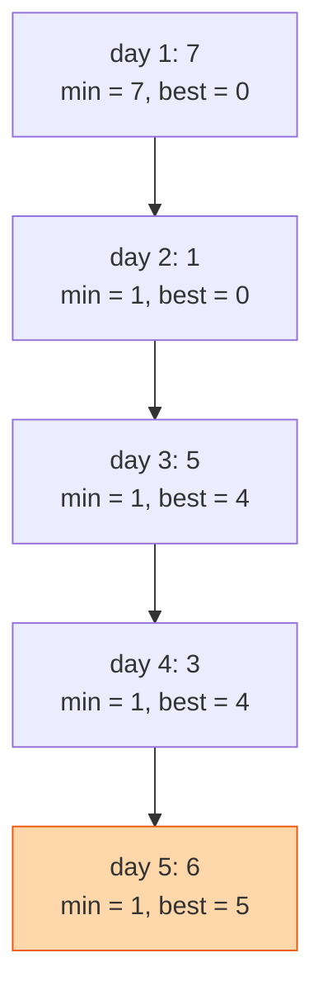

## The question

You are given a list of prices, one per day. You may buy on one day and sell on a later day. Return the biggest profit you can make. If no profit is possible, return zero.

## Explain it to a ten-year-old

Every day the toy shop changes the price of the same toy. You want to buy it on a cheap day and sell it to your friend on a dearer day, later. You cannot go back in time. So walk through the days in order. At each day ask two things: is this the cheapest price I have seen so far? And if I sold today, having bought at that cheapest price, how much would I make? Keep the best answer to the second question. You only ever need to remember two numbers.



## The trick

You do not need to try every pair of days. The best sale on any day is that day's price minus the cheapest price before it. So carry the cheapest price seen so far and the best profit seen so far. Two variables, one loop.

## The steps

1. `lowest = first price`, `best = 0`.
2. For each price after the first:
   - `best = max(best, price - lowest)`
   - `lowest = min(lowest, price)`
3. Return `best`.

```python
def max_profit(prices):
    lowest, best = prices[0], 0
    for p in prices[1:]:
        best = max(best, p - lowest)
        lowest = min(lowest, p)
    return best
```

Time O(n). Space O(1). The nested-loop version is O(n²) and I will ask you to do better.

## In GPU infrastructure

A training job logs its all-reduce throughput every few seconds. Walk that stream carrying the lowest throughput seen so far and the biggest rise above it, and you have the largest recovery the job made, which is usually the moment a straggler got drained. I use the same two numbers on GPU temperature and on free memory across a maintenance window. Cheapest so far and best gain so far are all you need, and they cost nothing to carry on a host that is already busy.

## What I am listening for

- The order of the two updates. Update `best` before `lowest`, or you may buy and sell on the same day.
- Whether you handle prices that only go down. The answer is zero, not negative.
- The follow-up: you may buy and sell as many times as you like. Suddenly it is "add up every uphill step". Same walk, different rule.


- **Carry two numbers: cheapest so far, best profit so far.**
- **Update best first, then cheapest.**
- **Falling prices means zero**, never negative.


## Go deeper

- The problem statement: [Best Time to Buy and Sell Stock on LeetCode](https://leetcode.com/problems/best-time-to-buy-and-sell-stock/)

**With AI on the table.** The tool gets this right. I add a transaction fee per sale and watch whether you can explain what changes in the update line before the tool rewrites it. If you cannot, you are not driving, you are riding.
