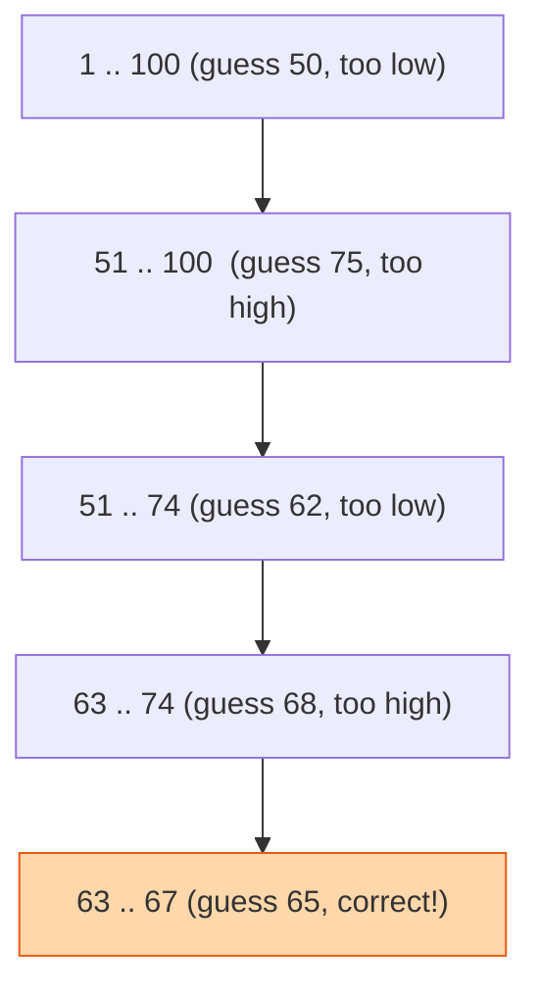

## The question

You are given a sorted array and a target. Return the index of the target, or -1 if it is not there. Do it faster than looking at every element.

## Explain it to a ten-year-old

I am thinking of a number between 1 and 100. You get to ask "is it higher or lower?" How many guesses do you need? If you guess 1, 2, 3, 4 you could need a hundred. If you always guess the middle of what is left, you need seven. Each guess throws away half of the numbers. Half of 100 is 50, then 25, then 13, 7, 4, 2, 1. Seven cuts and you are done. That is binary search. It works on anything sorted, and "sorted" is the only thing you have to check.



## The trick

Two walls, `lo` and `hi`. Look at the middle. If the middle is too small, the answer is to the right, move `lo` past it. Too big, move `hi` before it. Stop when the walls cross. Every bug in binary search is a wall that moved one step too few or too many.

## The steps

1. `lo = 0`, `hi = len(a) - 1`.
2. While `lo <= hi`:
   - `mid = lo + (hi - lo) // 2` (this form does not overflow in languages with fixed-size ints)
   - if `a[mid] == target`, return `mid`
   - if `a[mid] < target`, `lo = mid + 1`
   - else `hi = mid - 1`
3. Return -1.

```python
def search(a, target):
    lo, hi = 0, len(a) - 1
    while lo <= hi:
        mid = lo + (hi - lo) // 2
        if a[mid] == target:
            return mid
        if a[mid] < target:
            lo = mid + 1
        else:
            hi = mid - 1
    return -1
```

Time O(log n). Space O(1). Twenty elements takes five looks. A billion takes thirty.

## What I am listening for

- `<=` or `<` in the loop, and can you explain why. There is a right answer for each style, and a wrong mix.
- Do you ask "is it sorted?" before you start. It is the whole precondition.
- When I change it to "find the first element greater than or equal to target", do you know that is the same loop with a different stopping rule? That variant is what shows up in real code far more than the exact match.


- **Two walls, look in the middle, throw away half.**
- **`lo <= hi` with `mid ± 1`** is the pair that goes together.
- **Precondition: sorted.** Say it out loud.


**With AI on the table.** The assistant will write the exact-match version instantly. So I ask for "the leftmost position where I could insert the target and keep the array sorted". Watch the walls. Most generated code gets this right, and most candidates cannot tell me whether it did.

## Go deeper

- [MIT 6.006 Introduction to Algorithms (OpenCourseWare)](https://ocw.mit.edu/courses/6-006-introduction-to-algorithms-spring-2020/). The binary search lecture is the cleanest treatment of the wall invariant I know.
- [VisuAlgo](https://visualgo.net/en). Watch the walls move on a real array.
