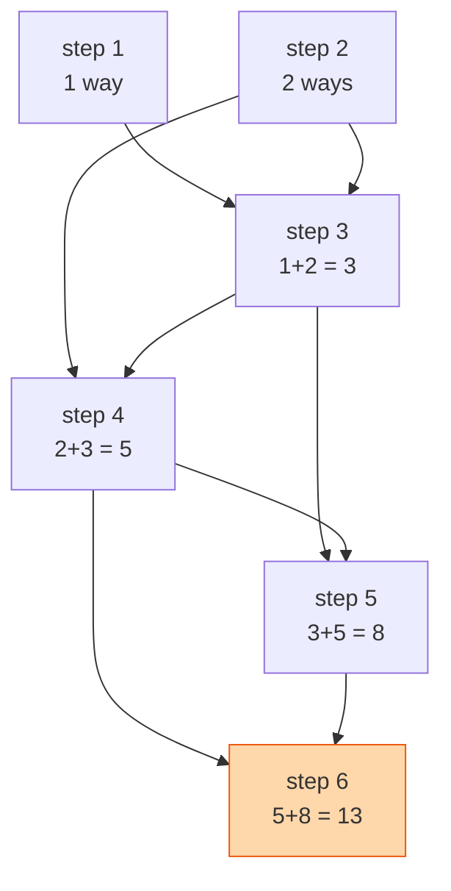

## The question

A staircase has `n` steps. Each move you climb one step or two. How many different ways can you reach the top?

## Explain it to a ten-year-old

Stand on the top step and look down. How did you get here? Either you hopped up from the step just below, or you jumped from two below. There is no other way. So the number of ways to reach step 10 is the number of ways to reach step 9 plus the number of ways to reach step 8. And the ways to reach step 9 is ways to 8 plus ways to 7. Keep going until you reach the bottom, where the answer is easy: there is one way to be on step 1 and two ways to be on step 2 (1+1 or 2). Now add your way back up.



## The trick

Ask "how did I get to the last step?" That question turns one big problem into two smaller copies of itself. That is dynamic programming. The only thing left to notice is that you do not need to keep the whole table, only the last two numbers.

## The steps

1. If `n` is 1, return 1. If `n` is 2, return 2.
2. Keep two numbers, `a = 1` (ways to step 1) and `b = 2` (ways to step 2).
3. For each step from 3 to `n`: `a, b = b, a + b`.
4. Return `b`.

```python
def climb(n):
    if n <= 2:
        return n
    a, b = 1, 2
    for _ in range(3, n + 1):
        a, b = b, a + b
    return b
```

Time O(n). Space O(1). The naive recursive version without a cache is O(2^n) and falls over around `n = 40`. Say that before I ask.

## What I am listening for

- Do you start with the recursion and then notice the repeated work, or do you jump straight to "it's Fibonacci" without being able to say why. I want the why.
- Can you extend it: steps of 1, 2 or 3. Steps with a cost on each one. A step that is broken. Each is the same picture with one more arrow.
- Do you know when to keep the whole table versus two variables. If I ask "which path", you need the table.


- **Look down from the top: ways(n) = ways(n-1) + ways(n-2).**
- **Base cases: 1 way to step 1, 2 ways to step 2.**
- **Keep two numbers, not a table**, unless you must reconstruct the path.


**With AI on the table.** The tool will say Fibonacci before you finish typing. So I ask for the version with a cost on each step and a budget, and I watch whether you can explain what the table cell means before you let the tool fill it in. The cell meaning is the skill. The code is not.

## Go deeper

- [MIT 6.006 dynamic programming lectures](https://ocw.mit.edu/courses/6-006-introduction-to-algorithms-spring-2020/). Four lectures on DP, start with the first.
- [Wikipedia: Dynamic programming](https://en.wikipedia.org/wiki/Dynamic_programming). For the history and the word "memoization".
