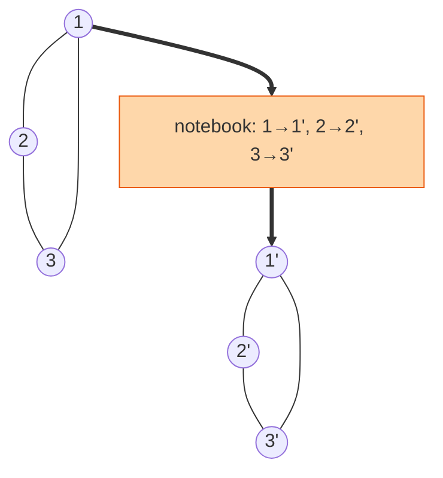

## The question

You are given one node of a connected, undirected graph. Each node has a value and a list of neighbours. Return a deep copy of the whole graph.

## Explain it to a ten-year-old

A group of friends, each holding a list of who their friends are. You want to build a second group of pretend friends with exactly the same friendships. Start with one. Make their copy. Now for each of their friends: if you have already made that friend's copy, just link to it. If not, make it, and then go and do their friends too. The important part is the notebook where you write "real person → their copy". Without it you would make the same person twice, and because friendships go both ways, you would never stop.



## The trick

A hash map from original to clone. Before you create a clone, look it up. If it exists, return it. That single check turns an infinite loop into a finished graph. Everything else is ordinary depth-first search.

## The steps

1. `seen = {}` maps old node to new node.
2. `clone(node)`: if node in `seen`, return `seen[node]`.
3. Create the copy, put it in `seen` before you touch the neighbours.
4. For each neighbour, append `clone(neighbour)` to the copy's neighbour list.
5. Return the copy.

```python
def clone_graph(node):
    seen = {}
    def clone(n):
        if n in seen:
            return seen[n]
        copy = Node(n.val)
        seen[n] = copy
        for nb in n.neighbors:
            copy.neighbors.append(clone(nb))
        return copy
    return clone(node) if node else None
```

Time O(V + E). Space O(V) for the map and the stack.

## In GPU infrastructure

An NVLink topology on one host is a graph with cycles in it, every GPU pointing at its neighbours and its neighbours pointing back. When a health check wants to simulate removing one GPU and see what the rest of the mesh looks like, it must not scribble on the live topology map, so it clones it first. Same for a fabric graph that a rollout planner mutates while it works out drain order across racks. The map from original to copy is what stops the clone from chasing a switch loop forever, and I have seen a planner hang on exactly that missing check.

## What I am listening for

- Whether you put the copy in the map before recursing on neighbours. After is too late for a cycle.
- The empty graph. One line, but it is the first thing I test.
- Can you do it breadth-first with a queue. Same map, different order. I ask when the graph is big.


- **Map old to new. Check the map before you create.**
- **Register the copy before visiting neighbours**, or cycles bite.
- **Then it is just DFS.**


## Go deeper

- The problem statement: [Clone Graph on LeetCode](https://leetcode.com/problems/clone-graph/)
- The search underneath: [Graph traversal on Wikipedia](https://en.wikipedia.org/wiki/Graph_traversal)

**With AI on the table.** The tool gets the map right. I ask you to move the `seen[n] = copy` line below the loop and predict what happens on a triangle graph. If you can trace the infinite recursion on paper, the map is yours.
