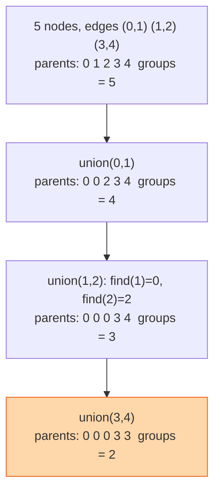

## The question

You are given `n` nodes and a list of edges. Return the number of connected components, meaning separate groups where every node can reach every other node in its group.

## Explain it to a ten-year-old

A playground with lots of children, and a list of who is holding hands with whom. How many separate chains are there? Give every child a badge that says who the leader of their chain is. At the start, everyone is their own leader. Each time two children hold hands, look up each one's leader. If the leaders are different, make one leader point to the other. That merges the two chains. Count how many children are still their own leader at the end. That is the number of chains.



## The trick

Two operations. `find(x)` follows parent pointers until it reaches a node that is its own parent, the leader. `union(a, b)` links the leader of one to the leader of the other. Two small improvements make it nearly constant time: path compression, where `find` rewires every node it passes to point straight at the leader, and union by size, where the smaller group joins the larger.

## The steps

1. `parent = [0, 1, ..., n-1]`, `groups = n`.
2. `find(x)`: while `parent[x] != x`, set `parent[x] = parent[parent[x]]` and move up. Return `x`.
3. `union(a, b)`: `ra, rb = find(a), find(b)`. If different, `parent[ra] = rb`, `groups -= 1`.
4. Run `union` on every edge. Return `groups`.

```python
def count_components(n, edges):
    parent = list(range(n))
    def find(x):
        while parent[x] != x:
            parent[x] = parent[parent[x]]
            x = parent[x]
        return x
    groups = n
    for a, b in edges:
        ra, rb = find(a), find(b)
        if ra != rb:
            parent[ra] = rb
            groups -= 1
    return groups
```

Time close to O(n + e) with compression. Space O(n).

## What I am listening for

- Whether you offer depth-first search first. That works too, and I want you to say which one you would pick and why. Union-find wins when edges arrive over time.
- The path compression line. If you skip it, I ask what a chain of a million nodes does to `find`.
- Where it lives in real life: which hosts share a network partition, which GPUs are in the same NVLink domain, Kruskal's minimum spanning tree.


- **Everyone is their own leader. Union merges leaders.**
- **Path compression:** point at the grandparent while you climb.
- **Count leaders at the end.** Or count down on every merge.


## Go deeper

- The structure with proofs and tricks: [Disjoint set union at cp-algorithms](https://cp-algorithms.com/data_structures/disjoint_set_union.html)
- Watch the trees flatten: [VisuAlgo union-find visualiser](https://visualgo.net/en/ufds)

**With AI on the table.** The tool writes union-find correctly. I hand you a stream of "server A can now reach server B" messages arriving forever and ask which structure you keep. If you say union-find and not DFS, and can say why, we are done.
