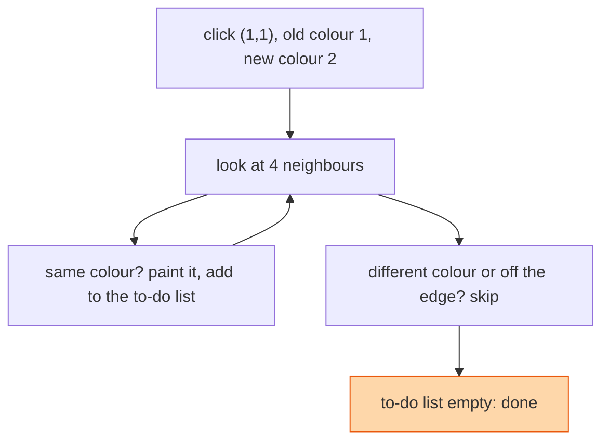

## The question

You are given a grid of colours, a starting cell, and a new colour. Change the starting cell and every cell connected to it (up, down, left, right) that has the same original colour to the new colour.

## Explain it to a ten-year-old

The paint bucket in a drawing app. You click one square. The paint spreads to the neighbour on each side, but only if that neighbour is the same colour as the square you clicked. Then it spreads from those neighbours to their neighbours. It stops when it hits a different colour or the edge of the picture. Diagonal squares do not count, paint does not leak through corners.



## The trick

A grid is a graph. Each cell is a node, each side is an edge. Flood fill is depth-first or breadth-first search where "can I go there" means "is it in bounds and the old colour". The one bug that catches everyone: if the new colour equals the old colour, you loop forever. Check that first.

## The steps

1. If the new colour equals the old colour, return the grid unchanged.
2. Start a to-do list with the starting cell.
3. While the list is not empty: take a cell, paint it, add each of its four neighbours that is in bounds and still the old colour.
4. Return the grid.

```python
def flood_fill(grid, r, c, new):
    old = grid[r][c]
    if old == new:
        return grid
    stack = [(r, c)]
    while stack:
        i, j = stack.pop()
        if 0 <= i < len(grid) and 0 <= j < len(grid[0]) and grid[i][j] == old:
            grid[i][j] = new
            stack.extend([(i+1, j), (i-1, j), (i, j+1), (i, j-1)])
    return grid
```

Time O(rows × cols). Space O(rows × cols) in the worst case for the to-do list.

## In GPU infrastructure

A leaf switch fails and I want the blast radius. Start at the switch in the topology graph and spread to every neighbour that is still connected only through it, and the painted set is the list of nodes to drain before the jobs on them notice. The same search on a rack diagram finds which nodes a single cooling loop touches. The old-equals-new bug has a cousin here, spreading into nodes that are already marked down, and the fix is the same one-place check before you paint.

## What I am listening for

- The infinite loop when old equals new. Say it before I show it.
- Bounds checking. Put it in one place, not four.
- Whether you know that the recursive version can overflow the stack on a big grid, and that the explicit stack version does not.


- **A grid is a graph. Four neighbours, no diagonals.**
- **Old equals new means stop before you start.**
- **Check bounds and colour in one place.**


## Go deeper

- The problem statement: [Flood Fill on LeetCode](https://leetcode.com/problems/flood-fill/)
- The two searches under the hood: [Depth-first search on Wikipedia](https://en.wikipedia.org/wiki/Depth-first_search)

**With AI on the table.** The tool writes the recursive version. I ask it to run on a 5,000 by 5,000 grid and let you predict what happens. If you say "stack overflow" before running it, you understand recursion. If you run it to find out, we talk.
