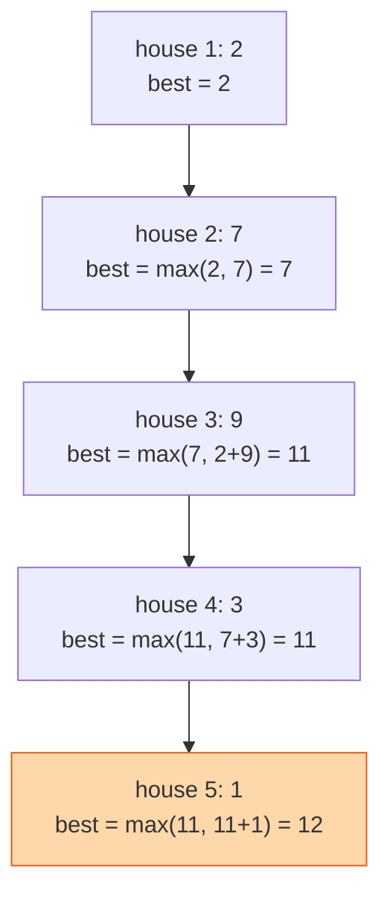

## The question

You are given a list of amounts, one per house along a street. You may take money from any houses, but not from two that are next to each other. Return the most you can take.

## Explain it to a ten-year-old

A row of Halloween houses with sweets on the doorstep. The rule is you cannot visit two houses in a row, the neighbours will notice. Walk down the street. At each house ask: is it better to take this one plus whatever I had two houses ago, or to skip it and keep whatever I had one house ago? Write down the best answer so far. At the end of the street, the last number is your answer.



## The trick

`best(i) = max(best(i-1), best(i-2) + money[i])`. That is the whole problem. Either you skip this house and keep the best up to the previous one, or you take it and add it to the best up to two houses back. You only ever need the last two answers.

## The steps

1. `prev2 = 0`, `prev1 = 0`.
2. For each amount `m`: `current = max(prev1, prev2 + m)`; then `prev2 = prev1`, `prev1 = current`.
3. Return `prev1`.

```python
def rob(houses):
    prev2 = prev1 = 0
    for m in houses:
        prev2, prev1 = prev1, max(prev1, prev2 + m)
    return prev1
```

Time O(n). Space O(1).

## What I am listening for

- Do you start greedy, "take the biggest houses", and then find the counterexample yourself. Greedy fails on `[2, 7, 9, 3, 1]`.
- Can you say what `best(i)` means in words. "The most I can take from the first i houses." If you can say it, you can write the recurrence.
- The circle version: first and last house are neighbours too. Run the same walk twice, once without the first house and once without the last.


- **Skip it or take it plus two back.** max(prev1, prev2 + m).
- **Say what the cell means** before you write the recurrence.
- **Two variables, not a table.**


## Go deeper

- The technique, properly: [MIT 6.006 Introduction to Algorithms](https://ocw.mit.edu/courses/6-006-introduction-to-algorithms-spring-2020/), the dynamic programming lectures
- Short video explanations of DP patterns: [Abdul Bari on YouTube](https://www.youtube.com/@abdul_bari)

**With AI on the table.** The tool writes this instantly. I change the rule to "no three in a row" and watch. The recurrence becomes three terms and the tool sometimes gets it wrong. Whether you catch that is the interview.
