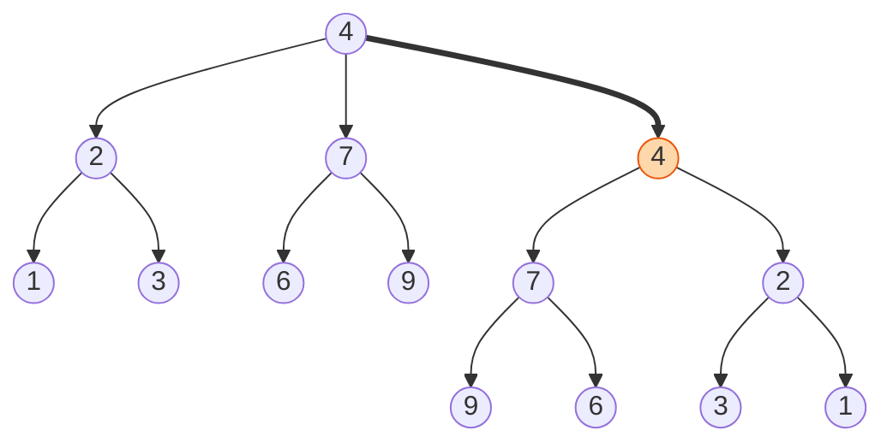

## The question

You are given the root of a binary tree. Mirror it: every left child becomes the right child and every right child becomes the left, all the way down.

## Explain it to a ten-year-old

A family tree drawn on paper. Hold it up to a mirror. Every parent still has the same children, but the one that was on the left is now on the right. To do it without a mirror: at the top, swap the two children. Then tell each child "now you do the same to your own children". Each child tells its own children. Eventually you reach children with no children, and they have nothing to do.



## The trick

Trust the recursive call. You do not invert the whole tree. You swap two pointers at this node and hand the rest to the same function. The base case is an empty node, which returns itself. That is all.

## The steps

1. If the node is empty, return it.
2. Swap `node.left` and `node.right`.
3. Call invert on the new left and the new right.
4. Return the node.

```python
def invert(node):
    if not node:
        return None
    node.left, node.right = node.right, node.left
    invert(node.left)
    invert(node.right)
    return node
```

Time O(n), every node visited once. Space O(h) for the call stack, where h is the height. A very deep tree can blow the stack, and I will ask you to do it with a queue.

## In GPU infrastructure

A GB200 rack is wired as two mirror-image halves, and the NVLink and PCIe topology tree for the right half is the left half inverted. When I generate the expected topology for a new rack I build one half and invert it rather than typing both, which is this recursion on a tree eight levels deep. Then the health check compares what `nvidia-smi` reports against the mirrored tree and flags any GPU or NIC that ended up on the wrong side. It is a modest use, but it removes a whole class of hand-typed cabling mistakes.

## What I am listening for

- Do you try to be clever and swap grandchildren by hand. That is the sign you do not trust recursion.
- Can you do it iteratively with a queue when I ask. Same swap, different bookkeeping.
- Can you say what "height" means for the space cost and why a tree that is really a line is the worst case.


- **Swap the two children. Recurse on both. Return the node.**
- **Base case is the empty node.**
- **Stack depth is tree height.** Use a queue if the tree is deep.


**With AI on the table.** The tool does it in three lines. I ask you to write the iterative version without the tool and then compare the two. The difference between them is the entire lesson about recursion, and you only learn it by doing both.
