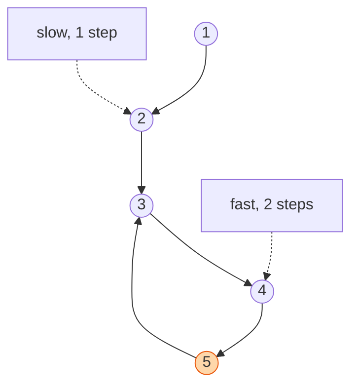

## The question

You are given the head of a linked list. Some node's `next` may point back to an earlier node, making a loop. Return true if there is a loop. Use no extra memory.

## Explain it to a ten-year-old

Two children run along a path. One walks, one runs twice as fast. If the path is straight, the runner reaches the end and stops. If the path is a circle, the runner goes round and round and eventually comes up behind the walker and taps them on the shoulder. Tap means loop. No tap, no loop. You never need to remember where you have been. The tap does it for you.



## The trick

Floyd's tortoise and hare. The slow pointer moves one node, the fast pointer moves two. In a loop, the gap between them shrinks by one each step, so they must meet. On a straight list, fast hits null first. The obvious answer, a set of visited nodes, works but costs O(n) memory and is what I expect you to say first and then improve.

## The steps

1. `slow = head`, `fast = head`.
2. While `fast` and `fast.next` exist:
   - `slow = slow.next`
   - `fast = fast.next.next`
   - if `slow is fast`, return true.
3. Return false.

```python
def has_cycle(head):
    slow = fast = head
    while fast and fast.next:
        slow = slow.next
        fast = fast.next.next
        if slow is fast:
            return True
    return False
```

Time O(n). Space O(1).

## In GPU infrastructure

Job stages on a GPU cluster form a chain: fetch the checkpoint, run burn-in, publish the result, trigger the next stage. When a retry handler sends a failed stage back to an earlier one, that chain becomes a loop and a node can sit in drain, reboot, health check, drain for days without anyone noticing. Floyd's walk over the stage graph finds the loop before the job is submitted, and the same two pointers find a dependency cycle in a rollout plan where rack A waits on rack B and rack B waits on rack A. I have seen the visited set version too, and it works until the cycle sits inside a workflow with a million steps.

## What I am listening for

- Do you say "visited set" first. Good. Then do you know the better answer.
- `is` versus `==`. You are comparing the node, not the value. Two different nodes can hold the same number.
- The follow-up: where does the loop start? There is a second walk from the head that finds it. Knowing that one exists is enough for most rounds.


- **Walker and runner.** Runner moves two, walker moves one.
- **Meet means loop. Null means no loop.**
- **Compare nodes, not values.**


## Go deeper

- The algorithm and its proof: [Cycle detection on Wikipedia](https://en.wikipedia.org/wiki/Cycle_detection)
- See it move: [VisuAlgo linked list visualiser](https://visualgo.net/en/list)

**With AI on the table.** The assistant writes Floyd from muscle memory. I ask why the fast pointer cannot jump over the slow one without meeting it. That is a sentence about the gap shrinking by one. If you can say it, the code is yours.
