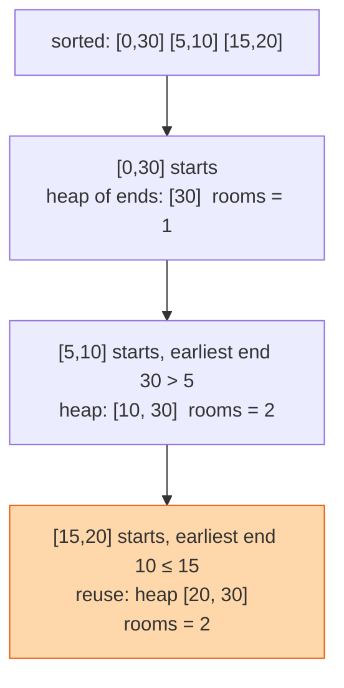

## The question

You are given meetings as start and end times. Return the minimum number of rooms needed so that no two overlapping meetings share a room.

## Explain it to a ten-year-old

Birthday parties at a play centre, each with a start and finish time. How many party rooms does the centre need? Line the parties up by start time. When a party starts, look at the room that will be free soonest. If it is already free, take it. If not, open a new room. Keep a note of which room frees up next. The most rooms you ever had open at once is the answer.



## The trick

A min-heap of end times is "which room frees up first". Sort meetings by start. For each meeting, if the smallest end time in the heap is at or before this start, pop it, that room is reusable. Push this meeting's end. The heap size is the number of rooms in use right now, and its maximum is the answer.

## The steps

1. Sort meetings by start time.
2. `ends = []` as a min-heap.
3. For each `[s, e]`: if `ends` and `ends[0] <= s`, pop. Push `e`.
4. Track the largest size `ends` reaches.

```python
import heapq
def min_rooms(meetings):
    meetings.sort()
    ends, best = [], 0
    for s, e in meetings:
        if ends and ends[0] <= s:
            heapq.heappop(ends)
        heapq.heappush(ends, e)
        best = max(best, len(ends))
    return best
```

Time O(n log n). Space O(n).

## In GPU infrastructure

Every job on the fleet has a start and an end. Sort them by start, keep a heap of end times, and the largest the heap gets is the most nodes busy at once, which is the number I size bastion hosts and log collectors against. Run it over the planned maintenance windows instead and it tells you the peak number of racks out of service on any day. I have watched a fleet get a bastion tier sized on the average and fall over at the peak, and this walk is the fifteen lines that would have caught it.

## What I am listening for

- Do you sort by start. Sorting by end is the wrong instinct here.
- Why a heap and not a list. Because "which ends soonest" must be fast.
- The alternative: two sorted lists of starts and ends, walk both with two pointers. Same answer, no heap. Mention it and I am happy.


- **Sort by start. Heap of end times.**
- **Earliest end ≤ this start means reuse the room.**
- **Max heap size is the answer.**


## Go deeper

- The family this belongs to: [Intervals](/teach/coding/intervals/), the pattern page with the template.
- The data structure: [Binary heap on Wikipedia](https://en.wikipedia.org/wiki/Binary_heap)
- See a heap change shape: [VisuAlgo heap visualiser](https://visualgo.net/en/heap)

**With AI on the table.** The tool writes the heap version. I ask for the two-pointer version without the tool and then ask which one you would ship and why. There is no wrong answer, but "I do not know the difference" is one.
