## The question

You are given a list of intervals, each a start and an end. Some overlap. Return a list where every overlapping group has been merged into one interval.

## Explain it to a ten-year-old

Your school day has activities written on sticky notes: football 1 to 3, music 2 to 4, homework 6 to 7. Football and music overlap, so really you are busy from 1 to 4, then free, then busy 6 to 7. To work that out, first put the notes in order by start time. Then walk through them holding one "current busy block". If the next note starts while you are still busy, make the block longer. If it starts after, close the block and start a new one.

```mermaid
gantt
  title Sorted by start, then walk once
  dateFormat X
  axisFormat %s
  section Input
  [1,3] football   :a1, 1, 3
  [2,4] music      :a2, 2, 4
  [6,7] homework   :a3, 6, 7
  [8,10] dinner    :a4, 8, 10
  [9,12] film      :a5, 9, 12
  section Output
  [1,4]            :done, b1, 1, 4
  [6,7]            :done, b2, 6, 7
  [8,12]           :done, b3, 8, 12
```



## The trick

Sort by start. Then the only comparison you ever need is: does the next start come before the current end? If yes, the new end is the bigger of the two ends. If no, push the current block and start fresh. The sort is what makes a one-pass walk possible.

## The steps

1. Sort intervals by start.
2. `out = [first interval]`.
3. For each remaining interval `[s, e]`:
   - if `s <= out[-1].end`, then `out[-1].end = max(out[-1].end, e)`
   - else append `[s, e]`
4. Return `out`.

```python
def merge(intervals):
    intervals.sort(key=lambda x: x[0])
    out = [intervals[0]]
    for s, e in intervals[1:]:
        if s <= out[-1][1]:
            out[-1][1] = max(out[-1][1], e)
        else:
            out.append([s, e])
    return out
```

Time O(n log n) for the sort, the walk is O(n). Space O(n) for the output.

## What I am listening for

- Do you sort first, or do you try nested loops. Nested loops is the tell that you have not seen the shape.
- The `max` on the end. Candidates forget it and merge `[1,10]` with `[2,3]` into `[1,3]`.
- Do you know its cousins: insert one interval, count meeting rooms needed, find free time between calendars. Same sort, same walk.


- **Sort by start. Walk once. Stretch or start fresh.**
- **New end = max of the two ends**, never just the newer one.
- **Touching counts as overlap** unless the question says otherwise. Ask.


**With AI on the table.** Generated code gets this right. So I change the input: intervals arrive one at a time over the network and never stop. Now there is no list to sort. What do you keep in memory? That question has no template answer, and that is the point.
