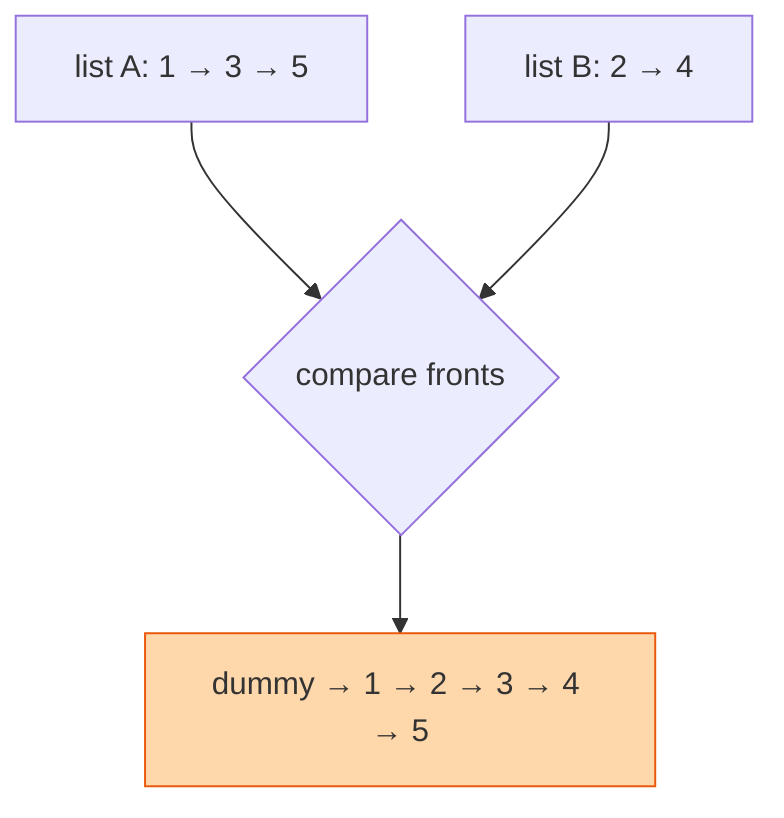

## The question

You are given two linked lists, each already sorted. Merge them into one sorted list by re-linking the existing nodes, not by copying.

## Explain it to a ten-year-old

Two queues of children, each already lined up shortest to tallest. You want one queue, still shortest to tallest. Look at the two children at the front. Take the shorter one and add them to your new line. Look again. Keep going until one queue is empty, then take the rest of the other queue as is, because it is already in order. To make life easy, start your new line with a pretend child, a cardboard cutout, so you always have someone to stand behind. Remove the cutout at the end.



## The trick

The dummy head. Without it you need an `if` to decide which list starts the result. With it, you always append to `tail.next` and return `dummy.next` at the end. The second trick: when one list runs out, attach the rest of the other in one move.

## The steps

1. `dummy = Node(0)`, `tail = dummy`.
2. While both lists have nodes:
   - point `tail.next` at the smaller front, advance that list.
   - `tail = tail.next`.
3. `tail.next = whichever list still has nodes`.
4. Return `dummy.next`.

```python
def merge(a, b):
    dummy = tail = ListNode(0)
    while a and b:
        if a.val <= b.val:
            tail.next, a = a, a.next
        else:
            tail.next, b = b, b.next
        tail = tail.next
    tail.next = a or b
    return dummy.next
```

Time O(n + m). Space O(1), we re-link, we do not copy.

## What I am listening for

- Whether the dummy head appears. It is the tell that you have written this before.
- `<=` not `<` if the question wants stable order. Small thing, real thing.
- Do you know where this shape lives in the real world: merge sort, merging sorted files on disk, compaction in a log-structured store.


- **Dummy head, tail pointer, append the smaller.**
- **When one runs out, attach the rest in one move.**
- **Return dummy.next**, not dummy.


## Go deeper

- The problem statement: [Merge Two Sorted Lists on LeetCode](https://leetcode.com/problems/merge-two-sorted-lists/)
- Where it lives at scale: [Merge sort on Wikipedia](https://en.wikipedia.org/wiki/Merge_sort)

**With AI on the table.** Generated code is correct. So I ask: the two lists are on two different disks and each is a hundred gigabytes. Same algorithm? What changes? The answer is buffering, and it is a systems conversation wearing a coding costume.
