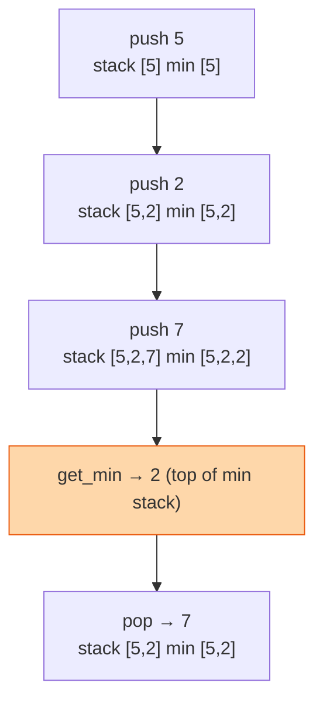

## The question

Design a stack with push, pop, top, and a `get_min` that returns the smallest element currently in the stack. Every operation must be constant time.

## Explain it to a ten-year-old

A pile of books. You can only add to the top or take from the top. Someone keeps asking "which book in the pile is the thinnest?" You could look through the whole pile every time. Or you could keep a second pile of sticky notes. Each time you add a book, write on a note "the thinnest so far is this thick" and put the note on the second pile. When you take a book off, throw away the top note. The top note always answers the question, instantly.



## The trick

A second stack that moves in lockstep with the first. On push, push `min(new value, current min)` onto it. On pop, pop both. `get_min` is the top of the second stack. You trade one extra number per element for a constant-time answer. That trade, memory for time, is most of system design.

## The steps

1. Two lists: `items` and `mins`.
2. Push `x`: append `x` to `items`; append `min(x, mins[-1])` to `mins` (or `x` if empty).
3. Pop: pop both.
4. Top: `items[-1]`. Min: `mins[-1]`.

```python
class MinStack:
    def __init__(self):
        self.items, self.mins = [], []
    def push(self, x):
        self.items.append(x)
        self.mins.append(min(x, self.mins[-1]) if self.mins else x)
    def pop(self):
        self.mins.pop()
        return self.items.pop()
    def top(self):
        return self.items[-1]
    def get_min(self):
        return self.mins[-1]
```

Every operation O(1). Space O(n) extra.

## What I am listening for

- Do you propose scanning on every `get_min`. Fine as a first answer. Then I say "constant time" and wait.
- Do you keep the two stacks in lockstep or try to be clever and only push to `mins` on a new minimum. The clever version works but needs care on pop. Explain the care.
- Can you extend it to `get_max` too. Third stack. Same idea.


- **Second stack holds "min so far" at every level.**
- **Push both, pop both.** Lockstep is simplest.
- **Memory for time.** That is the trade you just made.


**With AI on the table.** The tool writes the lockstep version. I ask what happens to memory if a million pushes all have the same value and whether the "only push on new minimum" version fixes it. Then I ask what breaks on pop. The follow-up is where you show me you read the code.
