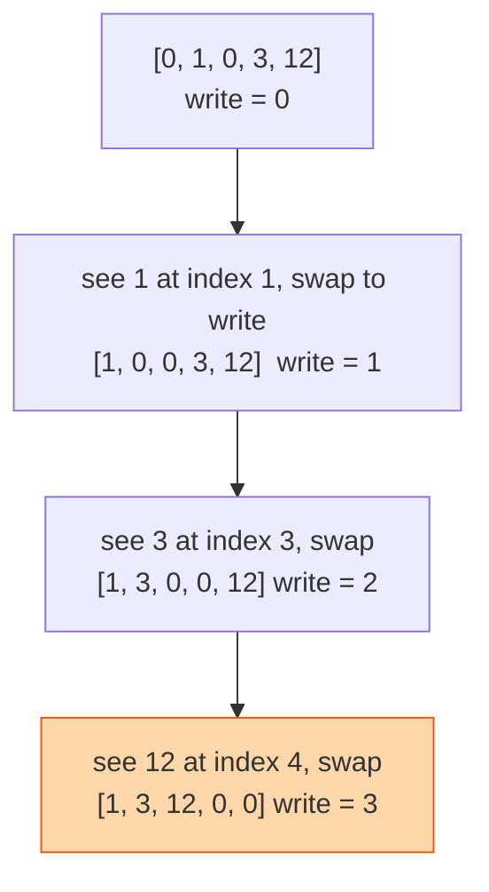

## The question

You are given an array of numbers. Move all the zeroes to the end, keep the other numbers in their original order, and do it in place with no second array.

## Explain it to a ten-year-old

A line of children, some holding a ball and some holding nothing. You want the children with balls at the front, in the same order they were in, and the empty-handed ones at the back. Walk down the line with one finger pointing at the first empty-handed spot. Every time you meet a child with a ball, swap them into that spot and move the finger one along. The children with balls stay in order because you only ever move them forward, never past each other.



## The trick

Two pointers moving at different speeds. The `read` pointer looks at every element. The `write` pointer only moves when you find something worth keeping. Everything before `write` is done. Everything between `write` and `read` is zeroes.

## The steps

1. `write = 0`.
2. For each index `read` from 0 to the end:
   - if `a[read]` is not zero, swap `a[write]` and `a[read]`, then `write += 1`.
3. Done. No second pass needed.

```python
def move_zeroes(a):
    write = 0
    for read in range(len(a)):
        if a[read] != 0:
            a[write], a[read] = a[read], a[write]
            write += 1
```

Time O(n). Space O(1). One pass.

## What I am listening for

- Do you reach for a new array first. That is fine to say, then I ask you to do it in place.
- Can you tell me the invariant: "everything before `write` is non-zero and in order." If you can say it, you can prove it.
- The cousin: remove all copies of a given value. Same finger, different test.


- **Two pointers, one slow, one fast.** Slow marks where the next keeper goes.
- **Swap forward only.** Order of the keepers survives.
- **Say the invariant out loud.** Before `write` is finished work.


## Go deeper

- The problem statement: [Move Zeroes on LeetCode](https://leetcode.com/problems/move-zeroes/)
- Two-pointer patterns walked through on video: [NeetCode on YouTube](https://www.youtube.com/@NeetCode)
- The problem this one grows out of: [Two Sum](/teach/coding/two-sum/)

**With AI on the table.** The assistant will write this in two seconds. So I ask for a version that counts how many swaps it made and whether the swap of an element with itself should count. Small question, but it tells me whether you read the code the tool gave you.
