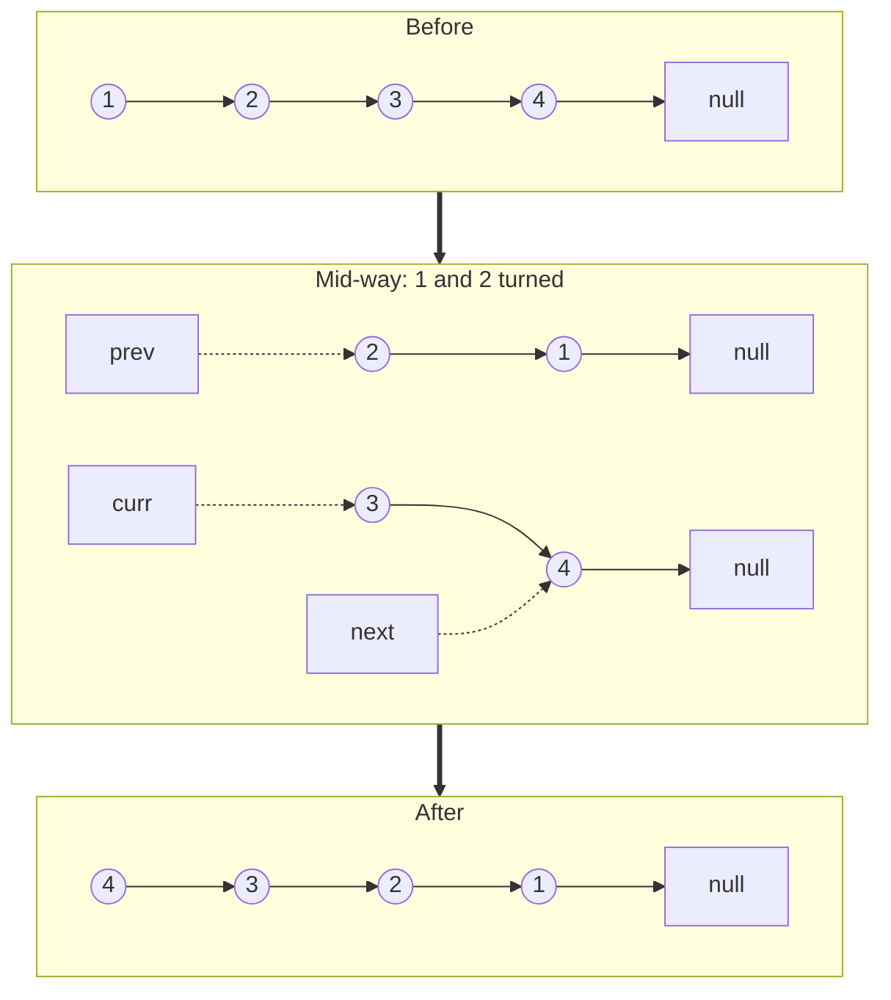

## The question

You are given the head of a singly linked list. Return the head of the same list, reversed. Do it in place, no extra list.

## Explain it to a ten-year-old

Picture kids in a line, each with a hand on the shoulder of the kid in front. You want the line to face the other way. You cannot shout "everyone turn around" because each kid only knows who is in front of them, not behind. So you walk down the line and turn one kid at a time. To do that safely you need three fingers: one on the kid you already turned, one on the kid you are turning now, and one on the kid you have not touched yet. Lose the third finger and the rest of the line walks away.



## The trick

Three pointers: `prev`, `curr`, `next`. Save `next` first, flip `curr`, then slide everything one step to the right. The order of those four lines is the entire problem.

## The steps

1. `prev = None`, `curr = head`.
2. While `curr` is not empty:
   - `next = curr.next` (save the rest of the line before you break it)
   - `curr.next = prev` (turn this kid around)
   - `prev = curr`, `curr = next` (slide the fingers)
3. Return `prev`. It is now the front.

```python
def reverse(head):
    prev, curr = None, head
    while curr:
        nxt = curr.next
        curr.next = prev
        prev, curr = curr, nxt
    return prev
```

Time O(n). Space O(1). One pass.

## What I am listening for

- Do you say "save next first" before you write it? If you do, you have done this before and you understand why.
- Do you check the empty list and the one-node list without me asking?
- Can you do it recursively when I ask, and can you tell me why the recursive one is worse (stack depth)?


- **Three fingers:** prev, curr, next.
- **Save next before you flip.** Always.
- **Return prev**, not curr. Curr is null when the loop ends.


**With AI on the table.** Any assistant writes this correctly in one shot. So I now hand you a version with `prev` and `curr` swapped in the last line and ask you what it returns. If you can trace it on paper, we move on. If you run it to find out, we talk about that.
