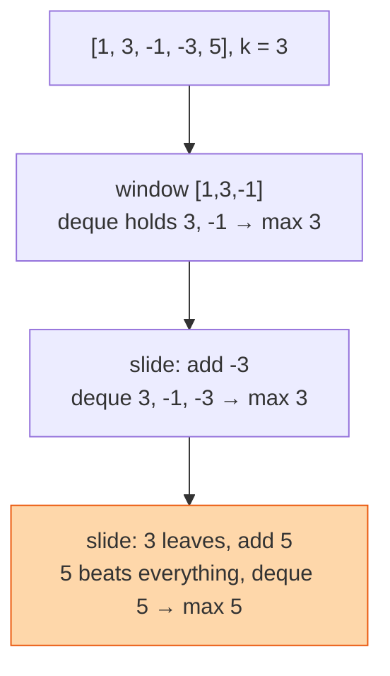

## The question

You are given an array and a window size `k`. As the window slides one step at a time from left to right, return the maximum inside the window at each position.

## Explain it to a ten-year-old

A line of children. You hold a picture frame that shows three children at a time and you slide it along. Each time, who is the tallest in the frame? The slow way: look at all three, every time. The clever way: keep a short list of "children who could still be tallest at some point". When a new child enters the frame, anyone shorter than them can never be the tallest again while the new child is there, so cross them off. When the child at the front of your list leaves the frame, cross them off too. The front of the list is always the tallest.



## The trick

A deque of indexes whose values are always decreasing from front to back. On each new element: pop from the back while the back is smaller than the new element, then push the new index. Pop from the front if it has fallen out of the window. The front is the maximum. Every index enters and leaves once, so the whole thing is linear.

## The steps

1. `dq = deque()`, `out = []`.
2. For each index `i`:
   - while `dq` and `a[dq[-1]] < a[i]`, pop from the back.
   - append `i`.
   - if `dq[0] <= i - k`, pop from the front.
   - if `i >= k - 1`, append `a[dq[0]]` to `out`.

```python
from collections import deque
def max_window(a, k):
    dq, out = deque(), []
    for i, x in enumerate(a):
        while dq and a[dq[-1]] < x:
            dq.pop()
        dq.append(i)
        if dq[0] <= i - k:
            dq.popleft()
        if i >= k - 1:
            out.append(a[dq[0]])
    return out
```

Time O(n). Space O(k).

## In GPU infrastructure

Every GPU health dashboard I have built shows peak temperature and peak power over the last five minutes, per GPU, across the whole fleet. That is sliding window maximum with a monotonic deque per sensor, one push and at most one pop per sample, so a collector on a host with eight GPUs and a dozen sensors each never falls behind. The same deque gives me the worst all-reduce latency over the last k iterations, which is how straggler detection notices one slow node before the job does. Recompute the maximum from scratch each tick and the collector eats the CPU the job wanted.

## What I am listening for

- Do you know the O(n × k) version and why it is not enough. Say it, then improve.
- Why store indexes and not values. Because you need to know when the front has left the window.
- The invariant, in words: "the deque holds candidates in decreasing order, front is the current max." If you can say that, I know you get it.


- **Deque of indexes, values decreasing front to back.**
- **New element evicts smaller ones from the back.**
- **Front falls out when it leaves the window.**


## Go deeper

- The problem statement: [Sliding Window Maximum on LeetCode](https://leetcode.com/problems/sliding-window-maximum/)
- The easy version first: [Sliding Window, Fixed Length](/teach/coding/sliding-window-fixed-length/)
- The pattern and its cousins: [Monotonic queue explained at cp-algorithms](https://cp-algorithms.com/data_structures/stack_queue_modification.html)

**With AI on the table.** The tool writes the deque correctly. I ask for the minimum instead of the maximum and watch whether you change one comparison or rewrite everything. One comparison. If you understood the invariant, that is obvious.
