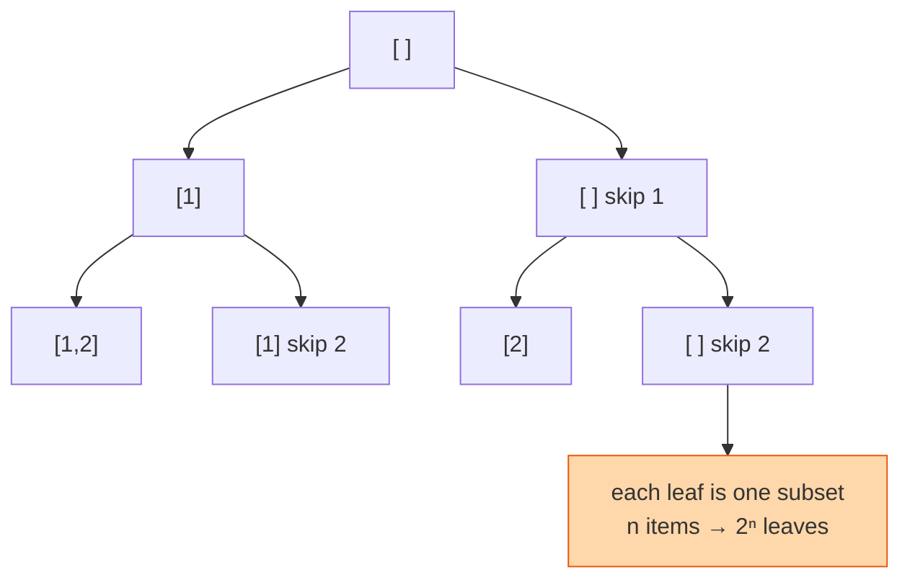

## The question

You are given a list of distinct numbers. Return every possible subset, including the empty set and the full set.

## Explain it to a ten-year-old

You have three toys and a bag. How many different ways can you pack the bag? For each toy you make one choice: put it in, or leave it out. Three toys, two choices each, eight bags. To list them all without missing any, go toy by toy. Put the first toy in, then decide about the second, then the third, write down the bag. Now take the last toy out and try the other choice. Keep undoing your last choice and trying the other way until you have tried everything. That "try, write down, undo, try the other way" is backtracking.



## The trick

One recursive function with a current path. At each index, record the path as a subset, then for every later index, add it, recurse, remove it. The remove is the backtrack. Forgetting it is the bug everyone writes first.

## The steps

1. `out = []`, `path = []`.
2. `walk(start)`: append a copy of `path` to `out`.
3. For `i` from `start` to the end: append `a[i]` to `path`, call `walk(i + 1)`, pop from `path`.
4. Call `walk(0)`.

```python
def subsets(a):
    out, path = [], []
    def walk(start):
        out.append(path[:])
        for i in range(start, len(a)):
            path.append(a[i])
            walk(i + 1)
            path.pop()
    walk(0)
    return out
```

Time O(n × 2ⁿ), there are 2ⁿ subsets and copying each costs up to n. You cannot beat the output size.

## What I am listening for

- The `path[:]` copy. Without it every entry in `out` is the same list.
- The `pop`. Without it the path never shrinks.
- The cousins: permutations, combinations of size k, subsets with duplicates. Same walk, one extra rule each. If you can name one, I stop asking.


- **Take it or leave it, for every item.**
- **Add, recurse, remove.** The remove is the backtrack.
- **Copy the path when you record it.**


## Go deeper

- The technique: [Backtracking on Wikipedia](https://en.wikipedia.org/wiki/Backtracking)
- The problem statement: [Subsets on LeetCode](https://leetcode.com/problems/subsets/)

**With AI on the table.** The tool writes the walk. I ask how many subsets a list of forty items has and whether your program will finish. A trillion. It will not. Knowing when not to run the code is a skill too.
