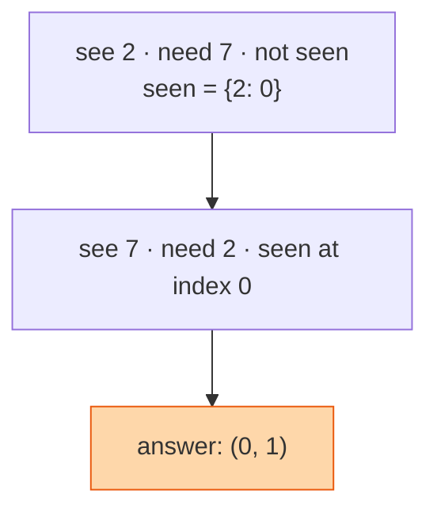
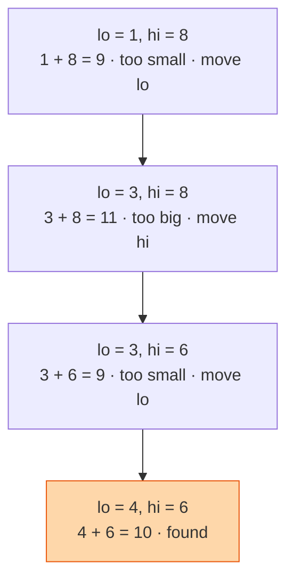

## The question

You are given a list of numbers and a target. Return the positions of the two numbers that add up to the target. There is exactly one answer and you cannot use the same number twice.

## Explain it to a ten-year-old

You have a pile of coins and need two that make exactly ten pence. The slow way is to pick up every coin and try it against every other coin. The clever way is to pick up one coin, say a three, and ask "have I already seen a seven?" Keep a note of every coin you put down. Each new coin, you check your note once. One pass through the pile.

If the coins are already lined up smallest to biggest, there is a second clever way. Put one finger on the smallest and one on the biggest. Add them. Too big? The big finger moves left. Too small? The small finger moves right. The fingers walk towards each other and meet in the middle.

**Unsorted, hash map.** List `[2, 7, 11, 15]`, target 9.



**Sorted, two pointers.** List `[1, 3, 4, 6, 8]`, target 10.



## The trick

There are two tricks, and which one you use depends on one question: is the list sorted?

**Not sorted.** Trade space for time. As you walk the list, store each number and its position in a hash map. For each new number, look up `target - number`. If it is in the map, you are done. One pass, one lookup per element.

**Sorted.** Trade nothing. Two pointers, one at each end. The sum tells you which pointer to move. Because the list is sorted, moving `lo` right can only make the sum bigger and moving `hi` left can only make it smaller, so you never skip the answer.

Sorting an unsorted list first costs n log n, which is slower than the hash map. So the map is the answer to the classic question, and two pointers is the answer to its sorted cousin. Know both and say why.

## The steps

Unsorted, hash map:

1. `seen = {}`.
2. For each index `i` and value `x`:
   - `need = target - x`.
   - If `need` is in `seen`, return `(seen[need], i)`.
   - Otherwise `seen[x] = i`.

```python
def two_sum(a, target):
    seen = {}
    for i, x in enumerate(a):
        need = target - x
        if need in seen:
            return seen[need], i
        seen[x] = i
```

Time O(n). Space O(n).

Sorted, two pointers:

1. `lo = 0`, `hi = len(a) - 1`.
2. While `lo < hi`:
   - `s = a[lo] + a[hi]`.
   - If `s == target`, return `(lo, hi)`.
   - If `s < target`, `lo += 1`. Otherwise `hi -= 1`.

```python
def two_sum_sorted(a, target):
    lo, hi = 0, len(a) - 1
    while lo < hi:
        s = a[lo] + a[hi]
        if s == target:
            return lo, hi
        if s < target:
            lo += 1
        else:
            hi -= 1
```

Time O(n). Space O(1).

## What I am listening for

- Whether you say the brute force first, two loops and n squared, and then improve it. Skipping straight to the map is fine. Not being able to explain what it beats is not.
- Whether you check the map before you insert. Insert first and `[3, 3]` with target 6 finds itself.
- Whether you ask if the list is sorted. That one question tells me you know there are two tools, not one.
- Whether you can explain why the two-pointer walk never misses the answer. It is the sorted order. If you cannot say that, you have memorised the code.

## Where it leads

Two Sum is the first rung on a ladder. Once the two ideas are in your head, these are the same problem in a different costume.

- [Two Sum II, sorted input](https://leetcode.com/problems/two-sum-ii-input-array-is-sorted/). The two-pointer version, on its own.
- [3Sum](https://leetcode.com/problems/3sum/). Sort, fix one number, run Two Sum II on the rest. The hard part is skipping duplicates.
- [Container With Most Water](https://leetcode.com/problems/container-with-most-water/). Two pointers from the ends, always move the shorter wall.
- [Valid Palindrome](https://leetcode.com/problems/valid-palindrome/). Two pointers from the ends, compare and walk in.
- [Remove Duplicates from Sorted Array](https://leetcode.com/problems/remove-duplicates-from-sorted-array/) and [Move Zeroes](/teach/coding/move-zeroes/). Two pointers moving the same direction at different speeds.
- [Trapping Rain Water](https://leetcode.com/problems/trapping-rain-water/). Two pointers from the ends, hard. Do it last.
- [Subarray Sum Equals K](https://leetcode.com/problems/subarray-sum-equals-k/). The hash map idea again, with running sums instead of single numbers.


- **Unsorted: hash map.** Look up `target - x` before you insert `x`.
- **Sorted: two pointers.** Too small, move `lo`. Too big, move `hi`.
- **Ask if it is sorted.** That decides the tool.
- **Say the brute force first.** Then say what you are beating.


## Go deeper

- The problem statement: [Two Sum on LeetCode](https://leetcode.com/problems/two-sum/). Then [Two Sum II](https://leetcode.com/problems/two-sum-ii-input-array-is-sorted/) for the sorted version.
- [Two Pointers overview](https://www.hellointerview.com/learn/code/two-pointers/overview) on Hello Interview covers the pattern, both directions, and the problems that use it.
- [Two Sum walked through by NeetCode](https://www.youtube.com/watch?v=KLlXCFG5TnA) is eight minutes and the drawing is exactly the one above. The rest of the [NeetCode channel](https://www.youtube.com/@NeetCode) has every problem in the list.

**With AI on the table.** The assistant will hand you the hash map version instantly. I ask it to handle a list with a million numbers where memory is tight and the list is already sorted, and I watch whether you notice the tool should switch tricks. Then I ask what breaks if the same number appears twice.
