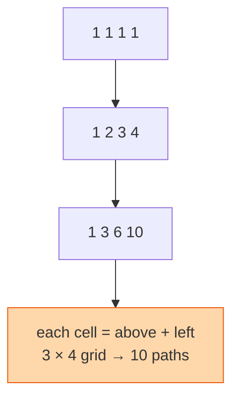

## The question

A grid has `m` rows and `n` columns. A robot starts at the top-left and can only move right or down. How many different paths reach the bottom-right corner?

## Explain it to a ten-year-old

A city with straight streets in a grid. You can only walk east or south. How many different routes to the shop at the far corner? Stand at any corner and ask: how did I get here? Either from the corner above me or from the corner to my left. So the number of ways to reach this corner is the number of ways to reach the one above plus the number of ways to reach the one on the left. Along the top edge and the left edge there is only one way, straight along. Fill in the rest square by square.



## The trick

`ways(r, c) = ways(r-1, c) + ways(r, c-1)`, with the first row and first column all equal to one. You can keep the whole grid, or notice that each row only depends on the row above and keep a single row. There is also a closed formula from combinatorics, choose `m-1` downs out of `m+n-2` moves, and I like it when you mention it, but I want to see the table.

## The steps

1. `row = [1] * n`.
2. For each of the remaining `m-1` rows: for each column `c` from 1 to `n-1`, `row[c] += row[c-1]`.
3. Return `row[-1]`.

```python
def unique_paths(m, n):
    row = [1] * n
    for _ in range(1, m):
        for c in range(1, n):
            row[c] += row[c - 1]
    return row[-1]
```

Time O(m × n). Space O(n) with one row.

## What I am listening for

- Can you say what the cell means before writing the loop. "Number of ways to reach this cell."
- The edges. Why are they one and not zero.
- The follow-up: some cells are blocked. Same table, blocked cells are zero. If you understood the cell meaning, this takes ten seconds.


- **Cell = above + left.** Edges are all one.
- **Keep one row.** Each row only needs the previous.
- **Obstacles are zeros.** Same table.


## Go deeper

- The counting behind the closed formula: [Lattice path on Wikipedia](https://en.wikipedia.org/wiki/Lattice_path)
- The problem statement: [Unique Paths on LeetCode](https://leetcode.com/problems/unique-paths/)

**With AI on the table.** The tool will reach for the binomial formula. I ask what happens to that formula when I add obstacles. It does not survive. The table does. Knowing which tool to keep is the skill.
