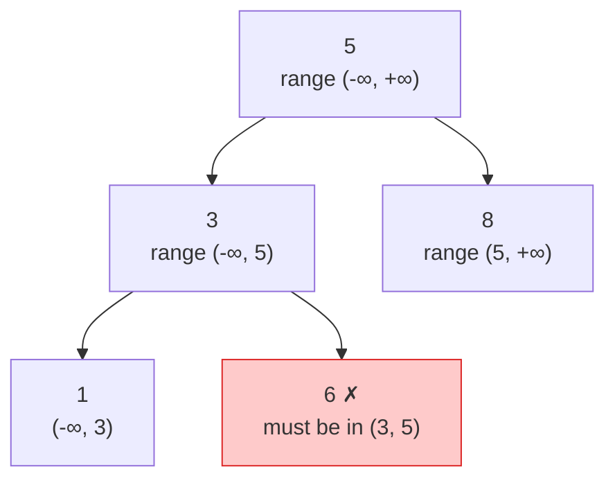

## The question

You are given the root of a binary tree. Return true if it is a valid binary search tree: every node is greater than all nodes in its left subtree and less than all nodes in its right subtree.

## Explain it to a ten-year-old

A sorting game. Numbers hang on a tree. The rule is: go left for smaller, go right for bigger, all the way from the top. The mistake everyone makes is checking only a node against its own two children. That is not enough. A grandchild on the left side can be bigger than the grandparent even if it is smaller than its own parent. So instead of comparing to parents, give every node a note that says "you must be between these two numbers". Pass the note down, tightening it at each step.



## The trick

Carry a lower and upper bound. The root can be anything. Going left, the upper bound becomes the parent's value. Going right, the lower bound becomes the parent's value. A node is valid if it sits strictly inside its range. The other trick: an in-order walk of a valid tree produces a sorted list. Both work, the range one is easier to explain.

## The steps

1. `check(node, low, high)`: if node is empty, return true.
2. If `node.val <= low` or `node.val >= high`, return false.
3. Return `check(left, low, node.val) and check(right, node.val, high)`.
4. Start with `low = -infinity`, `high = +infinity`.

```python
def is_bst(root):
    def check(node, low, high):
        if not node:
            return True
        if not (low < node.val < high):
            return False
        return check(node.left, low, node.val) and check(node.right, node.val, high)
    return check(root, float("-inf"), float("inf"))
```

Time O(n). Space O(h) for the stack.

## What I am listening for

- The child-only check. If you write it, I draw the counterexample and wait.
- Duplicates. Strict or not strict? Ask me. The question usually says strict.
- Whether you know the in-order alternative and can say why it also works.


- **Pass a range down, not a parent up.**
- **Left tightens the top. Right tightens the bottom.**
- **In-order walk of a BST is sorted.** Second way to check.


## Go deeper

- The structure and its rules: [Binary search tree on Wikipedia](https://en.wikipedia.org/wiki/Binary_search_tree)
- Play with one: [VisuAlgo BST visualiser](https://visualgo.net/en/bst)

**With AI on the table.** The tool writes the range version. I ask what happens when a node holds the largest possible integer and your bounds are integers too. The answer is "use None as the bound" or "use floats", and it is a question about the code, not the algorithm.
