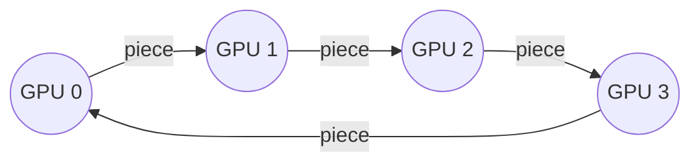

## The question

Eight GPUs each computed a gradient for their slice of the batch. Every GPU needs the sum of all eight. How do they do it, and what does it cost?

## Explain it to a ten-year-old

Eight children sit in a circle, each holding a number. Everyone needs to know the total. The slow way: each child shouts their number to all seven others, that is a lot of shouting. The clever way: cut each number into eight pieces. Pass your first piece to the child on your right, who adds it to their own first piece and passes the sum on. After seven passes, every piece has gone all the way round and one child holds the complete total for that piece. Then go around once more, just handing the finished totals along. Fourteen passes and everyone has everything, and nobody ever shouted.

*Four GPUs shown. Reduce-scatter takes N-1 passes, all-gather takes N-1 more. Each GPU sends about twice its data in total, however big N gets.*

## The trick

Ring all-reduce is bandwidth optimal: each GPU sends about twice its data no matter how many GPUs there are. The price is latency: 2×(N-1) steps, and every step waits for the slowest link. That is why a single degraded cable in a cluster of a thousand GPUs makes all thousand slow. The ring only moves as fast as its worst hop.

## The steps

1. **Reduce-scatter.** Split the buffer into N chunks. In N-1 steps, pass and add, until each GPU owns the fully reduced version of one chunk.
2. **All-gather.** In N-1 more steps, pass the finished chunks around until everyone has all of them.
3. **Cost.** Data sent per GPU is 2×(N-1)/N × size. Time is that divided by link bandwidth, plus 2×(N-1) × per-step latency.
4. **Tree instead of ring.** For small messages latency dominates, so NCCL uses a tree: log N steps. For big messages, the ring. NCCL picks per message size; you can force it and you should know how to.
5. **Inside the box versus across the network.** Inside one server the GPUs talk over NVLink, hundreds of gigabytes per second. Across servers they talk over RDMA on the east-west network, tens of gigabytes per second. NCCL builds rings that go around inside the box first and cross the network as few times as it can.

## What I am listening for

- Can you draw the ring and say "reduce-scatter then all-gather" without looking anything up.
- Do you know why the slowest link sets the pace. This is the whole reason fleet health matters.
- Do you know that all-reduce is the training collective, and that inference mostly uses different ones (all-to-all for mixture of experts). Different traffic, different network.


- **Ring: reduce-scatter, then all-gather.** 2×(N-1) steps.
- **Bandwidth optimal.** Each GPU sends about 2× its data, whatever N is.
- **Slowest link sets the pace.** One bad cable, a thousand slow GPUs.
- **Tree for small messages, ring for big.** NCCL chooses.


**With AI on the table.** The assistant recites the algorithm. I hand you an NCCL test output where bus bandwidth is 60 percent of what the spec sheet says and ask what you check first. The answer is a specific link, not a specific formula.

## Go deeper

- [NCCL User Guide](https://docs.nvidia.com/deeplearning/nccl/user-guide/docs/index.html). The collective operations chapter has the diagrams.
- [The Complete NCCL Reference Guide](/posts/nccl-complete-reference-guide/). My own long version, with commands and error tables.
