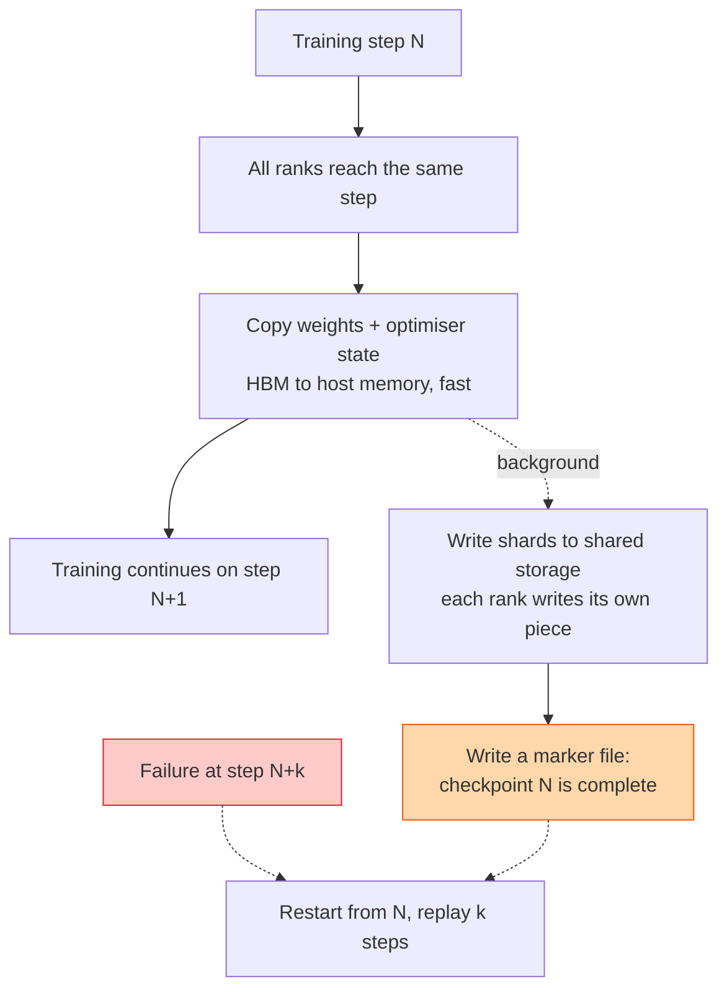

## The question

A training job runs for weeks on a thousand GPUs. Something will fail. How do you save progress so a failure costs minutes, not days, without the saving itself slowing the job down?

## Explain it to a ten-year-old

You are building an enormous Lego castle over a month. Your little brother knocks it over sometimes. So every so often you take a photo of exactly where every brick is. When it falls, you rebuild from the last photo instead of from nothing. Take photos too rarely and you lose a whole afternoon. Take them too often and you spend all day taking photos. And the photo has to be of the whole castle at one moment, not half before the wobble and half after.

## The trick

Make the checkpoint asynchronous and sharded. Every rank copies its own slice of the state to host memory in a few seconds, then training carries on while a background thread writes that slice to storage. The GPUs stop for seconds, not minutes. The marker file at the end is what makes a checkpoint real; without it, a half-written one looks complete.

## The steps

1. **What to save.** Weights, optimiser state, the data loader position, the random seeds, and the step number. Optimiser state is often twice the size of the weights. People forget it and cannot resume exactly.
2. **How big.** A large model with its optimiser state runs to terabytes. Multiply by the number of checkpoints kept.
3. **How often.** The maths: time between checkpoints should be about the square root of two times the checkpoint cost times the mean time between failures. In practice, every thirty to sixty minutes on a big job.
4. **Sharded writes.** Each rank writes its own piece in parallel. A thousand writers hitting one filesystem is a storage design question, so the storage team is in the room.
5. **Asynchronous.** Snapshot to host memory, resume training, write in the background. The stall drops from minutes to seconds.
6. **Atomic.** Write to a temporary path, then write a small marker file last. A resume looks for the newest marker, never the newest directory.
7. **Resume.** A new set of nodes, possibly a different count, loads the shards. Re-sharding on load is what makes elastic training possible.

## What I am listening for

- Whether optimiser state appears. It is the tell that you have resumed a real job.
- Whether you know why the marker file matters. Partial checkpoints are how people lose a week.
- The frequency question. "Often" is not an answer. A formula or a rule of thumb is.


- **Save weights, optimiser, loader position, seeds, step.**
- **Snapshot to host, write in the background.** Seconds, not minutes.
- **Sharded writes, marker file last.** No marker, no checkpoint.
- **Interval ≈ √(2 × cost × MTBF).**


## Go deeper

- [ZeRO paper](https://arxiv.org/abs/1910.02054), which explains why optimiser state dominates the bytes.
- [PyTorch distributed docs](https://pytorch.org/docs/stable/distributed.html), the distributed checkpoint section.

**With AI on the table.** The assistant will produce a checkpoint routine. I ask how you know the checkpoint from step 4000 is actually loadable before you delete step 3000. If your answer is "we trust it", we talk about the week that trust costs.
