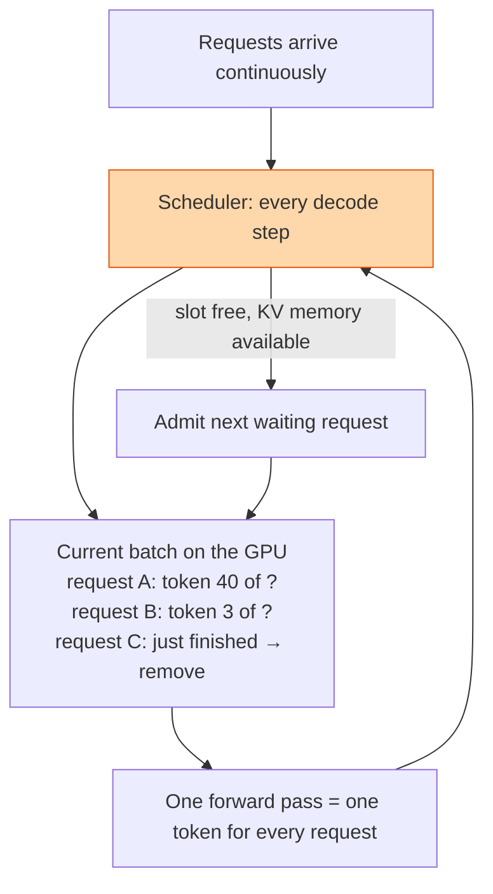

## The question

You are serving a language model to thousands of users. Each request generates a different number of tokens. How do you keep the GPU full without making short requests wait for long ones?

## Explain it to a ten-year-old

A bus goes round the town in a loop, one stop per minute. The old way: the bus waits at the depot until it is full, drives the whole loop, comes back, and only then lets new people on. Anyone who wanted to get off at the second stop had to ride the whole way round. The new way: at every stop, people who have arrived get off and people waiting get on. The bus is always nearly full and nobody rides further than they need to.

## The trick

Schedule at the granularity of one token step, not one request. After every forward pass, remove the requests that emitted an end token and admit new ones into the freed slots. The batch is always full, so the GPU's weight reads are shared across many users, and a short request never waits behind a long one. The limit on batch size is KV cache memory, not compute.

## The steps

1. **Why batching at all.** One token for one user reads all the weights from HBM for a tiny amount of maths. Memory bound. Serve 64 users in one pass and the weights are read once for all of them. Throughput goes up almost 64 times.
2. **Static batching's problem.** Wait for 64 requests, run until all finish. The last one to finish holds the others' slots idle. Utilisation collapses as lengths diverge.
3. **Continuous batching.** After each step, check for finished requests, free their KV cache, admit waiting requests. Iteration-level scheduling.
4. **Prefill versus decode.** A new request's prompt is processed in one big compute-heavy pass, then decode is one token at a time. Mixing prefill for a new request into a decode batch delays everyone else's token. Chunk the prefill, or run it on separate GPUs.
5. **Memory is the limit.** Each admitted request needs KV cache for its full possible length. Paged attention allocates it in blocks on demand so you admit by actual usage, not reserved worst case.
6. **Metrics.** Time to first token, time per output token, and tokens per second per GPU. The scheduler trades the first two against the third.

## What I am listening for

- Whether you know inference decode is memory bound and why batching fixes it.
- The prefill and decode distinction. Most candidates treat them as the same work.
- What limits the batch size. If you say compute, we go back to the KV cache lesson.


- **Decode is memory bound.** Batch to share the weight reads.
- **Schedule per token step, not per request.** Admit and evict every iteration.
- **Prefill and decode are different work.** Do not let one stall the other.
- **KV memory sets the batch size.** Page it.


## Go deeper

- [PagedAttention / vLLM paper](https://arxiv.org/abs/2309.06180), the memory side that makes continuous batching work.
- [vLLM documentation](https://docs.vllm.ai/), a serving engine that does everything on this page.
- [Size the KV Cache](/teach/gpu-ai/size-the-kv-cache/), the arithmetic behind step five.

**With AI on the table.** The assistant will describe continuous batching from the paper. I ask what happens to time-to-first-token for a user who sends a 30,000-token prompt while 60 users are mid-generation, and what knob you turn. The knob has a cost. Name it.
