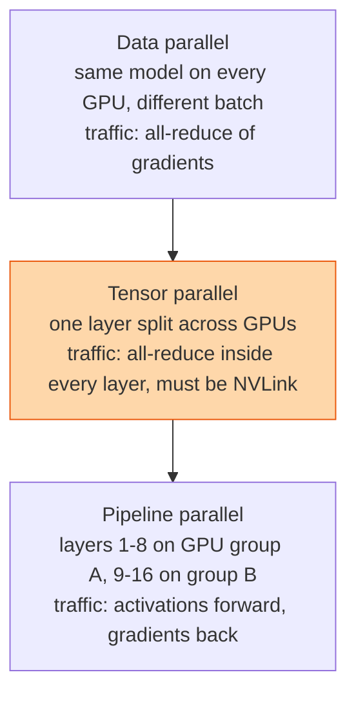

## The question

A model does not fit on one GPU, or it fits but training would take a year. How do you spread it across a thousand GPUs, and what does each choice cost?

## Explain it to a ten-year-old

A thousand children have to paint the same enormous picture from the same instructions. Way one: everyone paints their own small copy, then they compare and average. That is data parallel. Way two: the picture is cut into strips and each child paints one strip, passing the canvas along. That is pipeline parallel. Way three: each brushstroke is so big it takes several children holding the same brush. That is tensor parallel. Real jobs use all three at once, and the trick is choosing which children sit next to each other.

## The trick

Each kind of parallelism generates a different traffic pattern, and the traffic pattern decides where the GPUs must sit. Tensor parallel talks constantly and must stay inside an NVLink domain. Pipeline parallel talks in bursts between neighbours and can cross servers. Data parallel does one big all-reduce per step and is the most forgiving. Map the chatty one to the fast link and the rest falls out.

## The steps

1. **Data parallel.** Copy the model everywhere. Each GPU trains on its own slice of the batch. Once per step, all-reduce the gradients so every copy stays identical. Simple, scales far, but every GPU must hold the whole model.
2. **ZeRO and sharded data parallel.** Same idea, but the optimiser state and weights are sharded across GPUs and gathered when needed. Cuts memory per GPU by the number of GPUs. Costs extra collectives.
3. **Tensor parallel.** Split a single matrix multiply across, say, 8 GPUs. Each computes part of the output, then they all-reduce to combine. Happens inside every layer, so it must be on NVLink. Rarely spans more than one server.
4. **Pipeline parallel.** Give each group of GPUs a range of layers. Activations flow forward, gradients back. The cost is the bubble: the first group waits while the last one finishes. Micro-batches shrink the bubble.
5. **3D parallelism.** Tensor inside the box, pipeline across a few boxes, data parallel across the rest. A thousand-GPU job is typically 8 × 8 × 16 or similar.
6. **What the cluster needs.** Tensor parallel wants NVLink. Pipeline wants low latency between neighbours. Data parallel wants raw bandwidth across the whole fabric. The network lesson and this one are the same lesson.

## What I am listening for

- Can you name the collective each strategy uses. All-reduce, all-gather, point-to-point. That tells me you have watched one run.
- Whether you know why tensor parallel does not cross the box.
- Whether "bubble" comes up for pipelines without a prompt.


- **Data: split the batch. Tensor: split the layer. Pipeline: split the layers.**
- **Tensor parallel lives on NVLink.** Chattiest of the three.
- **Pipeline has a bubble.** Micro-batches shrink it.
- **Traffic pattern decides placement.**


## Go deeper

- [Megatron-LM paper](https://arxiv.org/abs/1909.08053), where tensor parallelism for transformers was laid out.
- [ZeRO paper](https://arxiv.org/abs/1910.02054), sharded optimiser state and why it matters for memory.
- [PyTorch distributed docs](https://pytorch.org/docs/stable/distributed.html).

**With AI on the table.** The assistant explains all three beautifully. I give you 512 GPUs in 64 servers and a model that needs 4 GPUs just to hold one layer, and ask you to write the three numbers of the 3D split and say which links each one uses. Then I break one NVLink and ask what changes.
