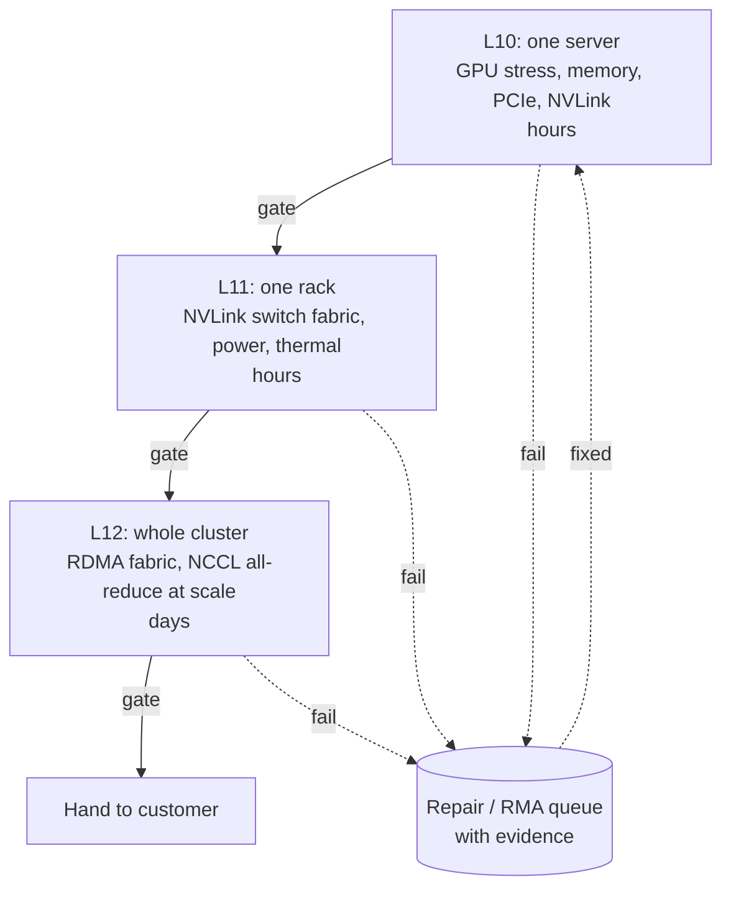

## The question

You are handed a new cluster: hundreds of servers, thousands of GPUs, fresh from the factory. Design the process that decides it is ready to give to a customer.

## Explain it to a ten-year-old

You bought a thousand torches for a camping trip. Some will not turn on. Some turn on and die after ten minutes. Some are fine alone but flicker when you put them in the big lantern with seven others. You do not find out on the mountain at night. You check each torch, then each lantern, then the whole camp with every lantern on, and you write down what failed and why. A torch that fails goes in a box marked "return", not back in the pile.

## The trick

Levels with gates. Each level tests one thing that the level below could not: a server alone cannot tell you the rack's switch fabric is bad, and a rack alone cannot tell you the cluster network has a slow link. The gate is a written pass rule, not a feeling. Anything that fails a gate goes back to the start with its evidence attached, never forward.

## The steps

1. **L10, the server.** Every GPU under sustained load for hours. Memory tests. PCIe link width and speed. NVLink between the GPUs in the box. Thermal and power within limits. Error counters (XID, ECC) at zero at the end.
2. **L11, the rack.** All servers in the rack together. The NVLink switch fabric if it is a rack-scale design. Power draw at full load. Firmware version identical on every host, GPU, and switch, because a mismatch here becomes a mystery slowdown later.
3. **L12, the cluster.** Every link on the east-west fabric at line rate. All-reduce across the whole cluster within a few percent of the theoretical number. Run it long enough to catch the part that fails after six hours.
4. **The pipeline.** Automation drives it, not people. Each stage emits a structured result. A dashboard shows what is in which stage. Anything that has been in a stage too long is a page.
5. **The stop rule.** Each gate has a threshold: this many GPUs failing, this much below expected bandwidth, this many errors. Written down before the run. Otherwise you will argue with yourself at 2am.
6. **Evidence.** Every failure carries the logs, counters, and the exact command that found it. The repair team should never have to rerun the test to believe you.

## What I am listening for

- Do you go straight to "run a big training job and see"? That finds the bad part last and most expensively.
- Do you name the gate as a written threshold, and do you know what a healthy number looks like.
- Do you separate the repair loop from the test loop. A failed part must not block the rest of the cluster from moving on.


- **Levels: server, rack, cluster.** Each finds what the last could not.
- **Gates are written thresholds**, decided before the run.
- **Fail fast, on your time.** Back to the start with evidence, never forward.
- **Firmware must match everywhere.** Mismatch is tomorrow's mystery.


**With AI on the table.** The assistant will list the tools. I give you a real summary: 98 percent of GPUs pass, 2 percent fail with the same memory error, all on servers from one delivery pallet. What do you do with the 98 percent? The template says ship. The job says wait.

## Go deeper

- [GPU Burn-In at Scale](/posts/gpu-burn-in-at-scale-reference-guide/). The full reference version of this lesson, with the commands.
- [NVIDIA DCGM documentation](https://docs.nvidia.com/datacenter/dcgm/latest/). The diagnostics levels map onto the gates here.
