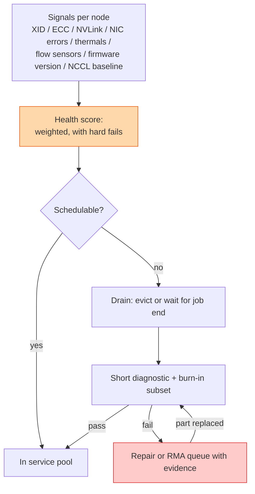

## The question

Design the system that decides, for every node in a GPU fleet of tens of thousands, whether it is healthy enough to run a customer job, and that gets unhealthy nodes repaired and back into service without a human per ticket.

## Explain it to a ten-year-old

A school has a thousand bicycles. Every morning, before lending them out, someone must know which ones are safe. Checking every bike by hand takes all day. So each bike gets a little card: tyres, brakes, chain, lights, each ticked or crossed. One cross on brakes means the bike goes to the shed. Bikes in the shed get fixed, ridden round the yard once to prove it, and go back on the rack. The number the headteacher cares about is how many bikes were lendable today, not how many crosses there were.

## The trick

Separate the signal from the decision. Signals are many, noisy, and per component. The decision is one bit per node: schedulable or not. Between them sits a score with a few hard-fail rules (any uncorrectable ECC, any NVLink down, firmware mismatch) and a weighted sum for the soft ones. Then the loop: nothing returns to the pool without passing the same test that would have caught its fault. Usable compute, the fraction of the fleet that is both healthy and allocatable, is the number you report.

## The steps

1. **Collect.** An agent per node exports GPU counters, NIC counters, link state, thermal and flow telemetry, and firmware versions. Structured, timestamped, into the metrics pipeline.
2. **Score.** Hard fails first. Then weights on soft signals: corrected ECC rate, PCIe replays, temperature headroom, days since last burn-in. Tunable, versioned, and the reason for every score is stored alongside it.
3. **Gate.** The scheduler reads one bit. Nodes below the line are drained: current job allowed to finish or evicted based on severity, then the node leaves the pool.
4. **Diagnose.** A short automated test suite. GPU stress, memory, NVLink, a pairwise NCCL test against a known-good neighbour. Twenty minutes, not a day.
5. **Repair.** Reset first, it fixes more than people expect. Then a firmware reflash. Then a part swap with the evidence bundle attached. Every step logged against the node.
6. **Prove.** The repaired node runs the same diagnostic before it returns. Passing it twice in a row after a part swap is the rule.
7. **Measure.** Usable compute: healthy and schedulable divided by total. Time in repair per node. Repeat-offender nodes. Those three numbers run the fleet.

## What I am listening for

- Whether you have one number the scheduler reads, or you make the scheduler interpret fifty signals.
- Whether repaired nodes are re-tested before return. Trusting a repair is how the same node comes back three times.
- Whether "usable compute" or its equivalent is the headline. Ticket counts are not a health metric.


- **Many signals, one decision.** Hard fails plus a weighted score.
- **Drain, diagnose, repair, prove, return.** Nothing returns untested.
- **Reset first, firmware second, swap third.**
- **Report usable compute**, not ticket counts.


## Go deeper

- [DCGM documentation](https://docs.nvidia.com/datacenter/dcgm/latest/), the health checks the agent runs.
- [NVIDIA XID errors reference](https://docs.nvidia.com/deploy/xid-errors/index.html), the hard-fail list starts here.
- [GPU Faults: XID, ECC, and What They Mean](/teach/gpu-ai/gpu-fault-taxonomy/) and [Design a Burn-In Pipeline](/teach/gpu-ai/design-a-burn-in-pipeline/), the two lessons this one is built on.

**With AI on the table.** The assistant will design the scoring system. I ask what you do when the score says healthy and the customer says slow. One of them is wrong, and the answer to which is a lesson of its own.
