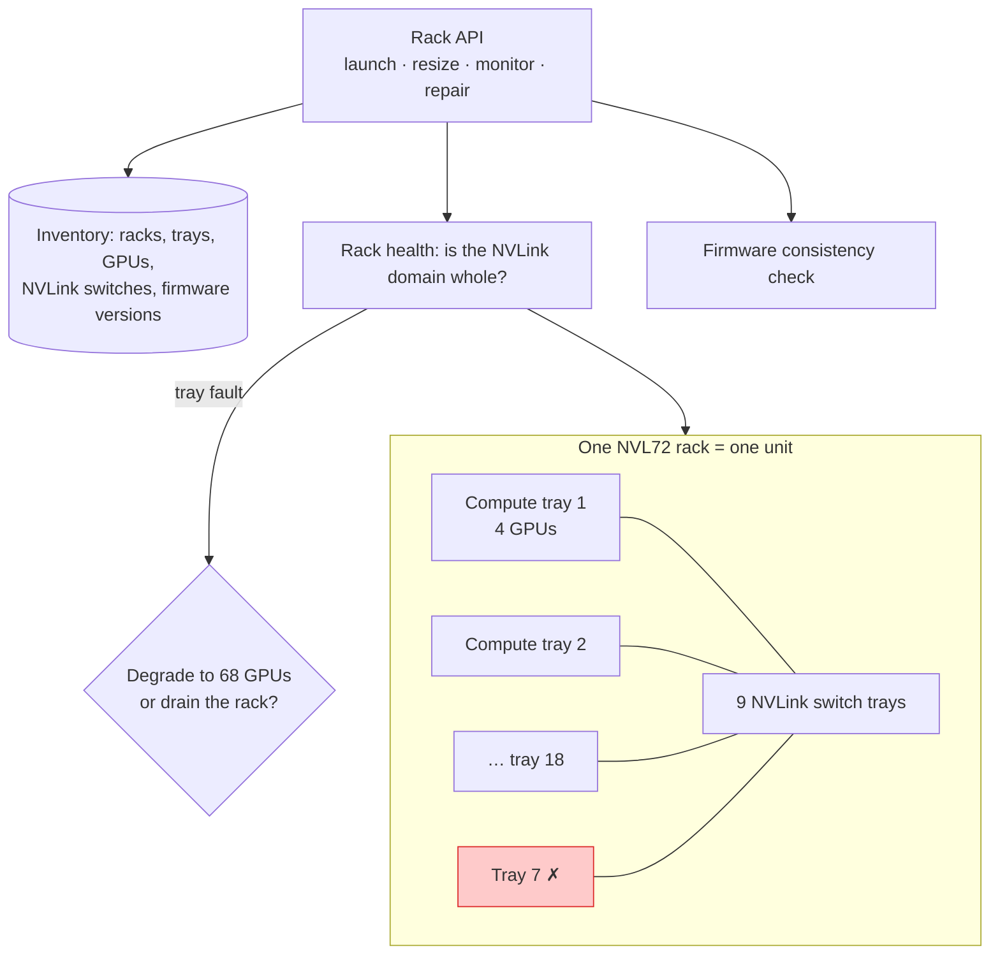

## The question

A rack holds 18 compute trays with 4 GPUs each, joined by 9 NVLink switch trays so that all 72 GPUs share memory at full speed. Customers want to launch, resize, monitor, and repair this as a single unit. Design the control plane.

## Explain it to a ten-year-old

Before, a data centre was a warehouse of separate computers. You could take one out and the others did not care. Now imagine 72 children holding hands in a circle so tightly that they play as one giant child. If one lets go, the circle is broken and the giant limps. So you stop thinking about children and start thinking about circles. You count circles, you check whether a circle is whole, and when one child is sick you decide: does the whole circle sit out, or does it play a little smaller?

## The trick

Change the unit. Every other layer of the system, the inventory, the scheduler, the health checker, the repair queue, the customer API, was built around the server. Now the smallest useful thing is the rack, and the smallest failure domain is also the rack, because a fault on one tray or one switch breaks the NVLink domain for all 72. Design every layer around that unit and the rest is plumbing.

## The steps

1. **Inventory.** Model the rack as a first-class object with trays, GPUs, and switch trays as children. Firmware version on every one of them is part of the record, not a detail.
2. **Launch.** The customer asks for a rack, not for 18 servers. The control plane finds a rack whose NVLink domain is whole, whose firmware matches across every component, and hands it over as one.
3. **Health.** A rack is healthy only if the whole domain is. Poll every tray and switch. One tray down changes the rack's state, not just the tray's. Surface that to the customer as one number.
4. **Repair.** Two policies and the customer picks. Degrade: keep running on 68 GPUs, mark the tray for repair, tell the customer their job is slower. Drain: move the workload, take the rack out, fix it, bring it back whole.
5. **Resize.** Adding capacity means adding racks, not servers. The API talks in racks. Multi-rack jobs cross the RDMA fabric, the same east-west network as before, so the rack boundary is also a bandwidth boundary.
6. **Firmware.** Enforce version consistency at launch and at repair. A rack with one tray on a different version passes every single-tray test and then fails under load in a way that takes a week to find.

## What I am listening for

- Whether you say "failure domain" and what you say it is. Server is the wrong answer here.
- Whether the degrade-or-drain choice comes up before I prompt it. It is the whole design decision.
- Whether firmware appears anywhere in your design. It should be near the top.


- **The unit is the rack.** Launch it, monitor it, repair it as one.
- **Failure domain is the NVLink domain.** One tray breaks 72.
- **Degrade or drain.** Decide the policy before the fault.
- **Firmware consistency is a launch gate**, not a maintenance chore.


**With AI on the table.** The assistant will design the API. I ask what the customer sees during the fifteen minutes between a tray fault and the health checker noticing, and whether their job crashed or just slowed. That gap is where the real design lives.

## Go deeper

- [NVIDIA GB200 NVL72](https://www.nvidia.com/en-us/data-center/gb200-nvl72/). The official page, for the tray and switch counts.
- [Behind the Scenes: Scale Your NVIDIA GB200 NVL72 Deployments with Dedicated OCI APIs](https://blogs.oracle.com/cloud-infrastructure/behind-the-scenes-scale-nvidia-gb200-nvl72-deployments). The Oracle blog post I co-authored on exactly this design.
