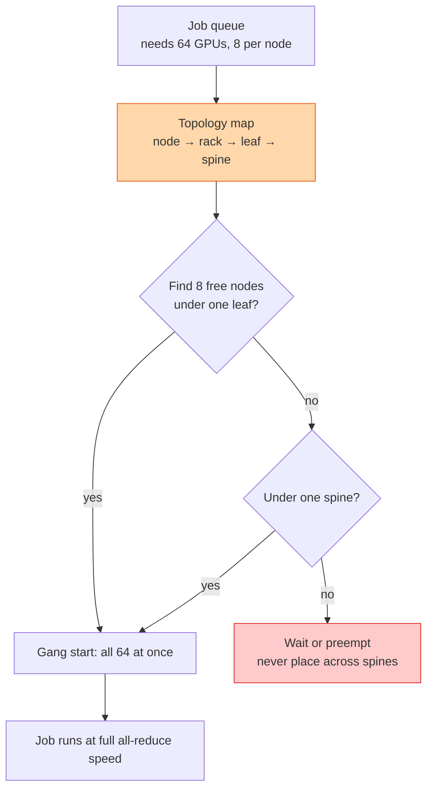

## The question

Design the scheduler that assigns GPUs to training jobs across a cluster of thousands. It must give every job GPUs that are close together on the network, start all of a job's GPUs at once, and keep the cluster full.

## Explain it to a ten-year-old

A teacher seats a class for group work. If she seats a group of eight children across four different tables in four corners of the room, they have to shout across the room to work together. A good teacher knows the room: which tables are next to each other, which are near the door. She seats each group as close as possible, and she never seats half a group and tells the other half to wait. Seven children at a table and one across the hall is worse than no group at all.

## The trick

Give the scheduler the network's shape as data: which nodes share a leaf, which leaves share a spine, which nodes share an NVLink rack. Score every candidate placement by how many network hops the job's collectives will cross. Then two rules: place a job as low in the tree as it fits, and start all of its GPUs together or not at all. A partially started job burns GPUs and finishes nothing.

## The steps

1. **The map.** Inventory records node, rack, leaf, spine, and NVLink domain for every GPU. Regenerated from the network's own view, not typed by hand.
2. **Gang scheduling.** A job's GPUs are one unit. Reserve all or none. Distributed training with 63 of 64 ranks present is a hang, not a slow run.
3. **Placement score.** Prefer one NVLink domain, then one leaf, then one spine. Reject cross-spine placements for jobs above a size, or accept them with a penalty the user can see.
4. **Fragmentation.** Small jobs scattered everywhere leave no contiguous block for big ones. Pack small jobs into the same corner. Bin-packing, not spreading.
5. **Preemption and queues.** Big jobs wait for a block to free up. A reservation system holds nodes as they drain. Without it, big jobs starve behind a stream of small ones.
6. **Health in the loop.** A node with a failed GPU or a degraded link is not free capacity. The scheduler reads the health score before it places anything.
7. **Fairness and quotas.** Per team limits so one group cannot take the whole cluster. Priority for production over experiments.

## What I am listening for

- Gang scheduling, by that name or any other. If you would start ranks as they become free, you have not run a distributed job.
- Whether the topology map is data the scheduler reads, or knowledge in an engineer's head.
- The fragmentation question. Most first designs spread jobs evenly, which is exactly wrong.


- **Give the scheduler the map.** Node, rack, leaf, spine, NVLink domain.
- **Gang: all or none.** 63 of 64 ranks is a hang.
- **Place low in the tree.** Never across spines for big jobs.
- **Pack, do not spread.** Fragmentation starves the big jobs.


## Go deeper

- [Design the Training Network](/teach/gpu-ai/design-the-training-network/), the fabric this scheduler is placing onto.
- [NCCL user guide](https://docs.nvidia.com/deeplearning/nccl/user-guide/docs/index.html), how NCCL discovers the topology it is given.

**With AI on the table.** The assistant designs the scheduler. I give you a cluster that is 70 percent busy with 4-GPU experiments and a 512-GPU production job that has waited six hours, and ask what you change. There is no clean answer, only a policy you can defend.
