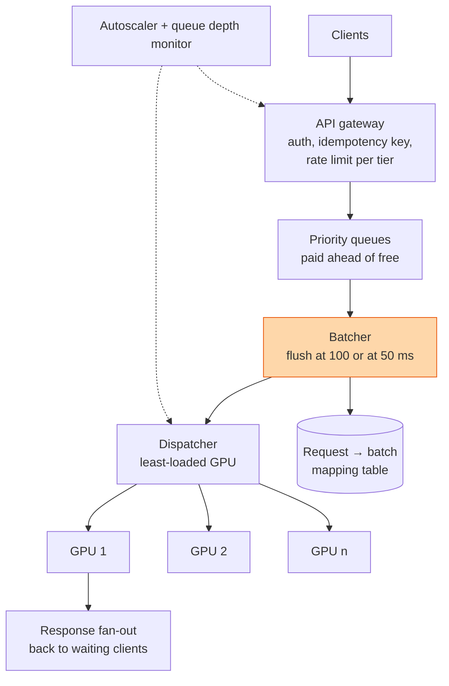

## The question

Design the API in front of a large language model. Users send a prompt and wait for the answer, some streaming, some not. Behind the API is a pool of GPUs running model replicas. Batch requests so the GPUs stay busy, keep tail latency bounded, tier free and paid users, survive a GPU dying mid-batch, and say how many GPUs you need for ten thousand requests a second.

This question comes in two costumes. The open one is the whole serving stack: continuous batching, KV cache, prefill against decode, autoscaling. The narrow one hands you a GPU function you cannot change and asks you to design only the dispatch layer around it:

```python
def batchstring(inputs: list[str]) -> list[str]: ...
# You CANNOT change any of these:
# - 1 <= len(inputs) <= 100 strings per batch
# - exactly one output per input, same order
# - ~100 ms per batch, FIXED, does not depend on batch size
# - each GPU runs exactly ONE batch at a time
```

Client calls are synchronous HTTP with a 500 ms P95 budget end to end. Be ready for 100 requests a second and for 10,000. And there is a follow-up that shows up in both costumes: the pool is fixed at eight GPUs, one model needs a single GPU per batch, the other needs all eight at once. Write the scheduler.

## Explain it to a ten-year-old

There is a ferry across a river. The crossing takes ten minutes whether one person is aboard or a hundred, and the boat holds a hundred. You are the person at the dock deciding when it leaves.

If you wait until it is full, the first person aboard on a quiet morning waits an hour. If you send it the moment anyone arrives, you run a hundred crossings to carry a hundred people and the queue on the bank grows forever. So you make a rule: leave when the boat is full, or when the first person aboard has waited one minute, whichever comes first. On a quiet morning the minute rule fires and a few people cross. At rush hour the boat fills in seconds and the full rule fires. That rule is the whole design, and everything else, how many ferries, who boards first, what happens if a ferry breaks down mid-river, is built on top of it.



Here is the dock rule as a picture. Six slots stand in for a hundred. Watch the timer bar against the queue:

<div class="ba" aria-label="Animation: a batcher flushes when its queue is full or when a timer expires, whichever comes first">
  <div class="ba-q"><span class="ba-lbl">pending</span><span class="ba-s0">req</span><span class="ba-s1">req</span><span class="ba-s2">req</span><span class="ba-s3">req</span><span class="ba-s4">req</span><span class="ba-s5">req</span></div>
  <div class="ba-timer"><span>50 ms timer</span><div class="ba-bar"><i></i></div></div>
  <div class="ba-steps">
    <span class="ba-l0">quiet hour: two requests trickle in, the timer runs</span>
    <span class="ba-l1">timer fires → flush a batch of 2 → GPU busy 100 ms</span>
    <span class="ba-l2">rush hour: requests arrive faster than the timer</span>
    <span class="ba-l3">queue full → flush a batch of 100, timer still had time left</span>
  </div>
  <p class="ba-cap">Orange means "handed to a GPU". At low load the timer sets your latency. At high load the batch size sets your throughput.</p>
</div>
<style>
.ba { --t: 9s; margin: 1.25rem 0 1.75rem; font-family: ui-monospace, SFMono-Regular, Menlo, monospace; }
.ba-q { display: flex; gap: 0.4rem; align-items: center; flex-wrap: wrap; }
.ba-q > span { width: 3.2rem; height: 2.6rem; display: grid; place-items: center; border: 2px dashed #94a3b8; border-radius: 0.35rem; font-size: 0.85rem; animation: none var(--t) steps(1, end) infinite; }
.ba-q .ba-lbl { width: auto; height: auto; border: 0; font-size: 0.85rem; opacity: 0.7; margin-right: 0.4rem; }
.ba-timer { margin-top: 0.7rem; display: flex; align-items: center; gap: 0.6rem; font-size: 0.85rem; }
.ba-bar { position: relative; width: 16rem; height: 0.6rem; border: 1px solid #94a3b8; border-radius: 0.3rem; overflow: hidden; }
.ba-bar > i { position: absolute; left: 0; top: 0; bottom: 0; width: 0; background: #ea580c; animation: ba-timer var(--t) linear infinite; }
.ba-steps { display: flex; flex-direction: column; gap: 0.15rem; margin-top: 0.9rem; font-size: 0.95rem; }
.ba-steps > span { opacity: 0.35; animation: none var(--t) steps(1, end) infinite; }
.ba-cap { font-size: 0.85rem; opacity: 0.7; margin: 0.6rem 0 0; }
.ba-q .ba-s0 { animation-name: ba-s0; }
@keyframes ba-s0 { 0.00%, 11.06% { border-style: dashed; border-color: #94a3b8; background: transparent; color: transparent; } 11.11%, 38.83% { border-style: solid; border-color: #0f766e; background: rgba(153, 246, 228, 0.45); color: inherit; } 38.89%, 44.39% { border-style: solid; border-color: #ea580c; background: rgba(254, 215, 170, 0.6); color: inherit; } 44.44%, 49.94% { border-style: dashed; border-color: #94a3b8; background: transparent; color: transparent; } 50.00%, 66.61% { border-style: solid; border-color: #0f766e; background: rgba(153, 246, 228, 0.45); color: inherit; } 66.67%, 73.28% { border-style: solid; border-color: #ea580c; background: rgba(254, 215, 170, 0.6); color: inherit; } 73.33%, 99.94% { border-style: dashed; border-color: #94a3b8; background: transparent; color: transparent; } }
.ba-q .ba-s1 { animation-name: ba-s1; }
@keyframes ba-s1 { 0.00%, 22.17% { border-style: dashed; border-color: #94a3b8; background: transparent; color: transparent; } 22.22%, 38.83% { border-style: solid; border-color: #0f766e; background: rgba(153, 246, 228, 0.45); color: inherit; } 38.89%, 44.39% { border-style: solid; border-color: #ea580c; background: rgba(254, 215, 170, 0.6); color: inherit; } 44.44%, 53.28% { border-style: dashed; border-color: #94a3b8; background: transparent; color: transparent; } 53.33%, 66.61% { border-style: solid; border-color: #0f766e; background: rgba(153, 246, 228, 0.45); color: inherit; } 66.67%, 73.28% { border-style: solid; border-color: #ea580c; background: rgba(254, 215, 170, 0.6); color: inherit; } 73.33%, 99.94% { border-style: dashed; border-color: #94a3b8; background: transparent; color: transparent; } }
.ba-q .ba-s2 { animation-name: ba-s2; }
@keyframes ba-s2 { 0.00%, 56.61% { border-style: dashed; border-color: #94a3b8; background: transparent; color: transparent; } 56.67%, 66.61% { border-style: solid; border-color: #0f766e; background: rgba(153, 246, 228, 0.45); color: inherit; } 66.67%, 73.28% { border-style: solid; border-color: #ea580c; background: rgba(254, 215, 170, 0.6); color: inherit; } 73.33%, 99.94% { border-style: dashed; border-color: #94a3b8; background: transparent; color: transparent; } }
.ba-q .ba-s3 { animation-name: ba-s3; }
@keyframes ba-s3 { 0.00%, 59.94% { border-style: dashed; border-color: #94a3b8; background: transparent; color: transparent; } 60.00%, 66.61% { border-style: solid; border-color: #0f766e; background: rgba(153, 246, 228, 0.45); color: inherit; } 66.67%, 73.28% { border-style: solid; border-color: #ea580c; background: rgba(254, 215, 170, 0.6); color: inherit; } 73.33%, 99.94% { border-style: dashed; border-color: #94a3b8; background: transparent; color: transparent; } }
.ba-q .ba-s4 { animation-name: ba-s4; }
@keyframes ba-s4 { 0.00%, 63.28% { border-style: dashed; border-color: #94a3b8; background: transparent; color: transparent; } 63.33%, 66.61% { border-style: solid; border-color: #0f766e; background: rgba(153, 246, 228, 0.45); color: inherit; } 66.67%, 73.28% { border-style: solid; border-color: #ea580c; background: rgba(254, 215, 170, 0.6); color: inherit; } 73.33%, 99.94% { border-style: dashed; border-color: #94a3b8; background: transparent; color: transparent; } }
.ba-q .ba-s5 { animation-name: ba-s5; }
@keyframes ba-s5 { 0.00%, 66.61% { border-style: dashed; border-color: #94a3b8; background: transparent; color: transparent; } 66.67%, 73.28% { border-style: solid; border-color: #ea580c; background: rgba(254, 215, 170, 0.6); color: inherit; } 73.33%, 99.94% { border-style: dashed; border-color: #94a3b8; background: transparent; color: transparent; } }
@keyframes ba-timer { 0%, 11.11% { width: 0; } 38.89%, 44.44% { width: 100%; } 44.50%, 50.00% { width: 0; } 66.67% { width: 60%; } 73.33% { width: 60%; } 73.39%, 100% { width: 0; } }
.ba-steps .ba-l0 { animation-name: ba-l0; }
@keyframes ba-l0 { 0.00%, 11.06% { opacity: 0.35; font-weight: 400; color: inherit; } 11.11%, 38.83% { opacity: 1; font-weight: 700; color: #ea580c; } 38.89%, 99.94% { opacity: 0.35; font-weight: 400; color: inherit; } }
.ba-steps .ba-l1 { animation-name: ba-l1; }
@keyframes ba-l1 { 0.00%, 38.83% { opacity: 0.35; font-weight: 400; color: inherit; } 38.89%, 49.94% { opacity: 1; font-weight: 700; color: #ea580c; } 50.00%, 99.94% { opacity: 0.35; font-weight: 400; color: inherit; } }
.ba-steps .ba-l2 { animation-name: ba-l2; }
@keyframes ba-l2 { 0.00%, 49.94% { opacity: 0.35; font-weight: 400; color: inherit; } 50.00%, 66.61% { opacity: 1; font-weight: 700; color: #ea580c; } 66.67%, 99.94% { opacity: 0.35; font-weight: 400; color: inherit; } }
.ba-steps .ba-l3 { animation-name: ba-l3; }
@keyframes ba-l3 { 0.00%, 66.61% { opacity: 0.35; font-weight: 400; color: inherit; } 66.67%, 99.94% { opacity: 1; font-weight: 700; color: #ea580c; } }
@media (prefers-reduced-motion: reduce) { .ba-q > span, .ba-steps > span, .ba-bar > i { animation: none; } .ba-q > span:not(.ba-lbl) { border-style: solid; border-color: #ea580c; background: rgba(254, 215, 170, 0.6); color: inherit; } .ba-bar > i { width: 60%; } .ba-steps .ba-l3 { opacity: 1; font-weight: 700; color: #ea580c; } }
</style>

## The trick

Everything the GPU function fixes, you stop arguing about. What is left is the fifty milliseconds in front of it, and the arithmetic.

Batch on size or time, whichever comes first. Then do the capacity sum out loud before anyone asks. One GPU runs one batch of up to 100 in 100 ms, so its ceiling is 1,000 requests a second at perfect fill. Ten thousand a second therefore needs ten GPUs as a floor, and a floor is not an answer: at 100 percent utilisation every queue grows without bound, so you run at 60 to 70 percent and add spares, which lands somewhere between 15 and 20. The candidates who stumble on this round stumble because they never wrote that formula down.

In the open costume the trick is the sentence "decode is memory bound", and the rest is the [continuous batching](/teach/gpu-ai/continuous-batching-for-inference/) and [KV cache](/teach/gpu-ai/size-the-kv-cache/) lessons. Name paged attention and in-flight batching together in the first five minutes and the interviewer will follow you into whichever one you know best.

## The steps

One thing about this round cuts against my own [45-minute plan](/teach/system-design-in-a-hurry/): do not walk the generic template. The interviewer skims requirements and API and spends the round on one or two depth areas, usually batching, capacity or rate limiting. So compress steps one and two to three minutes and get to the batcher.

1. **Find out which costume.** Ask what you may change. If the batch function is fixed, continuous batching, autoscaling and even rate limiting may be ruled out, and the entire round lives in the dispatch layer. If it is the open question, ask for the model size, the context length and whether the traffic is chat or batch. Ask whether the client waits or polls.
2. **Write the budget.** 500 ms P95. Spend it: up to 50 ms waiting in the batcher, 100 ms on the GPU, a few tens of milliseconds in queues and network, and keep about 200 ms back. That reserve is not slack. It is exactly one retry after a GPU dies mid-batch, and saying so is what turns a number into a design.
3. **Do the capacity sum.** Per GPU: batch size divided by batch latency, 100 / 0.1 = 1,000 requests a second. Floor for 10,000: ten GPUs. Then say why you will never see it. Batches do not fill perfectly, requests arrive in bursts, one GPU is always being replaced, and a latency-bounded online service runs well below an offline benchmark's throughput. Target 65 percent and N+2: about 18 GPUs. For 100 requests a second the sum flips. In a 50 ms window you collect five requests, so batches are tiny, one or two GPUs are plenty, and the timer, not the size, is the lever you tune. If the interviewer gives you B achieved requests per batch and C independent batch slots per server, the servers needed are at least 10,000 / (B × C / 0.1). Ask for B and C. Do not assume the eight-GPU model has eight slots. It has one.
4. **Build the batcher.** One in-memory pending list per model. Flush when it reaches 100 or when the oldest entry is 50 ms old. Each request carries a future the HTTP handler awaits. On flush, write the request-to-batch mapping to a table, hand the batch to a GPU, and on return resolve each future in order. Say why 50 and not 100: the timer plus the GPU time must fit under the budget with the retry reserve intact.
5. **Dispatch load-aware.** Round robin and random are the first answer and the interviewer will attack it: two GPUs with unequal queue depth, or one GPU slower than the rest. Route to the GPU with the shortest queue, or use a pull model where an idle GPU takes the next ready batch. The pull model also makes a dead GPU harmless, because it simply stops pulling.
6. **Tier the traffic.** Two priority queues, paid and free, feeding the same batcher. Fill from paid first, top up from free. Under overload the free queue is the shock absorber: it is shed first, its rate limit tightens first, and its timeout is longer.
7. **Survive a GPU dying mid-batch.** The mapping table tells you which requests were in the lost batch. Re-enqueue them at the head of the queue on another GPU. The client's idempotency key, on the user-facing request ID, means a retry from their side does not double-charge or double-generate. Partial batches on flush are fine. A partial batch on failure is the case to walk through.
8. **Handle overload honestly.** GPUs take minutes to start, so autoscaling does not save you in the next thirty seconds. What does is backpressure at the front door: watch queue depth, and when it crosses a line tighten rate limits dynamically, shed free tier, return 429 with a retry-after. The answer I want is throttling tied to observed queue depth, not a static token bucket. A token bucket is a policy. Queue depth is the truth.
9. **Bring GPUs up faster anyway.** Bake the weights into the image or keep them on local NVMe, pull from a regional mirror rather than across the country, keep a warm pool of a few idle nodes paid for as insurance, and pre-load the model before the node joins the pool so the first request does not eat the cold start.
10. **Decide about a cache.** A response cache sounds free and usually is not. Estimate the hit rate: identical prompts are rare in chat and common in classification. If it is under a few percent, say so and leave it out. A defended omission beats a reflex inclusion. A prefix cache of computed KV blocks is a different thing and usually worth it for shared system prompts.
11. **Place the guardrails.** Safety classifiers pre-model on the prompt, post-model on the output, or both. Both costs latency twice. Say where in the budget it lives and whether it runs on the GPU pool or on cheaper hardware beside it.
12. **The eight-GPU follow-up.** Small batches reserve one GPU each. A large batch reserves all eight atomically or not at all. When a large batch is waiting, stop admitting small ones and let the running ones drain, then launch. Bound the wait with aging or fixed turns so neither queue starves. Then say the cost out loud: during the drain, GPUs sit idle, so this policy trades utilisation for fairness and is not throughput-optimal.

Here is step twelve running. Teal is the one-GPU model, purple is the eight-GPU model, dashed is idle:

<div class="eg" aria-label="Animation: eight GPUs run small one-GPU batches, a large eight-GPU batch arrives, admissions stop, the GPUs drain, the large batch runs on all eight, then small batches resume">
  <div class="eg-row"><span class="eg-g0" data-g="GPU 0"></span><span class="eg-g1" data-g="GPU 1"></span><span class="eg-g2" data-g="GPU 2"></span><span class="eg-g3" data-g="GPU 3"></span><span class="eg-g4" data-g="GPU 4"></span><span class="eg-g5" data-g="GPU 5"></span><span class="eg-g6" data-g="GPU 6"></span><span class="eg-g7" data-g="GPU 7"></span></div>
  <div class="eg-key"><span><i style="background:rgba(153,246,228,.45);border:1px solid #0f766e"></i>small model, 1 GPU</span><span><i style="background:rgba(221,214,254,.7);border:1px solid #7c3aed"></i>large model, all 8</span><span><i style="border:1px dashed #94a3b8"></i>idle</span></div>
  <div class="eg-steps">
    <span class="eg-l0">small batches each take one GPU; idle GPUs pick up the next one</span>
    <span class="eg-l1">large batch arrives → stop admitting small batches</span>
    <span class="eg-l2">draining: finished GPUs sit idle, that is the utilisation cost</span>
    <span class="eg-l3">all eight reserved atomically → large batch runs</span>
    <span class="eg-l4">large done → small queue drains; aging bounds how long either waits</span>
  </div>
  <p class="eg-cap">Notice GPU 7. It was idle when the large batch arrived and stayed idle for the whole drain. Say that in the interview before the interviewer does.</p>
</div>
<style>
.eg { --t: 12s; margin: 1.25rem 0 1.75rem; font-family: ui-monospace, SFMono-Regular, Menlo, monospace; }
.eg-row { display: flex; gap: 0.4rem; flex-wrap: wrap; }
.eg-row > span { width: 3.4rem; height: 3rem; display: grid; place-items: center; border: 2px dashed #94a3b8; border-radius: 0.35rem; font-size: 0.8rem; line-height: 1.1; text-align: center; animation: none var(--t) steps(1, end) infinite; }
.eg-row > span::after { content: attr(data-g); font-size: 0.65rem; opacity: 0.6; }
.eg-key { display: flex; gap: 1rem; margin-top: 0.6rem; font-size: 0.8rem; opacity: 0.8; } .eg-key i { display: inline-block; width: 0.8rem; height: 0.8rem; border-radius: 0.2rem; vertical-align: -0.1rem; margin-right: 0.3rem; }
.eg-steps { display: flex; flex-direction: column; gap: 0.15rem; margin-top: 0.9rem; font-size: 0.95rem; }
.eg-steps > span { opacity: 0.35; animation: none var(--t) steps(1, end) infinite; }
.eg-cap { font-size: 0.85rem; opacity: 0.7; margin: 0.6rem 0 0; }
.eg-row .eg-g0 { animation-name: eg-g0; }
@keyframes eg-g0 { 0.00%, 20.79% { border-style: solid; border-color: #0f766e; background: rgba(153, 246, 228, 0.45); color: inherit; } 20.83%, 49.96% { border-style: dashed; border-color: #94a3b8; background: transparent; color: #94a3b8; } 50.00%, 74.96% { border-style: solid; border-color: #7c3aed; background: rgba(221, 214, 254, 0.7); color: inherit; } 75.00%, 76.62% { border-style: dashed; border-color: #94a3b8; background: transparent; color: #94a3b8; } 76.67%, 99.96% { border-style: solid; border-color: #0f766e; background: rgba(153, 246, 228, 0.45); color: inherit; } }
.eg-row .eg-g1 { animation-name: eg-g1; }
@keyframes eg-g1 { 0.00%, 26.62% { border-style: solid; border-color: #0f766e; background: rgba(153, 246, 228, 0.45); color: inherit; } 26.67%, 49.96% { border-style: dashed; border-color: #94a3b8; background: transparent; color: #94a3b8; } 50.00%, 74.96% { border-style: solid; border-color: #7c3aed; background: rgba(221, 214, 254, 0.7); color: inherit; } 75.00%, 78.29% { border-style: dashed; border-color: #94a3b8; background: transparent; color: #94a3b8; } 78.33%, 99.96% { border-style: solid; border-color: #0f766e; background: rgba(153, 246, 228, 0.45); color: inherit; } }
.eg-row .eg-g2 { animation-name: eg-g2; }
@keyframes eg-g2 { 0.00%, 32.46% { border-style: solid; border-color: #0f766e; background: rgba(153, 246, 228, 0.45); color: inherit; } 32.50%, 49.96% { border-style: dashed; border-color: #94a3b8; background: transparent; color: #94a3b8; } 50.00%, 74.96% { border-style: solid; border-color: #7c3aed; background: rgba(221, 214, 254, 0.7); color: inherit; } 75.00%, 79.96% { border-style: dashed; border-color: #94a3b8; background: transparent; color: #94a3b8; } 80.00%, 99.96% { border-style: solid; border-color: #0f766e; background: rgba(153, 246, 228, 0.45); color: inherit; } }
.eg-row .eg-g3 { animation-name: eg-g3; }
@keyframes eg-g3 { 0.00%, 8.29% { border-style: dashed; border-color: #94a3b8; background: transparent; color: #94a3b8; } 8.33%, 49.96% { border-style: solid; border-color: #0f766e; background: rgba(153, 246, 228, 0.45); color: inherit; } 50.00%, 74.96% { border-style: solid; border-color: #7c3aed; background: rgba(221, 214, 254, 0.7); color: inherit; } 75.00%, 81.62% { border-style: dashed; border-color: #94a3b8; background: transparent; color: #94a3b8; } 81.67%, 99.96% { border-style: solid; border-color: #0f766e; background: rgba(153, 246, 228, 0.45); color: inherit; } }
.eg-row .eg-g4 { animation-name: eg-g4; }
@keyframes eg-g4 { 0.00%, 37.46% { border-style: solid; border-color: #0f766e; background: rgba(153, 246, 228, 0.45); color: inherit; } 37.50%, 49.96% { border-style: dashed; border-color: #94a3b8; background: transparent; color: #94a3b8; } 50.00%, 74.96% { border-style: solid; border-color: #7c3aed; background: rgba(221, 214, 254, 0.7); color: inherit; } 75.00%, 83.29% { border-style: dashed; border-color: #94a3b8; background: transparent; color: #94a3b8; } 83.33%, 99.96% { border-style: solid; border-color: #0f766e; background: rgba(153, 246, 228, 0.45); color: inherit; } }
.eg-row .eg-g5 { animation-name: eg-g5; }
@keyframes eg-g5 { 0.00%, 12.46% { border-style: dashed; border-color: #94a3b8; background: transparent; color: #94a3b8; } 12.50%, 45.79% { border-style: solid; border-color: #0f766e; background: rgba(153, 246, 228, 0.45); color: inherit; } 45.83%, 49.96% { border-style: dashed; border-color: #94a3b8; background: transparent; color: #94a3b8; } 50.00%, 74.96% { border-style: solid; border-color: #7c3aed; background: rgba(221, 214, 254, 0.7); color: inherit; } 75.00%, 84.96% { border-style: dashed; border-color: #94a3b8; background: transparent; color: #94a3b8; } 85.00%, 99.96% { border-style: solid; border-color: #0f766e; background: rgba(153, 246, 228, 0.45); color: inherit; } }
.eg-row .eg-g6 { animation-name: eg-g6; }
@keyframes eg-g6 { 0.00%, 43.29% { border-style: solid; border-color: #0f766e; background: rgba(153, 246, 228, 0.45); color: inherit; } 43.33%, 49.96% { border-style: dashed; border-color: #94a3b8; background: transparent; color: #94a3b8; } 50.00%, 74.96% { border-style: solid; border-color: #7c3aed; background: rgba(221, 214, 254, 0.7); color: inherit; } 75.00%, 86.62% { border-style: dashed; border-color: #94a3b8; background: transparent; color: #94a3b8; } 86.67%, 99.96% { border-style: solid; border-color: #0f766e; background: rgba(153, 246, 228, 0.45); color: inherit; } }
.eg-row .eg-g7 { animation-name: eg-g7; }
@keyframes eg-g7 { 0.00%, 49.96% { border-style: dashed; border-color: #94a3b8; background: transparent; color: #94a3b8; } 50.00%, 74.96% { border-style: solid; border-color: #7c3aed; background: rgba(221, 214, 254, 0.7); color: inherit; } 75.00%, 88.29% { border-style: dashed; border-color: #94a3b8; background: transparent; color: #94a3b8; } 88.33%, 99.96% { border-style: solid; border-color: #0f766e; background: rgba(153, 246, 228, 0.45); color: inherit; } }
.eg-steps .eg-l0 { animation-name: eg-l0; }
@keyframes eg-l0 { 0.00%, 16.62% { opacity: 1; font-weight: 700; color: #ea580c; } 16.67%, 99.96% { opacity: 0.35; font-weight: 400; color: inherit; } }
.eg-steps .eg-l1 { animation-name: eg-l1; }
@keyframes eg-l1 { 0.00%, 16.62% { opacity: 0.35; font-weight: 400; color: inherit; } 16.67%, 24.96% { opacity: 1; font-weight: 700; color: #ea580c; } 25.00%, 99.96% { opacity: 0.35; font-weight: 400; color: inherit; } }
.eg-steps .eg-l2 { animation-name: eg-l2; }
@keyframes eg-l2 { 0.00%, 24.96% { opacity: 0.35; font-weight: 400; color: inherit; } 25.00%, 49.96% { opacity: 1; font-weight: 700; color: #ea580c; } 50.00%, 99.96% { opacity: 0.35; font-weight: 400; color: inherit; } }
.eg-steps .eg-l3 { animation-name: eg-l3; }
@keyframes eg-l3 { 0.00%, 49.96% { opacity: 0.35; font-weight: 400; color: inherit; } 50.00%, 74.96% { opacity: 1; font-weight: 700; color: #ea580c; } 75.00%, 99.96% { opacity: 0.35; font-weight: 400; color: inherit; } }
.eg-steps .eg-l4 { animation-name: eg-l4; }
@keyframes eg-l4 { 0.00%, 74.96% { opacity: 0.35; font-weight: 400; color: inherit; } 75.00%, 99.96% { opacity: 1; font-weight: 700; color: #ea580c; } }
@media (prefers-reduced-motion: reduce) { .eg-row > span, .eg-steps > span { animation: none; } .eg-row > span { border-style: solid; border-color: #7c3aed; background: rgba(221, 214, 254, 0.7); color: inherit; } .eg-steps .eg-l3 { opacity: 1; font-weight: 700; color: #ea580c; } }
</style>

## The template

The narrow costume is a shape you will meet again: **a dispatch layer in front of a fixed-cost batch backend**. Database bulk writers, log shippers, and payment settlement files all have the same loop.

```text
on request(r):
    r.future = new Future
    QUEUE[r.TIER].append(r)
    if len(pending for MODEL) >= MAX_BATCH: flush(MODEL)
    elif no timer running: start timer(MAX_WAIT) -> flush(MODEL)
    return await r.future            # HTTP handler blocks here

flush(MODEL):
    batch = take up to MAX_BATCH, PAID first, then FREE
    MAPPING[batch.id] = [r.id for r in batch]
    gpu = LEAST_LOADED(pool for MODEL)    # or let an idle GPU pull
    gpu.submit(batch)

on result(batch, outputs):
    for r, out in zip(MAPPING[batch.id], outputs): r.future.set(out)

on gpu_failure(gpu):
    for batch in gpu.inflight: requeue(MAPPING[batch.id], head=True)

on queue_depth > HIGH_WATER:
    tighten RATE_LIMIT[FREE], then RATE_LIMIT[PAID], answer 429 + retry-after
```

What changes per problem is the four capitals at the top: MAX_BATCH and MAX_WAIT come from the backend's contract and the latency budget, TIER comes from the product, and LEAST_LOADED is whatever signal you can actually observe. What must be understood, not memorised, is why MAX_WAIT is the lever at low load and MAX_BATCH at high load, and why the retry reserve in the budget decides MAX_WAIT rather than the other way round. Memorise the loop, then be able to derive every constant in it from the numbers you were given.

## In GPU infrastructure

This is the one lesson where I do not have to translate. The serving pool is a slice of the same fleet I burn in and health-check, and every box in the diagram maps to something that pages someone. The dispatcher's "least loaded" signal comes from the same telemetry that catches stragglers in training, because a GPU with a degraded NVLink or a throttling clock finishes its batch late and, under round robin, quietly drags the P95 of one eighth of all traffic. The "bring GPUs up faster" follow-up is a real project, not an interview flourish: baked images, weights staged on local NVMe from a regional mirror, and a warm pool sized to the slowest replacement time we have measured. And the eight-GPU scheduler is exactly the tension between a job that wants a whole node with its NVLink fabric and a stream of small jobs that would happily fragment it. Reserve atomically, drain, and know what the idle minutes cost.

## What I am listening for

- Whether you ask which parts of the design may change before you design any of it.
- Whether the capacity formula appears in the first ten minutes without prompting, and whether you then say why the floor is not the answer.
- Whether "size or time, whichever first" is your batcher, and whether you can derive the timer from the latency budget.
- Whether you defend round robin when I attack it, or move to a load-aware or pull-based dispatch.
- Whether your overload answer is a queue depth, not a token bucket.
- Whether you volunteer the utilisation cost of draining for the eight-GPU model.
- The follow-ups, which are where the round is decided:
  - **Half the GPUs just died. Protect the SLA.** Backpressure at the gateway, tighten limits by tier, shed free first, re-route in-flight batches from the mapping table.
  - **A GPU crashes mid-batch.** Which requests, where do they go, and does the client see a duplicate?
  - **How do you bring machines up faster?** Images, local weights, mirrors, a warm pool.
  - **Why is production throughput below the benchmark?** Batch fill under a latency bound, bursts, and spares.
  - **Do you need a cache?** Estimate the hit rate first. Be willing to say no.
  - **Two models, eight GPUs.** Atomic reservation, drain, aging, and the cost.

## How the round is delivered

This question turns up in a few formats, and knowing which one you are in saves ten minutes.

- **A design-doc review.** You are given an existing inference-server design with planted weaknesses and asked to critique it. Do not annotate every box. Go straight to the batching strategy and the KV cache trade-offs, because that is what the interviewer is grading, and leave time for the follow-ups.
- **A Google Doc, not a whiteboard.** Often a three-box diagram, client to API to GPU pool, and you type your reasoning rather than draw. Practise writing the capacity sum in plain text.
- **A phone screen.** A few minutes to read the doc, then entirely verbal. Load balancing and batching first, then the eight-GPU follow-up.
- **A pressure round.** Some interviewers give few hints and only open the next follow-up once you have landed the expected answer. Keep proposing concrete mechanisms. Silence is not a hint.


- **Size or time, whichever first.** Timer sets latency at low load, batch size sets throughput at high load.
- **Requests per second ÷ (batch ÷ batch latency) = GPU floor.** Then run at 65 percent, add spares.
- **Spend the 500 ms out loud.** Wait, GPU, network, and one retry in reserve.
- **Overload is a queue depth, not a token bucket.** Shed free tier first.
- **Mapping table plus idempotency key** is how a dead GPU costs one retry, not a duplicate.
- **Eight GPUs, two models: reserve atomically, drain, age.** And say what the drain costs.


## Go deeper

- [Orca](https://www.usenix.org/conference/osdi22/presentation/yu), the paper that introduced iteration-level, in-flight batching, and [PagedAttention / vLLM](https://arxiv.org/abs/2309.06180), the memory side. Together they are the baseline every serving stack converged on.
- [DistServe](https://arxiv.org/abs/2401.09670), on running prefill and decode on separate GPUs, which is the answer when the interviewer asks about long prompts stalling everyone else's tokens.
- The design docs for [vLLM](https://docs.vllm.ai/), [TensorRT-LLM](https://nvidia.github.io/TensorRT-LLM/) and [Triton Inference Server](https://docs.nvidia.com/deeplearning/triton-inference-server/user-guide/docs/index.html). Read at least one properly. The interviewer will follow you into whichever you name.
- [Continuous Batching for Inference](/teach/gpu-ai/continuous-batching-for-inference/), [Size the KV Cache](/teach/gpu-ai/size-the-kv-cache/) and [Design a Topology-Aware GPU Scheduler](/teach/gpu-ai/design-a-topology-aware-gpu-scheduler/) are the three lessons here that the open costume leans on. [Design a Rate Limiter](/teach/systems/design-a-rate-limiter/) and [Design a Load Balancer](/teach/systems/design-a-load-balancer/) cover the front door.

**With AI on the table.** An assistant will produce the batcher loop and the vLLM vocabulary in one go. So I give it the fixed-batch contract and a P95 of 500 ms and ask it for the timer value. It will say 50 ms. Then I ask you to defend 50 against 20 and against 80 using only the numbers in the contract. The tool knows the loop. You have to know where each constant comes from.
