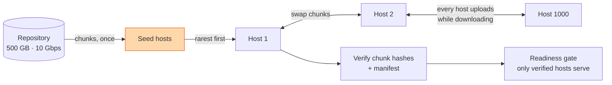

## The question

Distribute a 500 GB model checkpoint from an external repository to 1,000 servers in a datacenter. The repository has a 10 Gbps link. Each server has a 10 Gbps card and servers can copy from each other. One to five percent of servers fail during a rollout. Minimise the time until every server has a complete, verified copy, without a human in the loop.

The same question comes as "stream a large file to 1,000 hosts as fast as possible", as a phone screen with a single shared 10 Gbps budget for upload and download, and, in my day job, as "push the new image to every GB200 rack before the customer's Monday". Same shape every time.

## Explain it to a ten-year-old

One teacher has a 500-page book and a photocopier that does one page a second. Thirty children each need the whole book. If the teacher copies the book thirty times, it takes 15,000 seconds. If the teacher copies it once, hands it to a child, and every child who has a page copies that page for a neighbour while still receiving the rest, everyone finishes in about the time it takes to copy one book. That is the whole idea. The only extra rules: number the pages so nobody copies the same one twice, check each page against the original so a smudge does not spread, and if a child leaves early, their pages are still with someone else.

## The trick

Say the bound before you draw anything. Every host must receive 500 GB through a 10 Gbps card: 500 × 8 / 10 = 400 seconds. No topology, no protocol, no cleverness beats 400 seconds. Then design the thing that gets close to it: chunk the file, seed a few hosts from the source, and let every host upload the chunks it already has while it downloads the ones it does not. Bandwidth adds up across hosts instead of queuing behind the source. A candidate who states the bound in minute three and spends the rest on the swarm passes; a candidate who tours naive, tree, and swarm in order runs out of time on the follow-ups.

## The steps

1. **Confirm the units.** 10 Gbps or 10 GB/s? One report used gigabytes, which is eight times faster and changes every estimate. Per direction or one shared budget? If shared, the bound doubles to 800 seconds. Any topology (racks, spines) or assume none?
2. **State the bound, then the three designs in one breath.** Naive: every host pulls from the source, so the source link carries 1,000 copies, 1,000 × 400 s. Tree: source to one host, then fan out, but each level waits for the whole file. Swarm: chunks of tens of megabytes, each forwarded as soon as it lands, completion time approaches the bound. Pick the swarm and move on.
3. **Control plane.** A rollout controller holds the manifest (chunk list, per-chunk hashes, whole-file hash), the target set, and progress. Hosts report which chunks they hold as a bitmap. Peer selection is rarest-first so no chunk becomes scarce when hosts die. The controller is a coordinator, not a data path; nothing flows through it.
4. **Data plane.** A few seed hosts pull once from the source. Every other host asks peers for chunks, several in flight, and serves what it has. Cap concurrent peers per host so ten hosts do not all pull from one card at once (incast). If there is topology, prefer peers in the same rack.
5. **Integrity and activation.** Verify every chunk against its hash on arrival; verify the whole file at the end; download to a temporary path and swap a symlink so a host never has a half-written "current" model. A host that serves a bad chunk is quarantined as a source.
6. **Failure.** A host dies mid-rollout: its chunks are on other peers; neighbours re-fetch outstanding pieces; the source is the fallback. The coordinator-free follow-up: hosts gossip their bitmaps to neighbours and pull rarest-first with no central assignment at all. Say both.
7. **Readiness.** Only hosts that hold a verified copy of the intended version take traffic. This is the answer to "how do operators know a rollout is done" and to "what stops a half-loaded host from serving".
8. **Observability.** Per-host progress and ETA, so a stalled rollout looks different from one slow host. Bandwidth caps and scheduling windows so production traffic survives the copy.
9. **Cadence.** A new version every few hours: keep the previous one for rollback, pre-warm the next during quiet hours, and delete the one before that.

## The board



## In GPU infrastructure

This is the image-distribution problem for a new GPU cluster wearing a checkpoint costume. Twenty thousand GPUs arriving as racks, each host needing the same image, and a network that saturates if everyone pulls from one server, took hours per host until a seed-and-swarm design took it to seconds. The readiness gate is [the burn-in gate](/teach/gpu-ai/design-a-burn-in-pipeline/) in miniature: a host is not "ready" because bytes landed; it is ready because the hash matched and the version is the intended one. And rarest-first matters more than it sounds: when a rack loses power during a rollout, the chunks that were only on that rack are the ones you cannot get back.

## What I am listening for

- The bound, early, with the unit confirmed.
- Chunking with hashes, not a single 500 GB blob.
- What happens when a host dies, and whether the answer needs the coordinator.
- A readiness gate between "downloaded" and "serving".
- Whether the candidate drifts into consistent hashing or sharding. This is broadcast, not partition.


- **Bound first: size × 8 ÷ link Gbps.** 500 GB over 10 Gbps is 400 s. Say it in minute three.
- **Chunk, seed, swarm.** Every host uploads while it downloads; rarest-first.
- **Hash every chunk, swap a symlink**, quarantine bad sources.
- **Dead host: peers have its chunks.** Gossip bitmaps if there is no coordinator.
- **Readiness gate**: verified and correct version, or no traffic.


## Go deeper

- The BitTorrent [protocol specification](https://www.bittorrent.org/beps/bep_0003.html), for rarest-first and piece selection; ten minutes is enough.
- Meta's [Dragonfly-style P2P image distribution](https://d7y.io/) and Uber's [Kraken](https://github.com/uber/kraken), the production versions of this design for container images.
- [Design an Inference API](/teach/gpu-ai/design-an-inference-api/) is what the hosts do once the weights land, and [Design a Burn-In Pipeline](/teach/gpu-ai/design-a-burn-in-pipeline/) is the gate that decides whether they may.

**With AI on the table.** The assistant will say "BitTorrent" in the first sentence. I ask it for the completion time of the tree design with 1,000 hosts and 64 MB chunks, then ask you why the swarm beats it, using only the link number. The tool knows the name. You have to know the bound.
