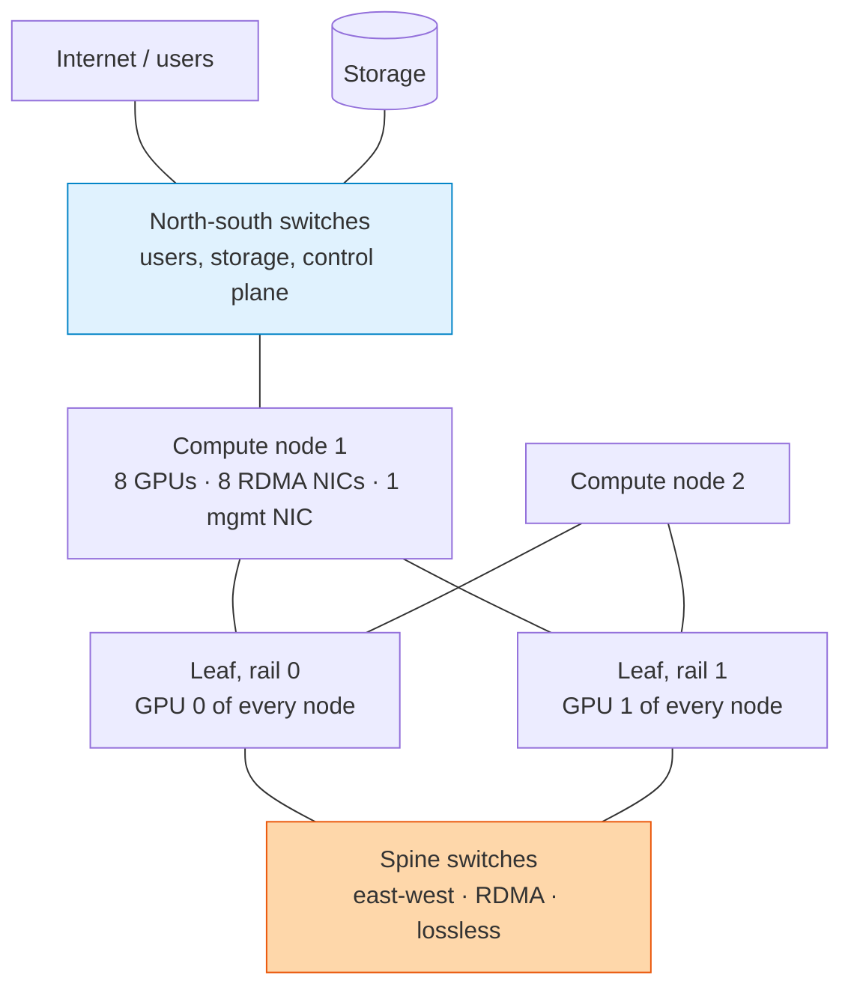

## The question

You are given 512 servers with eight GPUs each. Design the network so that a training job across all 4,096 GPUs runs at full speed.

## Explain it to a ten-year-old

A school has two kinds of corridors. The normal ones, where children walk to lunch and the library, and it is fine if they queue. And the special one between the science labs, where the children are carrying full beakers at a run and nobody may bump into anyone. You build the special corridor wide, straight, with its own doors, and you never let the lunch crowd in. In a GPU cluster the beaker corridor is the east-west network. The lunch corridor is north-south. Mix them and you spill.

*Blue is the north-south network. Orange is the east-west network. They share nothing but the compute node.*

## The trick

One NIC per GPU, and GPU number k on every server plugs into the same "rail" of switches. Then the all-reduce ring, which mostly talks GPU k to GPU k on the next server, never crosses a spine. The fabric is non-blocking, so any pair can talk at full speed, and it is lossless, so a dropped packet never forces a retransmit that stalls the collective.

## The steps

1. **Two fabrics.** East-west for RDMA between GPUs. North-south for storage, checkpoints, users, and management. Separate switches, separate NICs. Never share.
2. **Bandwidth.** Each GPU gets its own 400 gigabit NIC. Eight per server. Sum it: 512 servers × 8 × 400G is the east-west capacity you must not oversubscribe.
3. **Topology.** Leaf and spine, rail-optimised. Leaf switches per rail, spines connecting rails. Fat tree with no oversubscription between leaf and spine.
4. **Lossless.** RoCE over Ethernet needs priority flow control and explicit congestion notification so the switch tells the sender to slow down before it drops. Or InfiniBand, which does this natively. Tune it wrong and you get a network that is fast on paper and stalls under load.
5. **Placement.** The scheduler must know the topology. A job that spans two spines when it could have fit under one will run slower for no reason.
6. **Validation.** Before a customer touches it: every link at line rate, every NIC firmware matched, an all-reduce across the whole cluster within a few percent of theoretical. That is its own lesson.

## What I am listening for

- Whether you draw two networks or one. One is the wrong answer and I will wait for you to notice.
- Whether "lossless" comes up and whether you know what makes it lossless.
- The failure question: one leaf switch reboots for firmware. What happens to a job spanning that rail, and how would a good design keep it running?


- **Two networks.** East-west for GPUs, north-south for everything else.
- **One NIC per GPU, rail-aligned.** GPU k talks to GPU k without crossing a spine.
- **Non-blocking and lossless.** PFC and ECN, or InfiniBand.
- **The scheduler must know the topology.**


**With AI on the table.** The assistant will draw a beautiful fat tree. I ask what oversubscription ratio the customer will actually accept for the money, and what you would give up first. That is a judgement, not a diagram.

## Go deeper

- [From First Principles to Zettascale](/posts/summary-gpu-oci-first-principles-blog/). How OCI builds the RDMA fabric, in my words.
- [NCCL User Guide](https://docs.nvidia.com/deeplearning/nccl/user-guide/docs/index.html). The environment variables chapter for rail and topology settings.
