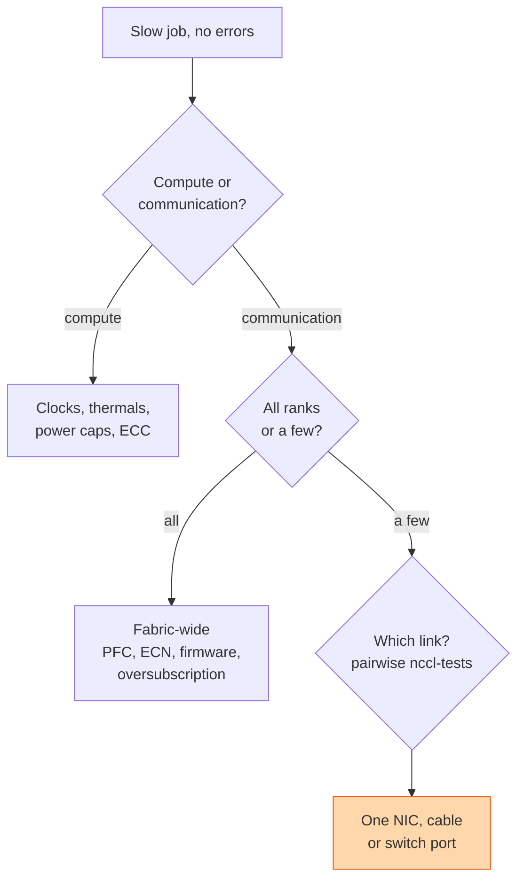

## The question

A customer's training job on 256 GPUs is running at 60 percent of the throughput it got last month. No errors in the logs. Find the cause.

## Explain it to a ten-year-old

A relay race with 256 runners is slower than it was. Nobody fell over. So you do not ask "who fell", you ask "who is slow". First check: is it the runners or the baton passing? Then: is it every runner or one? Then: is that runner slow on their own, or only when passing to a particular neighbour? You narrow it down the same way each time: whole race, one leg, one handover.

## The trick

Bisect. Compute or communication first. Then everyone or someone. Then which link. Each question halves the search, and each has a specific tool: a profiler for the first, per-rank NCCL timing for the second, a pairwise bandwidth test for the third. Do not start at the switch. Do not start at the model. Start at the top of the tree.

## The steps

1. **Reproduce small.** Run the standard NCCL bandwidth test on the same nodes. If it is slow, the model is innocent. If it is fast, the model or its data pipeline is the suspect.
2. **Compute or comms.** Profile one training step. If the GPUs are busy and the step is slow, look at clocks, thermal throttling, power caps. If they are idle waiting, it is the network.
3. **Everyone or someone.** Time the all-reduce on every rank. One slow rank drags the ring, so the slow rank shows up as everyone waiting on it. Find the rank that is late to the barrier.
4. **Which link.** Pairwise tests between that rank's node and its neighbours. Compare to the healthy number you wrote down at burn-in. A single link at half speed is the usual answer.
5. **What is wrong with it.** Link negotiated at a lower speed. Cable errors climbing. A switch port with pause frames. A NIC firmware version different from the rest. One of these, nearly every time.
6. **Fleet-wide causes.** If every rank is slow together: a fabric config change, a firmware rollout, congestion from another tenant, or a topology change that put the job across a spine.
7. **Write it down.** The healthy numbers from burn-in are what make step four possible. No baseline, no diagnosis.

## What I am listening for

- Whether you bisect or guess. Guessing at the switch first is the tell.
- Whether you reach for the standard tests before the model's logs.
- Whether you have a baseline number to compare against. "It seems slow" is not a measurement.


- **Bisect: compute or comms, everyone or someone, which link.**
- **Run the standard test first.** Model is innocent until the fabric is proven fast.
- **One slow rank drags the ring.** Find who is late to the barrier.
- **No baseline, no diagnosis.** Burn-in numbers are the baseline.


## Go deeper

- [The Complete NCCL Reference Guide](/posts/nccl-complete-reference-guide/), the commands and environment variables for each step above.
- [NCCL user guide](https://docs.nvidia.com/deeplearning/nccl/user-guide/docs/index.html), the troubleshooting chapter.
- [All-Reduce Explained](/teach/gpu-ai/all-reduce-explained/), why the slowest link sets the pace.

**With AI on the table.** The assistant lists every NCCL environment variable. I give you the per-rank timing output and ask which rank you would SSH to first and what command you would type. The fastest candidates answer in under a minute.
