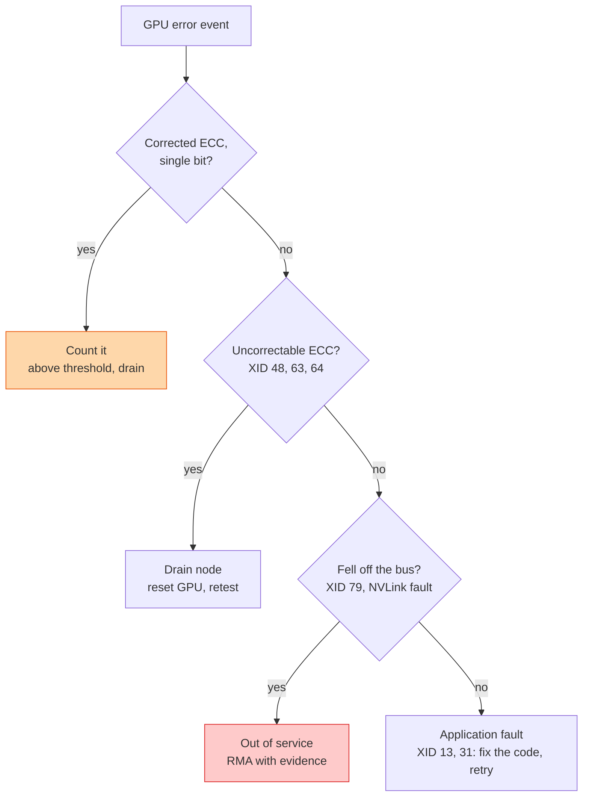

## The question

A GPU in the fleet reports an error. How do you decide, automatically, whether the job retries, the node reboots, or the part gets replaced?

## Explain it to a ten-year-old

A car dashboard has lights. Some say "you are low on fuel", which you fix by driving to a station. Some say "engine hot", which means stop now and let it cool. One says "engine failure", which means a tow truck. If you treat every light like a tow truck, you spend all day at the garage. If you treat the tow-truck light like low fuel, the car dies on the motorway. Reading the light correctly is the whole game. GPUs have lights too. They are called XIDs.

## The trick

Do not treat errors as one bucket. Build a table that maps each error class to one of three actions: retry, reset, or replace. Feed every event through it automatically. A human only looks at the ones the table has never seen. The table is the product; it is what turns a pile of logs into a healthy fleet.

## The steps

1. **XID.** The driver's error code, written to the kernel log. There are a couple of hundred. Perhaps fifteen matter in practice. Some are the application's fault: bad address, launch failure. Some are the hardware's: fell off the bus, NVLink error, uncorrectable memory.
2. **ECC.** Memory errors. Single-bit ones are corrected silently and counted. Double-bit ones are not correctable; the GPU flags the page and the job usually dies. Rising single-bit counts predict double-bit ones.
3. **Row remapping.** Modern GPUs can retire a bad memory row and carry on. The count of remapped rows is a health signal. When the spares run out, the card is done.
4. **Three bins.** Retry: the job, not the card. Reset: drain the node, reset the GPU, run a short diagnostic, return to pool if clean. Replace: pull it, attach the evidence, ship it back.
5. **Thresholds.** A single corrected ECC event is noise. Fifty in a day on one card is a signal. Write the number down before the fleet is large.
6. **Automation.** An agent on every host watches the kernel log and the driver counters and emits a structured event. A fleet service applies the table. Nothing waits for a human at 3am.

## What I am listening for

- Whether you know that some XIDs are the application's fault. Replacing a card for a bad pointer is expensive and common.
- The words "threshold" and "trend". Health is a rate, not an event.
- Whether the human is in the loop for every event or only the unknown ones.


- **Three bins: retry, reset, replace.**
- **App-fault XIDs are not hardware faults.**
- **Corrected ECC is a trend, uncorrected is an event.**
- **The mapping table is the product.** Humans handle only the unknowns.


## Go deeper

- [NVIDIA XID errors reference](https://docs.nvidia.com/deploy/xid-errors/index.html), the official list.
- [DCGM documentation](https://docs.nvidia.com/datacenter/dcgm/latest/), the health checks and counters a fleet agent should read.
- [GPU Burn-In at Scale](/posts/gpu-burn-in-at-scale-reference-guide/), where I list the error lookup tables I actually use.

**With AI on the table.** The assistant knows every XID by number. I hand you a week of events from one rack and ask which single card you would pull first and why. The pattern across the week is the answer, not the lookup.
