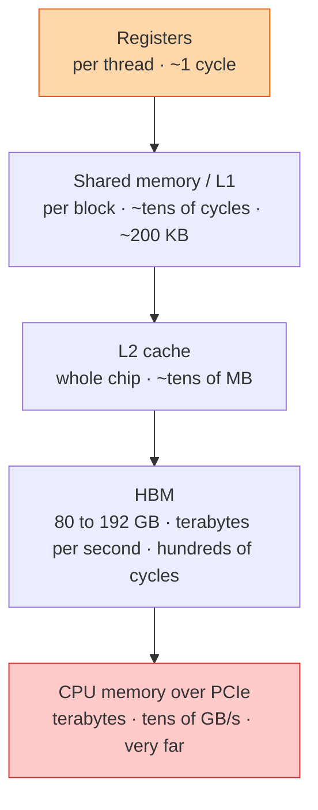

## The question

Where does a GPU keep its data, how fast is each place, and why does a kernel that does very little arithmetic still take a long time?

## Explain it to a ten-year-old

You are doing homework at a desk. Things in your hand: instant. Things on the desk: a second to grab. Things on the bookshelf across the room: get up, walk, come back. Things in the library down the road: gone for an hour. A GPU is the same. Registers are your hand, shared memory is the desk, HBM is the bookshelf, and the CPU's memory is the library. A clever student arranges the desk so they never walk to the library in the middle of a sum.

## The trick

Each level down is roughly ten times bigger and ten times slower. Arithmetic is nearly free; moving bytes is what costs. So the question for any kernel is not "how many multiplies" but "how many times does each byte cross a level". Reuse a byte while it is close, and the GPU flies. Fetch it from HBM every time, and the cores sit idle.

## The steps

1. **Registers.** Fastest, tiny, private to one thread. The compiler fills them. Too many and you spill to slower memory.
2. **Shared memory.** A small scratchpad each block of threads controls. The programmer loads a tile from HBM into it once and lets hundreds of threads reuse it. This is how matrix multiply gets fast.
3. **L2.** A chip-wide cache the hardware manages. Helps when many blocks read the same data.
4. **HBM.** The big memory, stacked next to the chip. Terabytes per second, but hundreds of cycles away. Everything a model needs must fit here or it does not run.
5. **Host memory.** Across PCIe. Ten to fifty times slower than HBM. Touching it inside a training step is the classic silent slowdown.
6. **Arithmetic intensity.** Operations per byte moved. Below the chip's ratio you are memory bound and the tensor cores wait. Roofline plots make this visible in one picture.

## What I am listening for

- Whether "bandwidth" and "latency" both show up, and whether you know they are different problems.
- Whether you can say why tiling in shared memory speeds up a matrix multiply.
- Whether you have ever been surprised that a kernel was memory bound. Everyone who has done real work has.


- **Hand, desk, bookshelf, library.** Each level ~10× bigger and slower.
- **Bytes cost, multiplies are free.** Reuse while close.
- **Tiles in shared memory** are why matmul is fast.
- **Never touch host memory inside the hot loop.**


## Go deeper

- [CUDA C Programming Guide](https://docs.nvidia.com/cuda/cuda-c-programming-guide/), the memory hierarchy and shared memory chapters.
- [GPU MODE on YouTube](https://www.youtube.com/@GPUMODE), working engineers walking through real kernels.

**With AI on the table.** The assistant writes a correct kernel. I ask what its arithmetic intensity is and whether that puts it above or below the roofline of the GPU it will run on. If you cannot answer that, you cannot tell me whether the kernel is fast.
