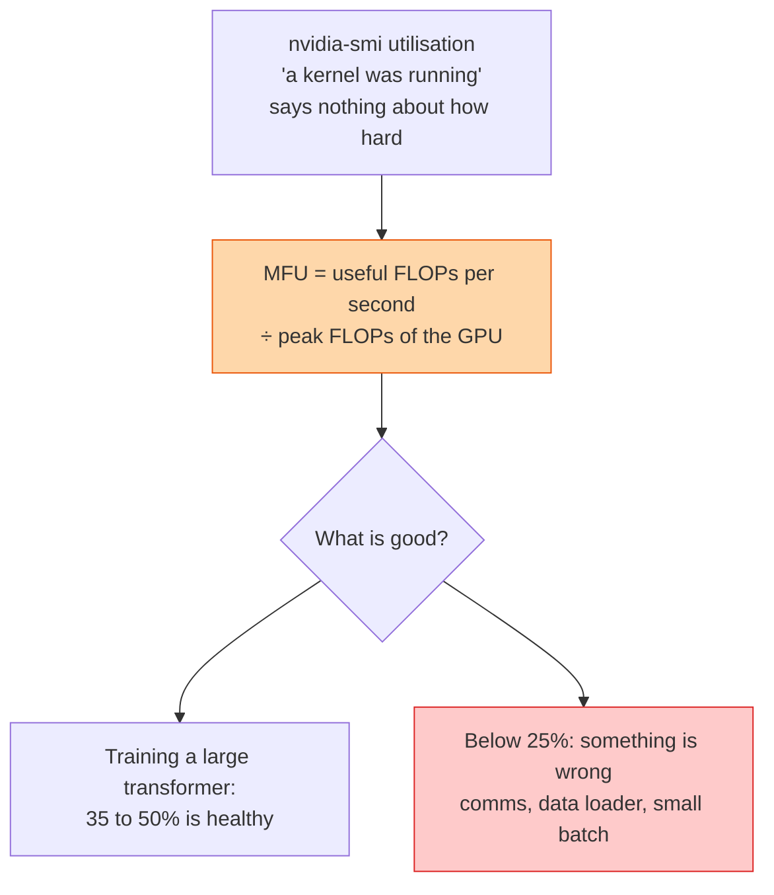

## The question

Someone asks "how busy are our GPUs?" What number do you give them, how do you compute it, and why is the obvious number wrong?

## Explain it to a ten-year-old

A factory has a light above each machine that is on whenever someone is standing at it. Head office counts the lights and says the factory is 100 percent busy. But one machine has a worker standing at it doing nothing. Another is running at a quarter speed. The lights do not know. The honest measure is: how many widgets came out this hour, divided by how many the machines could make if they all ran flat out. That is MFU.

## The trick

Compute the useful work from the model, not from the chip. For a transformer, the FLOPs per token are about six times the parameter count for training. Multiply by tokens per second, divide by the GPU's peak for the number format you are using. That is model FLOPs utilisation. The chip's own utilisation counter only knows whether any kernel was resident. Those are different questions.

## The steps

1. **The naive number.** The driver's utilisation field is the fraction of time at least one kernel was running. A single-thread kernel counts as 100 percent. Useful for spotting idle GPUs, useless for anything else.
2. **Tensor core activity.** DCGM exposes the fraction of cycles the tensor cores were active. Better. Still hardware's view, not the model's.
3. **MFU.** Six times parameters times tokens per second, divided by peak. A 70-billion parameter model at 2,000 tokens per second per GPU is 840 teraflops of useful work. Against a peak of roughly a petaflop in BF16, that is about 42 percent MFU.
4. **What eats the rest.** Communication the compute cannot hide, the data loader not keeping up, small batches, pipeline bubbles, activation recomputation. Each has its own fix.
5. **Fleet view.** Allocation: what fraction of GPUs are assigned to a job. Utilisation: what fraction of assigned GPUs are running kernels. MFU: how well the running ones are used. Three numbers, three different owners.
6. **What to report.** Executives get allocation and a fleet-average MFU. Engineers get MFU per job with the breakdown of where the rest went.

## What I am listening for

- Whether you know the driver's utilisation number is nearly meaningless for "how hard".
- Whether you can do the six-times-parameters calculation out loud with a real model.
- Whether you separate allocation from utilisation. Idle GPUs that are allocated are a scheduling problem, not a kernel problem.


- **Driver utilisation = "a kernel was there". Not "how hard".**
- **MFU = 6 × params × tokens/s ÷ peak FLOPs.**
- **35 to 50 percent is healthy for large training.**
- **Three numbers: allocation, utilisation, MFU.** Different owners.


## Go deeper

- [PaLM paper](https://arxiv.org/abs/2204.02311), appendix B, where MFU was defined.
- [DCGM documentation](https://docs.nvidia.com/datacenter/dcgm/latest/), the profiling metrics including tensor core activity.

**With AI on the table.** The assistant computes MFU correctly. I show you a dashboard reading 98 percent utilisation and 18 percent MFU and ask what you tell the customer. Then what you tell the executive who paid for the GPUs.
