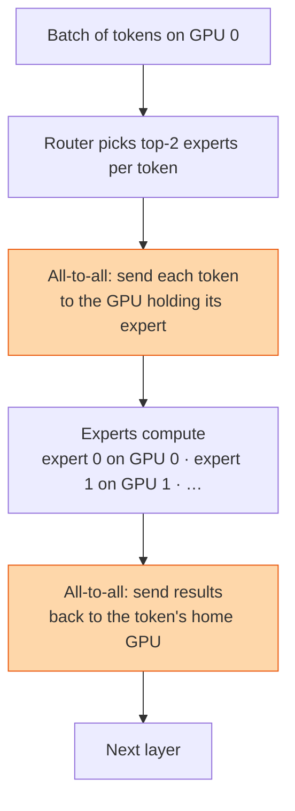

## The question

What is a mixture-of-experts model, why is its network traffic different from a dense model, and what does that change in the cluster?

## Explain it to a ten-year-old

A hospital with one doctor who knows everything is slow. A hospital with eight specialists is faster, but now every patient first sees a receptionist who decides which two specialists they need, and the patients have to walk to different rooms. The specialists are experts. The receptionist is the router. The walking is the network traffic, and it goes in every direction at once, not in a neat circle.

## The trick

Dense models move gradients in one big, predictable all-reduce per step. Experts move activations, twice per layer, in an all-to-all whose pattern depends on which experts the router picked. Every GPU sends a different amount to every other GPU, and it changes every step. The ring is gone. The fabric needs full bisection bandwidth and low latency for many small messages, and the placement of experts matters as much as the placement of ranks.

## The steps

1. **The model.** Replace the feed-forward block in each layer with N experts and a small router. Each token uses only the top one or two. Total parameters go up, compute per token stays flat.
2. **Expert parallelism.** Put different experts on different GPUs. Tokens travel to their experts and back. Two all-to-alls per layer, tens of layers, every step.
3. **Traffic shape.** All-to-all is many messages of varying size to every peer. Latency and switch fairness matter more than for an all-reduce. Oversubscription hurts immediately.
4. **Load balance.** If the router sends most tokens to one expert, that GPU is the straggler and the others idle. Auxiliary losses and capacity factors keep the load even. Watch expert utilisation as a metric.
5. **Placement.** Keep experts that are often chosen together on the same NVLink domain. Spread the expert group across the fewest switches possible.
6. **Inference.** Experts mean a large model with small per-token compute, so memory holds everything and the all-to-all becomes the serving bottleneck. Serving engines batch tokens by expert to shrink it.
7. **Debugging.** The slow-NCCL playbook still works, but the collective you profile is all-to-all, and the fix may be a router change, not a cable.

## What I am listening for

- Whether you can say what changes in the traffic: all-reduce to all-to-all, gradients to activations.
- Whether load balance across experts comes up. It is the operational problem.
- Whether you know that the network requirement went up, not down, even though compute per token did not.


- **Router picks experts, tokens travel.** Two all-to-alls per layer.
- **All-to-all, not all-reduce.** Every GPU to every GPU, sizes vary per step.
- **Expert load balance is the straggler problem in disguise.**
- **Fabric needs bisection bandwidth and low latency.**


## Go deeper

- [Switch Transformer paper](https://arxiv.org/abs/2101.03961), the clean version of routing and load balancing.
- [NCCL user guide](https://docs.nvidia.com/deeplearning/nccl/user-guide/docs/index.html), the all-to-all collective.
- [Straggler Detection](/teach/gpu-ai/straggler-detection/), which is what expert imbalance looks like from the fleet.

**With AI on the table.** The assistant explains the router. I show you a cluster where the all-reduce benchmark is perfect and the customer's expert model is slow, and ask why both can be true. The answer is a different collective on a different pattern.
