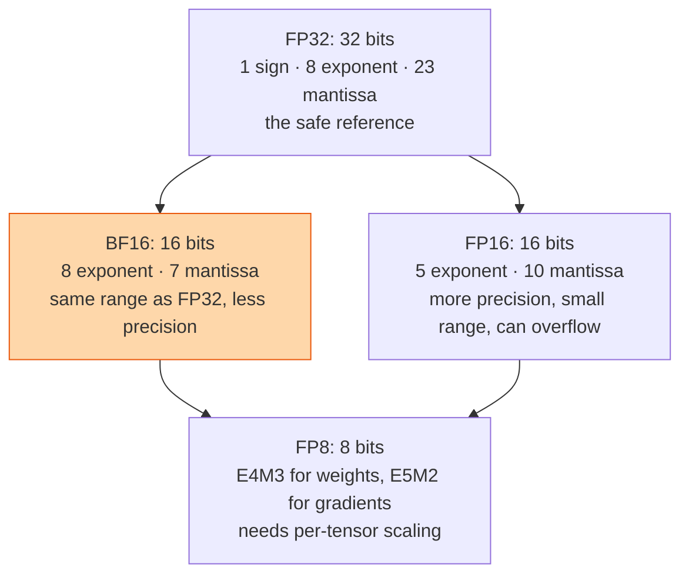

## The question

Why do we train and serve models in 16-bit or 8-bit numbers instead of 32-bit, what can go wrong, and how do the tricks that make it safe work?

## Explain it to a ten-year-old

Writing a number with lots of decimal places is precise but slow, and takes up a lot of room on the page. Writing it rounded is fast and small, but if you round too much, three point one four becomes three, and your circle comes out wrong. A number format is how many digits you agree to keep. Big models have billions of numbers, so shaving digits off each one saves an enormous amount of paper. The trick is to know which numbers can be rounded and which ones cannot.

## The trick

Two things describe a format: range, set by the exponent bits, and precision, set by the mantissa bits. Training cares more about range, because gradients get tiny and must not vanish to zero. That is why BF16 won for training: it keeps FP32's range and gives up precision. FP8 gives up both, so it needs a scale factor per tensor to keep the numbers in the window. The hardware does the multiply in the small format and accumulates in a bigger one.

## The steps

1. **FP32.** The reference. Everything works, everything is slow, everything is big.
2. **FP16.** Half the bytes, but the largest number it holds is about 65,000. Gradients overflow or underflow. Loss scaling, multiplying the loss by a big constant before the backward pass, was invented to fix this.
3. **BF16.** Same exponent as FP32, so no loss scaling needed. Fewer mantissa bits, and it turns out models do not care. The default for training today.
4. **Mixed precision.** Compute in 16-bit, keep a 32-bit master copy of the weights, accumulate in 32-bit. The master copy is why optimiser state is so large.
5. **FP8.** Two variants: one with more precision for weights and activations, one with more range for gradients. Each tensor carries a scale. Tensor cores run it at twice the FP16 rate. Memory for the KV cache halves.
6. **Where not to cut.** Softmax, layer norm, the loss, and the optimiser update. Keep those in higher precision. The framework does this for you, until you write a custom kernel and forget.

## What I am listening for

- Range versus precision, in your own words. The exponent and mantissa split is the whole idea.
- Why BF16 replaced FP16 for training. If you say "it is newer", we dig.
- What the master weights are for. This connects to the checkpoint and memory lessons.


- **Exponent = range, mantissa = precision.**
- **Training wants range.** BF16 keeps FP32's exponent.
- **FP8 needs a scale per tensor.** Two flavours: weights and gradients.
- **Never cut softmax, norms, loss, or the optimiser step.**


## Go deeper

- [Mixed Precision Training](https://arxiv.org/abs/1710.03740), the paper that introduced loss scaling and master weights.
- [FP8 Formats for Deep Learning](https://arxiv.org/abs/2209.05433), the two FP8 variants and why.

**With AI on the table.** The assistant will convert a model to FP8 in one command. I ask you which layers it left in higher precision and how you would find out if it got that wrong. Loss curves, not documentation.
