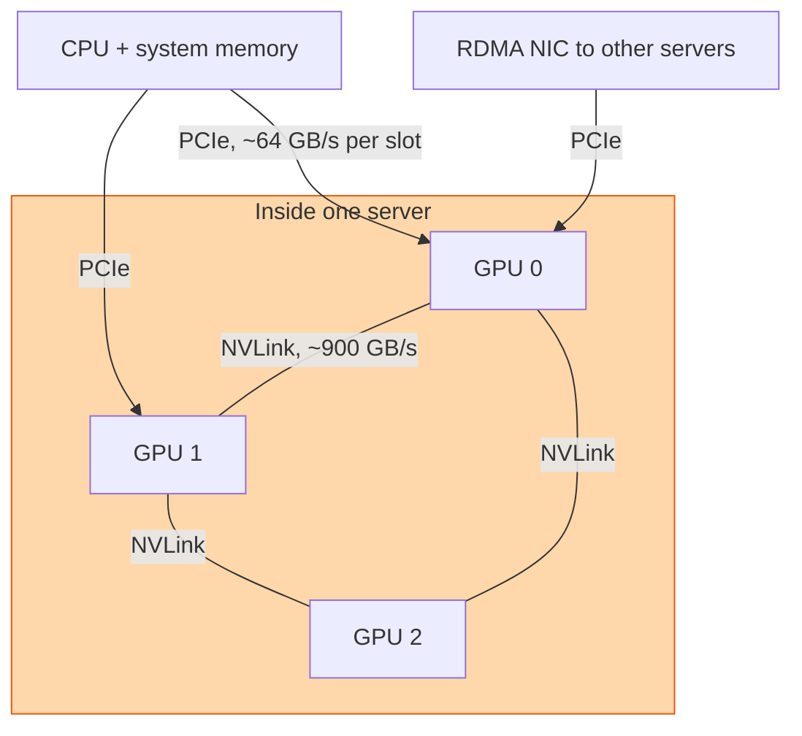

## The question

A server has eight GPUs. How do they talk to each other, how do they talk to the CPU and the network, and why does it matter which path a byte takes?

## Explain it to a ten-year-old

Eight houses on one street. Every house has a normal road to the town centre, where the shops and the post office are. That road is PCIe. It is fine, but it is shared and it has traffic lights. The eight houses also have a private motorway that only connects them to each other, no lights, ten times wider. That is NVLink. If you want to borrow sugar from next door, use the motorway. If you want to post a letter to another street, you have no choice, it is the town road.

## The trick

Every byte a GPU moves takes one of two roads, and they differ by roughly ten times in speed. Inside the box, GPU to GPU rides NVLink, hundreds of gigabytes per second. Anything that leaves the box, or goes to the CPU, rides PCIe, tens of gigabytes per second. Design so the fat traffic stays on the motorway.

## The steps

1. **PCIe.** The general-purpose bus. A Gen5 x16 slot is about 64 gigabytes per second each way. GPUs, network cards, and storage all hang off it, and they share the CPU's lanes.
2. **NVLink.** A point-to-point link between GPUs. On a modern part, all links together give a GPU around 900 gigabytes per second to its neighbours. On an eight-GPU server an NVSwitch sits in the middle so every GPU sees every other at full speed.
3. **Where each is used.** Gradient exchange between the eight GPUs in one box: NVLink. Loading a batch from CPU memory: PCIe. Sending a gradient to another server: PCIe to the NIC, then the network.
4. **The mistake.** Two GPUs on the same board talking through the CPU because the software did not know NVLink existed. The job runs at a tenth of the speed and nothing reports an error.
5. **Check it.** `nvidia-smi topo -m` prints the matrix. NV means NVLink, PIX or PHB means you are going through PCIe or the CPU. Learn to read it in ten seconds.
6. **Rack scale.** NVL72 stretches the motorway across eighteen servers with switch trays, so 72 GPUs share one NVLink domain. That is the whole point of the design.

## What I am listening for

- Rough numbers. Tens versus hundreds of gigabytes per second is enough. Guessing they are similar is not.
- Whether you know that a GPU's path to the network goes through PCIe, so the NIC placement on the board matters.
- Whether you would run `nvidia-smi topo -m` before or after the job is slow.


- **Two roads: PCIe to the world, NVLink to the neighbours.**
- **About ten times apart.** Tens versus hundreds of GB/s.
- **Keep the fat traffic on NVLink.** Check the topology matrix.
- **NVL72 makes the rack one NVLink domain.**


## Go deeper

- [NVIDIA GB200 NVL72](https://www.nvidia.com/en-us/data-center/gb200-nvl72/), the rack-scale version of the same idea.
- [CUDA C Programming Guide](https://docs.nvidia.com/cuda/cuda-c-programming-guide/), the chapter on peer-to-peer memory access.

**With AI on the table.** The assistant will recite the bandwidth numbers. I show you a topology matrix with one GPU marked PHB to the others and ask what a training job on that server will look like, and whether the customer will notice. Reading the matrix is the skill.
