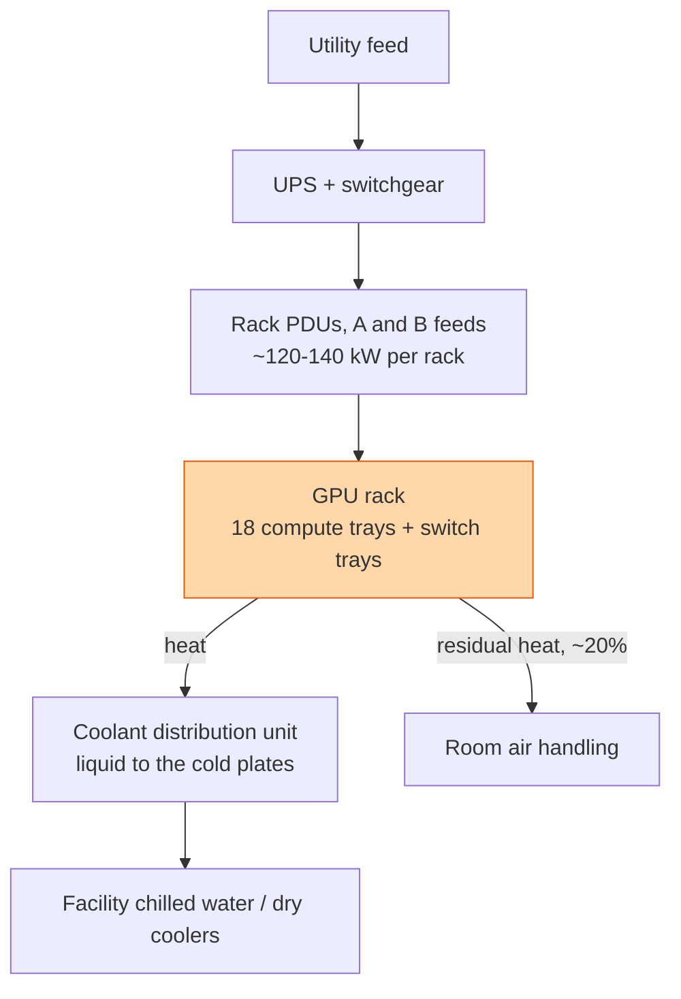

## The question

A GPU rack draws over 100 kilowatts. Design the power and cooling for a row of them, and explain what changes compared to a traditional data centre.

## Explain it to a ten-year-old

A hair dryer is about one kilowatt. A modern GPU rack is more than a hundred hair dryers running all day in a wardrobe. You cannot fan that heat away; the fan would need to be a hurricane. So instead you run cold water through pipes pressed right against the hot chips, like a car engine's radiator. And you need a cable into the wardrobe thick enough to feed a hundred hair dryers, which is not a normal plug.

## The trick

Heat equals power. Every kilowatt in is a kilowatt of heat out, and above about 40 kilowatts per rack, air stops being a practical way to move it. So the design starts from the rack's power number and works outward: liquid to the chips, a coolant loop per row, chilled water for the building, and a power path sized for the peak with headroom. The GPU is the last thing you choose.

## The steps

1. **The number.** A rack-scale GPU system draws in the region of 120 to 140 kilowatts under load. Say it first. A traditional rack was 5 to 15.
2. **Power path.** Two independent feeds to every rack so one failure does not drop it. Breakers, PDUs, and busway rated for the sustained draw, not the average. GPUs pull their peak for hours.
3. **Liquid cooling.** Cold plates on GPUs and switches. A coolant distribution unit per row or per rack moves the loop. Roughly 80 percent of the heat leaves through the liquid, the rest through air.
4. **Leak and flow monitoring.** Flow rate, inlet and outlet temperature, pressure, and leak sensors on every rack. A dropped flow rate is a thermal event minutes away. This telemetry goes into the same fleet health system as the GPU counters.
5. **Floor and rigging.** A liquid-cooled rack can weigh over a tonne and a half. Floor loading, delivery path, and the crane are real engineering questions.
6. **Power capping.** Firmware can cap GPU power. A fleet-wide cap is how you survive a cooling fault or a grid event without shutting down. Design the control path for it before you need it.
7. **Efficiency.** Power usage effectiveness: total facility power over IT power. Liquid cooling brings it down because pumps are cheaper than fans and chillers run warmer.

## What I am listening for

- The rack number. If you think a GPU rack is 20 kilowatts, the rest of the design is wrong.
- Whether liquid cooling comes up as a requirement, not an option.
- Whether cooling telemetry is part of fleet health. A flow sensor is a GPU health signal.


- **Power in equals heat out.** 120+ kW per rack.
- **Above ~40 kW, air is done.** Liquid to the cold plates.
- **Two feeds, sized for peak.** GPUs hold their peak for hours.
- **Flow, temperature, and leak sensors are fleet health.**


## Go deeper

- [NVIDIA GB200 NVL72](https://www.nvidia.com/en-us/data-center/gb200-nvl72/), the rack this lesson is sized for.
- [Design a Rack as One Computer](/teach/gpu-ai/design-a-rack-as-one-computer/), the control plane side of the same rack.

**With AI on the table.** The assistant will produce a tidy power budget. I tell you a coolant pump in one row has dropped to half flow and ask, in order, what happens in the next ten minutes and what your system does about it. Thermal events are fast.
