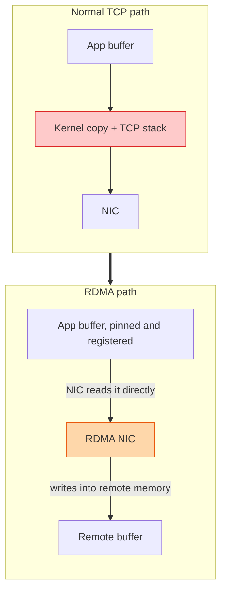

## The question

What is RDMA, why does every serious GPU cluster use it, and what has to be true for it to work?

## Explain it to a ten-year-old

Passing a note in class the normal way: you give it to the teacher, the teacher reads it, copies it into the register, then hands the copy to your friend. Slow, and the teacher is busy. RDMA is having a hole in the wall straight into your friend's desk drawer. You put the note in, it appears in the drawer, the teacher never knows. The catch is the hole has to be drilled in advance, exactly the right size, and both desks have to agree on it before class starts.

## The trick

Take the CPU and the kernel out of the data path. The application registers a memory region with the NIC in advance, the NIC reads and writes it directly, and the remote NIC writes straight into the far side's registered memory. Zero copies, near-zero CPU, microsecond latency. With GPUDirect, that registered memory can be GPU memory, so a gradient goes NIC to HBM without touching the host at all.

## The steps

1. **Two flavours.** InfiniBand, a separate fabric built for this. RoCE, RDMA over converged Ethernet, the same verbs on Ethernet switches. Most clouds run RoCE.
2. **Setup cost.** Registering memory pins it and tells the NIC the addresses. Slow, done once. That is why frameworks keep big fixed buffers rather than allocating per message.
3. **Queue pairs.** Each side posts work requests to a send or receive queue. The NIC executes them and posts a completion. No system call per message.
4. **Lossless is not optional.** RDMA transports were built for a network that does not drop packets. On Ethernet that means priority flow control and ECN tuned properly. A lossy RoCE fabric is slower than plain TCP.
5. **GPUDirect RDMA.** The NIC talks to GPU memory over PCIe without a host copy. Needs the NIC and GPU on the same PCIe root, which is a hardware layout decision.
6. **What to check.** Link up at the right speed, the right MTU, PFC counters not climbing, and a bandwidth test between two nodes before you blame the model.

## What I am listening for

- "Kernel bypass" and "zero copy" said in your own words, not as slogans.
- Whether you know why lossless matters. It is the single most common misconfiguration.
- Whether you know that GPUDirect needs the right PCIe topology. Software cannot fix a board layout.


- **Hole in the wall.** NIC writes remote memory, kernel not involved.
- **Register once, reuse forever.** Pinned buffers.
- **Must be lossless.** PFC and ECN on RoCE, or InfiniBand.
- **GPUDirect: NIC to HBM directly**, if the PCIe layout allows.


## Go deeper

- [NCCL user guide](https://docs.nvidia.com/deeplearning/nccl/user-guide/docs/index.html), the transport and environment variable sections show how NCCL uses RDMA.
- [Design the Training Network](/teach/gpu-ai/design-the-training-network/), the lesson on what the fabric around RDMA must look like.

**With AI on the table.** The assistant explains verbs and queue pairs cleanly. I hand you a NIC counter dump with pause frames climbing on one port and ask what the training job feels like and what you touch first. The counters are the interview.
