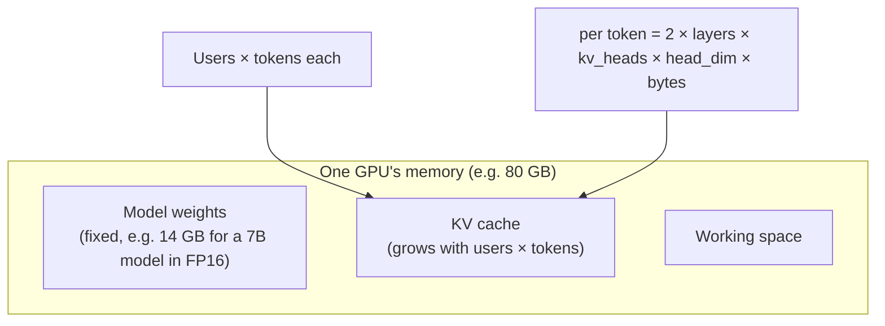

## The question

You are serving a large language model. How much GPU memory does each conversation take, and how many conversations can one GPU hold at once?

## Explain it to a ten-year-old

When you talk to the model, it does not re-read the whole conversation every time it picks the next word. That would be too slow. Instead it keeps notes: for every word so far, in every layer of its brain, it saves two small lists, a "key" and a "value". Next word, it just looks at the notes. Those notes are the KV cache. The longer the chat and the more people chatting at once, the more notes. The notes live in the GPU's memory next to the model itself. When the memory is full, the next person waits.

## The trick

KV cache per token is 2 × layers × kv_heads × head_dim × bytes. The 2 is key and value. Multiply by tokens per conversation and by conversations. Subtract the weights from the GPU memory and what is left is your budget. Everything in inference serving is this subtraction.

## The steps

1. **Per token.** For a 7B-class model: 32 layers, 32 heads, head dim 128, 2 bytes in FP16. 2 × 32 × 32 × 128 × 2 = 524,288 bytes. Half a megabyte per token.
2. **Per conversation.** A 4,000-token context is 2 GB. An 8,000-token one is 4 GB.
3. **Per GPU.** 80 GB minus 14 GB of weights is 66 GB. At 2 GB each, about 33 conversations at full length. Fewer if you leave working space.
4. **Why the real number is better.** Grouped-query attention shares keys and values across heads, so kv_heads is 8 instead of 32 and the cache is four times smaller. Quantising the cache to 8 bits halves it again. Paged attention stops you reserving the full context for every user up front.
5. **Why it matters.** Serving cost is dollars per GPU-hour divided by conversations per GPU. The KV cache is the denominator. Everything that shrinks it makes money.
6. **Batch versus latency.** More conversations per GPU is more throughput but each one waits its turn. Say which the customer wants.

## What I am listening for

- Can you write the formula and put real numbers in it. Not the exact numbers, the shape and the order of magnitude.
- Do you know that the weights are fixed and the cache is the thing that scales. Most candidates worry about the wrong one.
- Do you know two ways to shrink it. GQA and paging are the ones I want to hear.


- **Per token: 2 × layers × kv_heads × head_dim × bytes.**
- **Budget = GPU memory − weights.** The cache lives in what is left.
- **Shrink it: grouped-query attention, 8-bit cache, paged attention.**
- **Conversations per GPU is your cost.**


**With AI on the table.** The assistant will do the multiplication. I change one input: the customer wants 128,000-token contexts. Now the cache is bigger than the model. Redesign, out loud, and tell me what you would ask the customer before you do.

## Go deeper

- [Efficient Memory Management for LLM Serving with PagedAttention](https://arxiv.org/abs/2309.06180). The vLLM paper, read section 2 for the memory picture.
- [Attention Is All You Need: An Infrastructure Engineer's Guide](/posts/attention-is-all-you-need-and-all-you-need-to-know/). My post on where the formula comes from.
