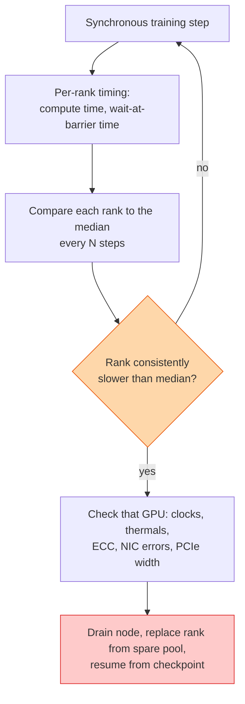

## The question

A 1,024-GPU training job is running slower than expected. One or two GPUs are the cause. Design the system that finds them while the job is running, without a human reading logs.

## Explain it to a ten-year-old

A rowing boat with a thousand rowers. Everyone must pull at the same moment, so the boat goes at the speed of the slowest rower. If one rower is tired, the whole boat slows, and from the shore it just looks like a slow boat. The coxswain's job is to time every rower's stroke, spot the one who is always a bit late, and swap them out at the next bend. Not to shout "row faster" at everyone.

## The trick

Instrument the barrier. Every rank knows how long it spent computing and how long it spent waiting for everyone else. The straggler is the rank with high compute time and zero wait, because everyone is waiting for it. Compare each rank to the median over a window, not to an absolute number, because the healthy speed changes with the model. Then automate the swap.

## The steps

1. **Measure per rank.** Time the forward and backward pass, and separately time the collective. Export both every few steps. The framework can do this with hooks; it should not need the model code changed.
2. **Compare to the pack.** The median across ranks is the baseline. A rank more than, say, 10 percent slower than the median for twenty consecutive windows is a straggler. Use a persistent gap, not a single spike.
3. **Distinguish causes.** Slow compute on one rank: a throttling GPU, thermal or power, or ECC page retirement eating memory. Slow collective on one rank: its NIC or link. The two timings tell them apart.
4. **Confirm on the host.** The fleet agent checks clocks, temperature, power cap, ECC counters, and NIC error counters on the suspect. Ninety percent of the time one of them is obviously wrong.
5. **Act.** Drain the node, bring a spare in from the pool, restart from the last checkpoint. Minutes of loss instead of days of slow.
6. **Close the loop.** The suspect node goes through the short diagnostic. If it passes, back in the pool with a note. If it fails twice, out for repair.

## What I am listening for

- Whether you compare to the median or to a fixed number. Fixed numbers rot.
- Whether you separate compute time from communication time per rank. That split is the diagnosis.
- Whether the swap is automatic. A human waking up at 3am to do it is a design that does not scale.


- **Synchronous means slowest wins.** One slow GPU, a thousand slow GPUs.
- **Instrument the barrier.** High compute, zero wait is the straggler.
- **Compare to the median, over a window.**
- **Swap from the spare pool, resume from checkpoint.** Automatically.


## Go deeper

- [DCGM documentation](https://docs.nvidia.com/datacenter/dcgm/latest/), the host-side counters the fleet agent reads.
- [Checkpointing at Scale](/teach/gpu-ai/checkpointing-at-scale/), what makes the swap cheap.

**With AI on the table.** The assistant will write the detection logic. I ask you what happens when the straggler is a healthy GPU sitting behind a congested switch port shared with another job. Your detector blames the wrong thing. How do you find out?
