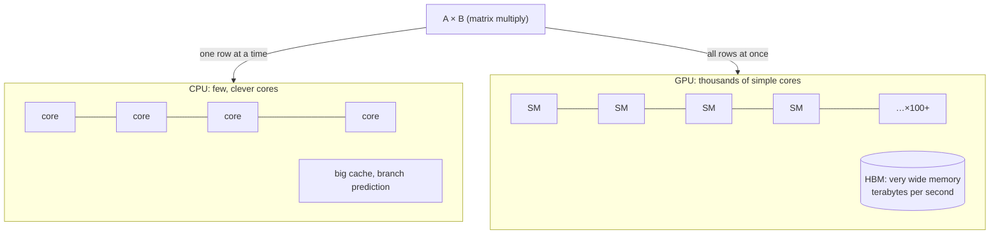

## The question

Why do we train and run AI models on GPUs and not CPUs? What is a GPU actually good at, and what is it bad at?

## Explain it to a ten-year-old

A CPU is a kitchen with eight brilliant chefs. Each can cook any dish, follow a complicated recipe, change plan half way. A GPU is a hall with ten thousand children, each holding one spoon. They cannot do anything complicated. But if you shout "everyone stir once", ten thousand pots get stirred at the same moment. Training an AI model is almost entirely one instruction: multiply these two huge grids of numbers together. That is ten thousand pots. You want the hall, not the kitchen.

## The trick

Two things make the GPU win, and candidates usually name only one. Parallelism: thousands of cores doing the same operation on different data. And memory bandwidth: the high-bandwidth memory next to the chip feeds those cores at terabytes per second. A GPU with fast cores and slow memory is a hall of children with no pots. In practice most models are limited by memory, not by arithmetic.

## The steps

1. **What the work is.** A neural network is layers of matrix multiplies with a simple function between them. Matrix multiply is the same tiny operation repeated millions of times with no branching. Perfect for the hall.
2. **What a GPU is.** Many streaming multiprocessors, each running hundreds of threads in lockstep. Tensor cores that do small matrix multiplies as one instruction. HBM stacked right beside the die.
3. **The two limits.** Compute bound: the cores are busy, memory is keeping up. Memory bound: the cores are waiting for numbers. Know which one you are in. The ratio of arithmetic to bytes moved (arithmetic intensity) tells you.
4. **What a GPU is bad at.** Branchy code, small batches, anything that needs the children to do different things. Latency-sensitive work with no parallelism. The chefs win those.
5. **Why it matters for infrastructure.** You do not buy a GPU. You buy a GPU, its memory, its power, its cooling, and the network that lets it talk to seven or seventy-one others. The GPU is the cheap part of the bill.

## What I am listening for

- Do you say "bandwidth" as well as "parallel". If you only say parallel, you have read the marketing.
- Do you know roughly how much memory sits on one modern GPU and why that number decides which model fits.
- Can you name one thing a GPU is worse at than a CPU. A candidate who thinks GPUs are just faster has not run one.


- **Ten thousand kids with one spoon each.** Same instruction, different data.
- **Two wins: parallel cores and HBM bandwidth.** Most models are memory bound.
- **GPUs are bad at branches and small batches.**
- **The GPU is the cheap part.** Memory, power, network cost more.


**With AI on the table.** The assistant will explain SIMD and tensor cores beautifully. I ask which is bigger for a given model, the weights or the activations, and whether that changes between training and inference. Look at the model, not the chip.

## Go deeper

- [CUDA C++ Programming Guide](https://docs.nvidia.com/cuda/cuda-c-programming-guide/). Chapter 1 is enough for an interview, the hardware model section.
- [Programming Massively Parallel Processors](/teach/books/). On the book list, the only textbook I recommend for this.
