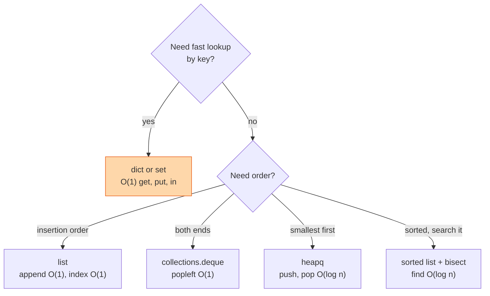

Use Python in the coding round unless the job is C++ or the interviewer says otherwise. It reads like the pseudocode you would write anyway, the standard library has every structure you need, and you spend the fifteen minutes on the problem, not on semicolons. This page is what I hand people who have not typed Python in a year. Read it the night before. Do not learn anything new from it, just wake the memory up.

## Which structure do I reach for



## The lines you type most

```python
nums = [3, 1, 2]                 # list
nums.append(4); nums.pop()       # push, pop from the end, O(1)
nums.sort()                      # in place, stable, O(n log n)
top = sorted(nums, reverse=True) # new list
nums[::-1]                       # reversed copy;  nums[1:3] is items 1 and 2
nums[-1]                         # last item

seen = set(); seen.add(3); 3 in seen        # O(1)
count = {}; count[k] = count.get(k, 0) + 1  # count without KeyError

from collections import defaultdict, Counter, deque
graph = defaultdict(list); graph[u].append(v)
freq = Counter("banana")          # {'a': 3, 'n': 2, 'b': 1}
q = deque([start]); q.popleft()   # BFS queue

import heapq
h = []; heapq.heappush(h, (dist, node)); d, n = heapq.heappop(h)  # min-heap

for i, x in enumerate(nums): ...  # index and value
for a, b in zip(xs, ys): ...      # walk two lists together
squares = [x * x for x in nums if x % 2 == 0]
lo, hi = 0, len(nums) - 1         # two variables, one line
a, b = b, a                       # swap, no temp
print(f"{node=} {dist:.2f}")      # f-strings, and the = trick for debugging
```

## Strings

Strings are immutable. Every `s += c` in a loop copies the whole string. Build a list and `"".join(parts)` at the end.

```python
s.split()            # on whitespace;  s.split(",") on a comma
s.strip()            # both ends;  s.lower(), s.isdigit(), s.isalnum()
ord("a"), chr(97)    # letter to number and back, for the 26-bucket trick
s[::-1]              # reversed
s == s[::-1]         # palindrome in one line, O(n) space though
```

## Functions and recursion

```python
def dfs(node, seen=None):        # never use a mutable default (see gotchas)
    if seen is None:
        seen = set()

import sys; sys.setrecursionlimit(10_000)   # default is 1000, deep trees hit it

from functools import lru_cache
@lru_cache(maxsize=None)         # memoise a pure recursive function in one line
def ways(n): ...

def outer():
    best = 0
    def inner():
        nonlocal best             # without this, best = ... makes a new local
        best = max(best, 1)
```

## Classes you will be handed

```python
class ListNode:
    def __init__(self, val=0, next=None):
        self.val, self.next = val, next

class TreeNode:
    def __init__(self, val=0, left=None, right=None):
        self.val, self.left, self.right = val, left, right

from dataclasses import dataclass
@dataclass(order=True)            # order=True gives < so it can sit in a heap
class Item:
    priority: int
    name: str
```

## Complexity you should say out loud

| Operation | Cost |
|---|---|
| `x in list` | O(n). Use a set. |
| `x in set`, `d[k]` | O(1) average |
| `list.pop(0)`, `list.insert(0, x)` | O(n). Use a deque. |
| `list.append`, `list.pop()` | O(1) |
| `sorted`, `.sort()` | O(n log n), stable |
| `heapq.heappush`, `heappop` | O(log n) |
| `heapq.heapify(list)` | O(n) |
| `min(list)`, `max(list)`, `sum` | O(n) |
| string `+=` in a loop | O(n²) total. Use join. |
| slicing `a[i:j]` | O(j - i), it copies |

## Gotchas

These are the ones I watch candidates fall into. Each has cost someone a round.

1. **Mutable default argument.** `def f(x, acc=[])` shares one list across every call. Use `None` and create inside.
2. **`[[0] * n] * m` makes m references to one row.** Change one cell, they all change. Write `[[0] * n for _ in range(m)]`.
3. **`//` floors toward negative infinity.** `-7 // 2` is `-4`, not `-3`. `%` follows the same rule: `-7 % 2` is `1`. Use `int(a / b)` if you want truncation.
4. **`is` is not `==`.** `is` compares identity. Use `==` for values. `is None` is the one place `is` belongs.
5. **Do not modify a list while iterating over it.** Iterate over a copy, `for x in nums[:]`, or build a new list.
6. **`heapq` is a min-heap only.** For a max-heap push `-x`. For tuples the first element is compared first, then the second, so put the key first.
7. **`nonlocal` for closures.** Reading an outer variable works. Assigning to it silently creates a new local. Say `nonlocal` or pass a list.
8. **Recursion limit is 1000.** A linked list of 10,000 nodes crashes a recursive solution. Raise it or go iterative.
9. **`sort()` returns None.** `nums = nums.sort()` throws your list away. `sorted(nums)` returns a new one.
10. **Shallow copy.** `b = a[:]` and `list(a)` copy the outer list only. Nested lists inside are shared. `copy.deepcopy` if you must.
11. **Sets and dict keys must be hashable.** No lists. Use a tuple: `seen.add((r, c))`.
12. **`range(n)` stops at n - 1.** `range(len(a) - 1, -1, -1)` walks backwards; `reversed(range(n))` is easier to read.
13. **Truthiness.** `0`, `""`, `[]`, `{}`, `None` are all false. `if not node` is fine for a tree. `if not count` is a bug if count can be zero.
14. **Integers do not overflow.** You do not need to worry about 32-bit limits unless the question says so. Then say `& 0xFFFFFFFF` out loud.
15. **`dict` keeps insertion order** since 3.7. `Counter.most_common(k)` gives the top k. `OrderedDict.move_to_end` is the LRU trick, but know how to do it with a deque or a linked list too.
16. **`float("inf")`** is your sentinel for "no answer yet". `math.inf` is the same thing.
17. **Chained comparison works.** `lo <= x < hi` is legal and clearer than two `and`s.
18. **`max()` on an empty list throws.** `max(nums, default=0)`.
19. **Tabs and spaces.** Four spaces. The interviewer's editor will not forgive you.
20. **`print` is your debugger.** Print the state at the top of the loop, run it in your head, delete it before you say "done".

## The five templates

```python
# BFS on a grid
q = deque([(r0, c0)]); seen = {(r0, c0)}
while q:
    r, c = q.popleft()
    for dr, dc in ((1,0), (-1,0), (0,1), (0,-1)):
        nr, nc = r + dr, c + dc
        if 0 <= nr < R and 0 <= nc < C and (nr, nc) not in seen:
            seen.add((nr, nc)); q.append((nr, nc))

# DFS on a graph, iterative
stack = [start]; seen = {start}
while stack:
    node = stack.pop()
    for nxt in graph[node]:
        if nxt not in seen:
            seen.add(nxt); stack.append(nxt)

# Two pointers on a sorted array
lo, hi = 0, len(a) - 1
while lo < hi:
    if a[lo] + a[hi] < target: lo += 1
    else: hi -= 1

# Sliding window
left = 0
for right, x in enumerate(a):
    # add x to the window
    while window_is_invalid():
        # remove a[left]
        left += 1
    best = max(best, right - left + 1)

# Binary search, leftmost position
lo, hi = 0, len(a)
while lo < hi:
    mid = (lo + hi) // 2
    if a[mid] < target: lo = mid + 1
    else: hi = mid
```


- **dict and set for lookup, deque for both ends, heapq for smallest first.**
- **Never a mutable default. Never `[[0]*n]*m`.**
- **`//` floors, `sort()` returns None, strings are immutable.**
- **Say the complexity of every built-in you call.**


## Go deeper

- [The Python Tutorial](https://docs.python.org/3/tutorial/). Chapters 3 to 5 are all you need for interviews.
- [collections](https://docs.python.org/3/library/collections.html), [heapq](https://docs.python.org/3/library/heapq.html), and [bisect](https://docs.python.org/3/library/bisect.html). Read the three module pages once, they are short.
- [Time complexity of Python operations](https://wiki.python.org/moin/TimeComplexity). The table above, in full.
