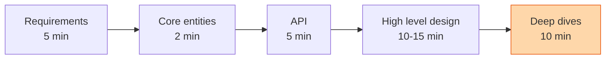

Most candidates fail the design round the same way. They hear "design Twitter", grab the marker, and draw a load balancer. Twenty minutes later there are fourteen boxes, no one has said what a tweet is, and the hard question has not been asked yet. This page is the plan I wish they had walked in with. Read it the night before. Then read the lessons in the [systems track](/teach/systems/) and the [GPU track](/teach/gpu-ai/) and notice they all follow it.

## Explain it to a ten-year-old

You are asked to build a treehouse. Do not start sawing. First ask who is using it and for what. Sleeping in it changes the answer. Then agree what goes inside: a rope, a window, a bucket on a pulley. Then draw the simplest treehouse that does the job. Only then ask the fun question: what happens when six kids climb in at once, or it rains.

## The plan

The split matters. Under-invest in the first three and the deep dive has nothing to stand on. Over-invest in them and you never get there. The times are for a 45-minute round.

1. **Requirements, five minutes.** Three things a user must be able to do, written as "a user can...". Then three to five qualities with a number on them: available over consistent, under 200 ms for reads, a hundred million users. Skip the capacity maths here. Do it later, only if it changes a decision. "It is a lot" is not a decision.
2. **Core entities, two minutes.** A short list of the nouns. User, Tweet, Follow. Not a schema. You do not know enough yet to write a schema, and you will add to this list as you go.
3. **API, five minutes.** One endpoint per requirement. REST by default, plural nouns, the user comes from the auth token and never from the request body. Reach for GraphQL only if many different clients want different shapes, and gRPC only for internal calls where speed matters. This is your contract. It keeps you honest later.
4. **Data flow, optional.** If the system is a pipeline, crawler or feed builder, write the four to six steps that turn input into output. If it is a plain backend, skip this.
5. **High level design, ten to fifteen minutes.** Boxes and arrows, one endpoint at a time. Walk each request through the picture out loud: it arrives here, it reads that, it writes there. Note the fields you need beside each database. When you spot a hard spot, say "this will need a cache, I will come back to it" and keep moving. A finished simple design beats a half-finished clever one.
6. **Deep dives, ten minutes.** Now go back to the hard spots and to the qualities from step one. The hot key. The slow write. The single box whose death takes the site down. Lead, but leave room. If the interviewer asks a question, that is the question they care about. Follow it.

## The concepts that keep coming up

Every deep dive lands on one of these. Know each well enough to say it in two sentences.

- **Protocols.** HTTP over TCP for nearly everything. WebSockets only when the server must push. Layer 4 balancing for long-lived connections, layer 7 for routing on the request.
- **Data model.** Start normalised. Denormalise the one hot path that needs it. Pick relational or NoSQL for a reason you can say aloud, not because one sounds bigger.
- **Indexes.** A B-tree gives you exact match and ranges. Full-text and geo need their own system, fed by change data capture, and a little stale is fine.
- **Caching.** Cache-aside with Redis is the default. The interesting parts are invalidation, the stampede when a hot key expires, and knowing when a cache adds nothing.
- **Sharding.** Later than you think. One good database with read replicas carries more than most candidates believe. When you do shard, name the key and admit cross-shard queries are now expensive. See [consistent hashing](/teach/systems/consistent-hashing/).
- **Consistency.** Most systems choose availability and eventual consistency. Choose strong consistency when a wrong answer costs money or a seat: inventory, payments, tickets.
- **Numbers.** A Redis node does over a hundred thousand operations a second. A single Postgres does tens of thousands of transactions a second. Use these to justify a decision, not to show off.

## The boxes and what each one is for

Know one tool per box, well. Nobody is impressed by a list of six databases.

| Box | What it is for | Know one |
|---|---|---|
| Database | The transactional truth. Joins, indexes, transactions. | Postgres or DynamoDB |
| Blob store | Big files. Presigned URLs so clients upload directly. | S3 |
| Search index | Full text. Inverted index, tokens, fuzzy match. | Elasticsearch |
| API gateway | The front door. Auth, rate limits, routing. | Nginx or AWS API Gateway |
| Load balancer | Spread traffic, survive a dead server. | Nginx or HAProxy |
| Queue | Absorb bursts, hand work to workers. Never on the synchronous path. | SQS or Kafka |
| Stream | Replayable log, many readers, real-time processing. | Kafka or Kinesis |
| Cache | Cut latency and database load. Say the data structure, not just "Redis". | Redis |
| Distributed lock | Hold a seat for ten minutes. Always with an expiry. | Redis |
| CDN | Static and slow-changing content, close to the user. | Cloudflare or CloudFront |

## What I am listening for

- Whether you ask before you draw. The first two minutes tell me most of what I need.
- Whether the API matches the requirements, and whether the boxes serve the API. Extra boxes are noise.
- Whether you trace a request through the picture without being asked.
- Whether you can name what breaks first. That one question is the whole round.
- Whether you stop talking when I ask something. The best candidates treat my question as a gift.


- **Requirements, entities, API, boxes, deep dive.** In that order, every time.
- **Three features, three to five qualities with numbers.** No more.
- **Simple and finished beats clever and half done.**
- **Know one tool per box.** Say why, in one sentence.
- **The round is won in the deep dive.** Get there with fifteen minutes left.


## Go deeper

- [System Design in a Hurry](https://www.hellointerview.com/learn/system-design/in-a-hurry/introduction) from Hello Interview is the source for the plan above. Read the [delivery](https://www.hellointerview.com/learn/system-design/in-a-hurry/delivery), [core concepts](https://www.hellointerview.com/learn/system-design/in-a-hurry/core-concepts) and [key technologies](https://www.hellointerview.com/learn/system-design/in-a-hurry/key-technologies) pages in that order. Two hours, well spent.
- [Hello Interview on YouTube](https://www.youtube.com/@hello_interview) has full mock rounds. Watch one at normal speed and count how long the candidate spends before drawing a box.
- [System Design Interview: A Step-By-Step Guide](https://www.youtube.com/watch?v=i7twT3x5yv8) by ByteByteGo covers the same four-step shape in twelve minutes.
- [The System Design Primer](https://github.com/donnemartin/system-design-primer) on GitHub is the free encyclopaedia. Use it to look things up, not to read end to end.
- [Latency numbers every programmer should know](https://gist.github.com/jboner/2841832) is the one-page cheat sheet for the numbers section.
- **Designing Data-Intensive Applications** by Martin Kleppmann for the why behind every box. It is on the [book list](/teach/books/).

**With AI on the table.** An assistant will produce a plausible Twitter architecture in ten seconds, with all fourteen boxes. I ask the candidate to delete half of them and defend what is left. Then I ask what breaks first. The tool draws boxes. The job is knowing which ones you need.
