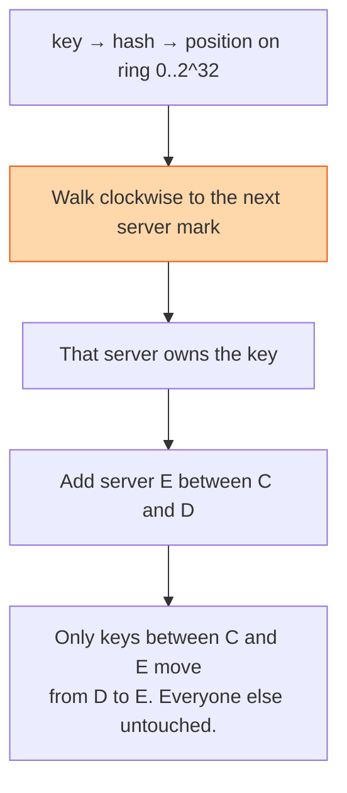

## The question

You have a hundred cache servers and a billion keys. Which server holds which key? What happens to your answer when you add the hundred and first server?

## Explain it to a ten-year-old

Thirty children sit in a circle. You have a bag of sweets and each sweet has a number on it. The rule is: spin the sweet's number round the circle and give it to the next child clockwise. Now a new child joins the circle. With the simple rule "sweet number divided by number of children", almost every sweet would have to move to a different child. With the clockwise rule, only the sweets that would now stop at the new child move. Everyone else keeps what they had.

## The trick

Hash the servers onto the same ring as the keys. A key belongs to the first server clockwise from it. Adding or removing a server moves only the keys between it and its predecessor, about one over N of the total. The second trick, which candidates forget: put each server on the ring many times, as virtual nodes, or the ranges will be badly uneven.

## The steps

1. **The problem with modulo.** Key mod N sends every key somewhere new when N changes. On a cache that is a total miss storm. On a database it is a migration.
2. **The ring.** Hash space is a circle from zero to two to the thirty-two. Hash each server's name onto it. Hash each key onto it. Key goes to the next server clockwise.
3. **Virtual nodes.** One point per server gives wildly uneven slices. Give each server a hundred or so points. The slices average out and a big server can have more points than a small one.
4. **Replication.** The key's copies live on the next N distinct physical servers clockwise. Skip virtual nodes that belong to a server you already chose.
5. **Membership.** Every client needs the same picture of the ring. Either a small coordination service publishes it, or the servers gossip it. A client with a stale ring sends keys to the wrong place, which is a miss, not a disaster.
6. **Where it is used.** Cache clusters, key-value stores, the load balancer lesson's sticky sessions, sharding a message queue. Learn it once, use it everywhere.

## In GPU infrastructure

Health-check collectors are assigned to hosts this way. Hash every hostname onto the ring, hash each collector onto it a hundred times, and a host reports to the first collector clockwise. When a collector dies or I add one to take load, only the hosts between it and its neighbour move, so the fleet does not stampede a fresh collector with a full history upload. Modulo by collector count was the first version and every restart reshuffled all ten thousand hosts, which showed up as a gap in every dashboard. Virtual nodes are what stop one collector owning half a region by accident.

## What I am listening for

- Whether you can say why modulo is bad in one sentence.
- Whether virtual nodes appear. Without them the design is correct and unusable.
- How a client learns the ring. Most candidates hand-wave this and it is where the real bugs live.


- **Servers and keys on one ring. Walk clockwise.**
- **Add a server, only one over N of keys move.**
- **Virtual nodes** or the slices are uneven.
- **Every client must see the same ring.**


## Go deeper

- [Consistent hashing on Wikipedia](https://en.wikipedia.org/wiki/Consistent_hashing) is short and has the diagram you want to be able to draw.
- [Amazon's Dynamo paper](https://www.allthingsdistributed.com/2007/10/amazons_dynamo.html) section 4.2 shows it in a real system.

**With AI on the table.** The assistant explains the ring beautifully. I ask what happens to a cache cluster when one server crashes and its whole slice lands on the next server clockwise, and how virtual nodes change that answer. The picture is the point.
