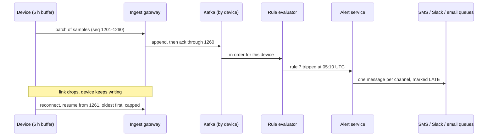

## The question

Create a system that sends alerts based on data from remote devices. The devices have spotty internet connections and enough local memory to hold six hours of data. The data is generally numeric.

Ask, and you learn the rest. Each device sends up to 128 numbers once a second. It is pre-configured, so treat it as a black box. There are up to ten thousand devices across a country. Users write rules such as "number 1 above 90,000 on any device" or "number 4 changed by more than 10 within 30 seconds", and want the alert by SMS, Slack or email. Fresh means about as long as it takes someone to look at their phone.

## Explain it to a ten-year-old

Ten thousand weather stations sit on mountains. Each one writes down a few numbers every second. When the radio works, it sends them to the town. When the radio is broken, it keeps writing in its notebook, and it can fill six hours of pages before it runs out. In town, a helper reads every number. If one is too high, the helper rings whoever asked to be told. The tricky part is when a station's radio comes back after five hours and sends the whole notebook at once. The helper has to read it in the right order, notice that the numbers are old, and say "this happened five hours ago" instead of ringing an alarm as if it were happening now.

## The trick

Two ideas carry the whole design.

The first is that **every sample carries two things: a sequence number and the time it was taken**. The sequence number makes a resend free: the gateway skips any number it already has, appends the rest and acknowledges the highest one stored, so a device on a link that drops mid-batch just sends again. The time it was taken lets the system judge the sample by when it happened, not when it arrived. A rule that says "changed by more than 10 within 30 seconds" is meaningless if thirty seconds means thirty seconds of arrival.

The second is that **delivery is fan-out, and each channel gets its own queue**. If SMS, Slack and email share one queue and Slack goes down, the Slack message at the head of the line blocks everyone behind it. With one queue and one sender per channel, a dead Slack backs up alone.

## The steps

1. **Ask five questions, then move.** Who gets the alert, and on which channels? Are rules per device or global? When a device returns after an hour, do old samples still alert? How fresh? How many devices, numbers per sample and samples per second?
2. **Write what the user does.** Create, edit and delete a rule. Choose the channels. Receive the alert. See open alerts and acknowledge one. The device is given, not designed: say that and move on.
3. **Do the multiplication on the board.** 10,000 devices × 1 sample a second is 10,000 samples a second. 128 numbers × 8 bytes is about 1 KB. So 10 MB a second, about 860 GB a day. Six hours offline is 21,600 samples, about 22 MB for one device.
4. **Entities you can count.** Device, Sample (with seq and event time), AlertRule, Subscription, Alert (with a late flag), Notification. The metric name is not an entity. It is a label the user puts on index 4, and it lives in the rule.
5. **The device endpoint is idempotent.** `POST /devices/{id}/samples` returns `acked_through`. A resend costs nothing.
6. **The gateway acks after the append, never before.** Otherwise a crash between the ack and the write loses data the device has already deleted.
7. **Kafka for fan-in, keyed by device.** It takes the write load durably, keeps each device's samples in order, and can be replayed.
8. **The rule evaluator is stateful per device.** It holds a small window for each rule, checks every sample on event time, and emits an alert event when a rule trips. If it restarts, it rebuilds the window by replaying the last few seconds from Kafka.
9. **The alert service turns a trip into one alert.** It dedupes on rule, device and window, tracks firing and resolved, sets the late flag, writes the alert and puts one message on each subscribed channel's queue.
10. **Per-channel queues and senders.** Each sender pulls, calls its provider, retries with backoff and moves a message that keeps failing to a dead-letter queue.
11. **Draining a backlog.** Oldest first, in acknowledged batches of about a minute, with a per-device rate cap and a 429 above it. Live and backlog travel in one ordered stream, so no window ever sees time run backwards.
12. **Late alerts say they are late.** "Rule 7 tripped on device 4412 at 05:10 UTC (data arrived 10:14)." Severity decides whether a late alert pages someone or is only recorded.
13. **No storms.** Fire once, resolve once, with a little hysteresis so a value hovering at the limit does not flap. Group a rule that trips on a hundred devices at once into one message.
14. **UTC end to end.** Every timestamp, every window, every message.

## The board



[Download the one-page cheat sheet](/teach/systems/device-alerting-cheat-sheet.pdf) (A4, two sides: front is the five questions, the entities, the endpoints and the minute budget; back is the board above).

## Every box: its job, what it reads, what it writes

The question that decides this interview is "what exactly does this box do?" Have one line for every box.

| Box | Job | Reads | Writes or sends |
|---|---|---|---|
| Ingest gateway | Accept a batch, drop duplicates, make it durable, ack | device state (last acked seq) | Kafka; device state; ack to the device |
| Kafka | Durable fan-in log, ordered per device | | |
| Rule evaluator | Check each sample against the rules on event time | Kafka; cached rules | alert events |
| Rule store | Hold rules and subscriptions | | a change event to the evaluators |
| Alert service | One trip becomes one alert; fan out | alert events; subscriptions | alert store; one message per channel queue |
| Channel sender | Deliver, retry, dead-letter | its own queue | the provider; delivery status |
| Liveness checker | Raise "device offline" after ten minutes of silence | device state | an offline event |

## The numbers to say out loud

| Quantity | Value | Why it decides something |
|---|---|---|
| Sample rate | 10,000 samples a second | One consumer group of a few instances is enough |
| Sample size | 128 numbers × 8 bytes ≈ 1 KB | Sets the bandwidth and the storage |
| Daily volume | 10 MB/s ≈ 860 GB a day | Raw goes to object storage, not a database the users query |
| One device's backlog | 6 h = 21,600 samples ≈ 22 MB | Drained at 100× real time in about four minutes |
| A hundred devices reconnecting | about double the normal load for minutes | Kafka absorbs it; the per-device cap keeps it there |
| Alert latency | seconds | A person takes about thirty seconds to look at a phone |

## Kafka, a queue or Redis

This comes up every time, so have one sentence for each.

- **Kafka is for fan-in.** A durable log that takes heavy writes, keeps order within a partition and can be replayed to rebuild state or test a new rule against last week.
- **A queue is for fan-out of work.** One message per delivery, acknowledged when done, retried when not, dead-lettered when it keeps failing, with consumers competing for messages.
- **Redis pub/sub is for broadcast.** In memory and fast, with no history. Here it tells every evaluator that a rule changed.

## In GPU infrastructure

A GPU fleet has the same shape. Every node runs an agent that reports temperatures, ECC counts, link errors and clock speeds once a second. Nodes in a remote site or behind a flaky management network buffer locally and catch up later. The rules are global ("any GPU above 85 °C", "ECC errors up by more than 10 in a minute"), and the alerts go to the on-call rotation, a chat channel and a ticket queue. The late-data rule matters more than it looks. A node that reports an hour of rising temperatures after a network blip should open a ticket for the hour. It should not page someone at 3 a.m. about a problem that has already resolved itself.

## What I am listening for

Whether you put a sequence number and an event time on the sample before anyone asks about resends or ordering. Whether you multiply the numbers on the board. Whether you give each channel its own queue. Whether you can say, for any box, what it reads and what it writes. And whether you raise the late-data question yourself, because it is the reason the prompt mentions six hours.

## What I got wrong in the mock

My numbers were out by four orders of magnitude. I wrote "about 100 MB a day" and said "a hundred gigabytes" for something that is 860 GB a day. Neither number came from a multiplication, and the interviewer noticed. Write the multiplication on the board before you say the number.

I drew a box called "normalizer" and gave it five jobs: cleaning, bucketing by time, converting units, renaming metrics across firmware versions and evaluating rules. The prompt says the data is plain numbers, so four of those jobs did not exist. Next to it I drew a "quota/limits" server that decided where alerts went. Quota means rate limiting in every other design, and the routing belonged to the alert service. When the interviewer asked which box reads the rules database, I called my own design a mistake halfway through the answer. The fix was to rename the box to rule evaluator and give its one job.

I also spent thirty-two minutes on requirements, including the protocol: WebSockets, then a half-remembered "RTC", then a claim to be an expert in TCP that the next sentence did not support. The plain answer is: TCP, because samples must not be lost, and short batches that can each be resent safely, because a long-lived connection on a bad link spends its life reconnecting.


Put a sequence number and an event time on every sample. The gateway dedupes on device and sequence and acks after the append, so a resend is free. Kafka for fan-in, keyed by device. Evaluate rules on event time, and mark alerts from old data as late. One queue and one sender per channel. UTC everywhere. For every box, know its job, what it reads and what it writes.


## Go deeper

The follow-up worth preparing is "a device comes back after five hours: should it page?" The honest answer is "it depends on the rule, so make it a property of the rule". A threshold that was crossed and then recovered four hours ago is history: record it and do not page. A pressure value that is still rising in the newest sample is current, whatever the backlog says. Severity and the time since the newest sample decide, and the alert always says when the data is from.

The other one is clock trust. A device's clock can drift, and one that rebooted without a time source may report 1970. Store both the device's timestamp and the gateway's arrival time. Evaluate on the device time when it is plausible, fall back to arrival time when it is not, and raise the drift itself as an alert. A clock that is wrong is a fault like any other.

## With AI on the table

An assistant will draw this pipeline in seconds, and it will look right. What it will not do unprompted is ask what happens to data that is five hours old, because nothing in a generic alerting template mentions it. That question is the whole interview, and it comes from reading the prompt slowly: "enough local memory to hold six hours" is a sentence about late data. Use the tool to draw the boxes. Do the reading yourself.
