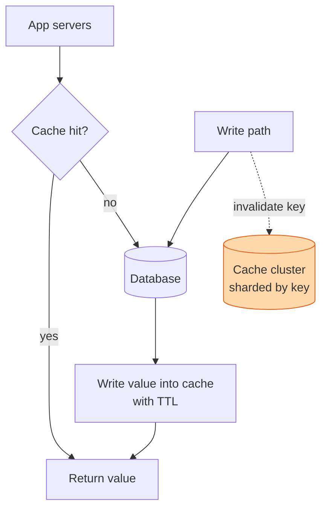

## The question

Design a cache that sits in front of a database and serves reads across many application servers. It must be fast, hold more than one machine can, and never serve a value that is badly out of date.

## Explain it to a ten-year-old

Your school bag is in a cupboard upstairs. Every morning you need it, so you keep it on a hook by the front door. That hook is a cache. Grabbing from the hook is fast; going upstairs is slow. Two problems. The hook holds one bag, so if you have ten things you need daily, you must choose which ones live by the door. And if your mum moves your lunch into a different bag upstairs, the one on the hook is now wrong. Choosing what to keep is eviction. Knowing when the hook is wrong is invalidation.

## The trick

Every cache is two decisions. What to throw out when full: least recently used is right ninety percent of the time. When to stop trusting a value: a time-to-live plus an explicit delete on write. Everything else is plumbing. The three failures that get you paged are stale reads, a stampede when a hot key expires, and a hot key that lives on one shard and melts it.

## The steps

1. **Say the number.** A million reads a second, one kilobyte each, is a gigabyte a second. One cache node handles maybe a hundred thousand reads a second. Ten nodes, and shard by key.
2. **Placement.** Consistent hashing so that adding a node moves a tenth of the keys, not all of them. Clients hash the key and go straight to the node.
3. **Read path.** Cache-aside. App checks the cache, on miss reads the database and fills the cache with a TTL. Simple, and the database is the truth.
4. **Write path.** Write the database, then delete the cache key. Not update it. A delete cannot be wrong; an update can race an older read and leave a stale value in place.
5. **Stampede.** A hot key expires and ten thousand requests all miss at once and hit the database. Let one request refill and make the others wait a few milliseconds, or refresh hot keys before they expire.
6. **Hot keys.** One celebrity's profile is read a million times a second. One shard cannot take it. Replicate that key to several nodes or keep a tiny in-process cache on every app server for the very hottest keys.
7. **Failure.** A cache node dies and its share of traffic lands on the database. Can the database take it? If not, the cache is not a cache, it is a dependency. Say that.

## In GPU infrastructure

The scheduler asks the same questions on every tick: which nodes are in this rack, which NVLink domain is this GPU in, which NICs share a spine. Those answers change only when a node is racked, drained, or recabled, so they live in a cache in front of the inventory store with a TTL of minutes and an explicit delete on every inventory write. The hot key is real here as well: a single popular cluster's topology gets read by every placement decision, so it is replicated to every node and kept in process. A cache miss on every tick would turn the inventory database into the thing that decides scheduler latency, which is the dependency trap in step seven.

## What I am listening for

- Delete or update on write. Delete. If you say update, I ask you to draw the race.
- Whether "stampede" or "thundering herd" comes up before I ask what happens when a hot key expires.
- Whether you know if the database can survive the cache dying. Most cannot, and most designs pretend otherwise.


- **Two decisions: evict (LRU) and invalidate (TTL plus delete on write).**
- **Write the database, delete the key.** Never update the cache from the write path.
- **Stampede:** one request refills, the rest wait.
- **If the database dies without the cache, the cache is a dependency.**


**With AI on the table.** The assistant will write cache-aside in any language. I show you a read that happened between the database write and the cache delete and ask what value the next reader sees. Then I ask how long it stays wrong. The template does not know.
