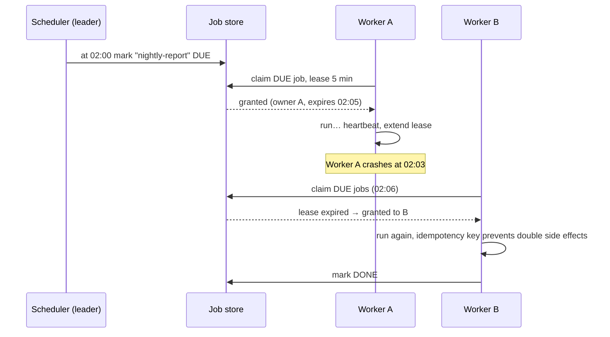

## The question

Design a system that runs jobs on a schedule (every hour, every night at 2am, once at a given time) across a pool of workers. A job must run, must not run twice, and must survive workers dying mid-job.

## Explain it to a ten-year-old

There is a whiteboard of chores and ten helpers. A helper walks up, picks a chore, writes their name and the time next to it, and goes off to do it. If they are not back in twenty minutes, we assume they got lost and another helper may take the chore. But here is the catch: what if the first helper was not lost, just slow, and now two helpers are both washing the same dog? So we make every chore safe to do twice. Washing the dog twice is fine. Feeding the dog twice is not, so that chore checks the bowl first.

## The trick

Nobody "assigns" work. Workers pull. A pulled job carries a lease with an expiry. Heartbeats extend it. If the lease lapses, the job goes back on the board. That single mechanism handles crashed workers, slow workers, and network partitions with no special cases. What it cannot do is prevent the double-run in the slow-not-dead case, so every job must be idempotent.

## The steps

1. **Job store.** A table: job id, schedule, next-run time, state (due, running, done, failed), lease owner, lease expiry, attempt count.
2. **Scheduler.** A small leader whose only job is to turn "every hour" into a row with a next-run time. One leader at a time, elected through a lock in the store. If it dies, another takes over; jobs are already in the table, nothing is lost.
3. **Workers.** Pull the next due job with an atomic "claim if unclaimed or lease expired". Heartbeat to extend the lease. Report done or failed.
4. **Retries.** On failure, back off exponentially, cap the attempts, then park it in a dead-letter state a human can see.
5. **Idempotency.** Every run carries a key (job id plus scheduled time). Side effects check the key first. This is what makes at-least-once delivery safe.
6. **Scale.** Shard the job table by job id. Workers pull from their shard. The leader is tiny and never on the hot path.

## In GPU infrastructure

The GPU job scheduler is this design with one extra column: topology. A job asks for sixty-four GPUs and the claim has to land on hosts that share a leaf switch, or the all-reduce spends its time crossing spines. Workers pull, the lease covers a running job, and a host that stops heartbeating has its job re-queued and its GPUs marked suspect until a health check clears them. Idempotency is the checkpoint: a re-run resumes from the last saved step rather than epoch zero. The leader is small, elected through the store, and stays off the hot path so a scheduler failover never stalls a thousand hosts.

## What I am listening for

- Whether you pull or push. Push means the scheduler tracks worker health, which is a second system.
- Whether "lease" or "lock with a timeout" appears. Without it, a dead worker holds a job forever.
- The double-run question. If you say "exactly once" I ask how, and you should say "at least once plus idempotent".


- **Workers pull. Jobs carry a lease.**
- **Lease lapses → job is free again.** That is your crash recovery.
- **Slow ≠ dead, so every job must be idempotent.**
- **Exactly once is a lie.** At least once plus idempotency is the truth.


**With AI on the table.** The assistant will produce a clean design. I ask what the idempotency key is for a job that sends a customer an email, and what happens to the key store when it fills up. The answer is not in the template.

## Go deeper

- [Raft consensus](https://raft.github.io/). The visualisation on this page is how I learned leader election.
- [Google Research publications](https://research.google/pubs/). Search for the Borg paper, "Large-scale cluster management at Google".
