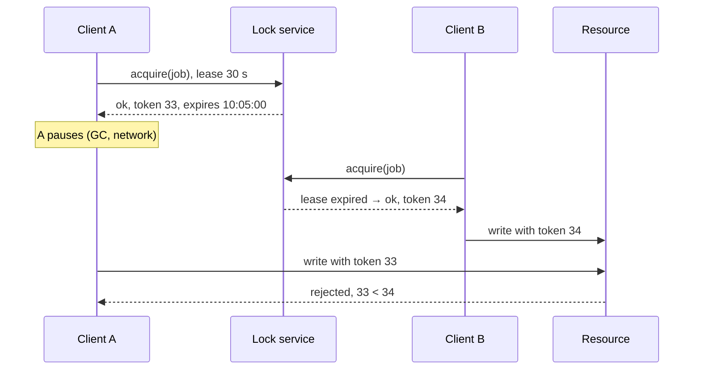

## The question

Many machines want to run the same job. Only one may run it at a time. Design the lock. The holder can crash, and the network can drop.

## Explain it to a ten-year-old

There is one bathroom key hanging on a hook. Take the key, use the bathroom, put it back. Now imagine the key is a note in a book at the office and the bathroom is across the playground. You write "Rik has it until 10:05". If you fall asleep in there, at 10:05 the note expires and someone else can take it. But what if you wake up at 10:06 and walk out thinking you still have it? Two people in the bathroom. So the office also writes a number on each note, and the bathroom door only opens for the highest number it has seen.

## The trick

A lock in a distributed system is a lease: it has an expiry. That handles the holder dying. It does not handle the holder pausing and waking up late, still believing. For that you need a fencing token, a number that goes up on every grant, and a resource that refuses any write carrying a smaller number than the last one it saw. The lock service prevents most overlap. The token prevents the damage from the rest.

## The steps

1. **Lock service.** A small cluster that agrees on who holds what, using a consensus protocol like Raft. Three or five nodes. Every grant is a majority decision, so one dead node changes nothing.
2. **Lease.** Every grant has a time-to-live. The holder heartbeats to extend it. Miss the heartbeat and the lease lapses. Choose the TTL longer than a normal pause and shorter than the damage you can tolerate.
3. **Fencing token.** A counter that increments per grant. The holder passes it to every write. The storage or the resource checks it. Without this, the lease alone is not safe.
4. **Client behaviour.** Do the work in small steps and check the lease is still yours before each one. Stop immediately if it is not. Never assume you still hold it because you did a second ago.
5. **Say the number.** Lock acquisitions per second are low, hundreds not millions. Consensus is slow and that is fine. If you need a million locks a second, you need a different design, probably partitioning the work instead of locking it.
6. **The honest part.** If the resource cannot check a token, say a third-party API, then the lock reduces the chance of overlap but cannot make it zero. Make the operation idempotent and stop pretending.

## In GPU infrastructure

Draining a rack for maintenance is the job only one bastion may run at a time. Two operators on two bastions both start a drain, the first pauses on a slow SSH session, and the second finishes before the first wakes up and begins evicting jobs from a rack that is already back in service. So the drain tool takes a lease from the lock service with the rack ID as the key, and every state change to the inventory carries the fencing token. The inventory rejects a stale token, and that is the line that has saved us more than the lease ever has. When the resource is a firmware flash that cannot check a token, the flash script is made idempotent and we accept the small window.

## What I am listening for

- Whether "lease" and "expiry" arrive before I mention a crashed holder.
- Whether you can explain the pause problem and whether "fencing token" or something like it comes out.
- Whether you know that a single cache node is not a lock service. It is a suggestion.


- **A distributed lock is a lease.** It expires.
- **Lease handles death. Fencing token handles the sleeper.**
- **The resource checks the token**, or the lock is decoration.
- **A lock cannot make an unsafe operation safe.** Idempotency can.


## Go deeper

- [Raft](https://raft.github.io/) has the clearest visualisation of consensus you will find. Play with it for ten minutes.
- Martin Kleppmann's essay on the safety of distributed locks, on [his site](https://martin.kleppmann.com/), is where the fencing token argument comes from.
- Redis's own page on the [Redlock pattern](https://redis.io/docs/latest/develop/use/patterns/distributed-locks/) and the debate around it.

**With AI on the table.** The assistant will hand you Redlock. I ask what happens when the holder's process pauses for forty seconds during garbage collection and the lease is thirty. Walk me through both clients, step by step, and show me where the second write lands.
